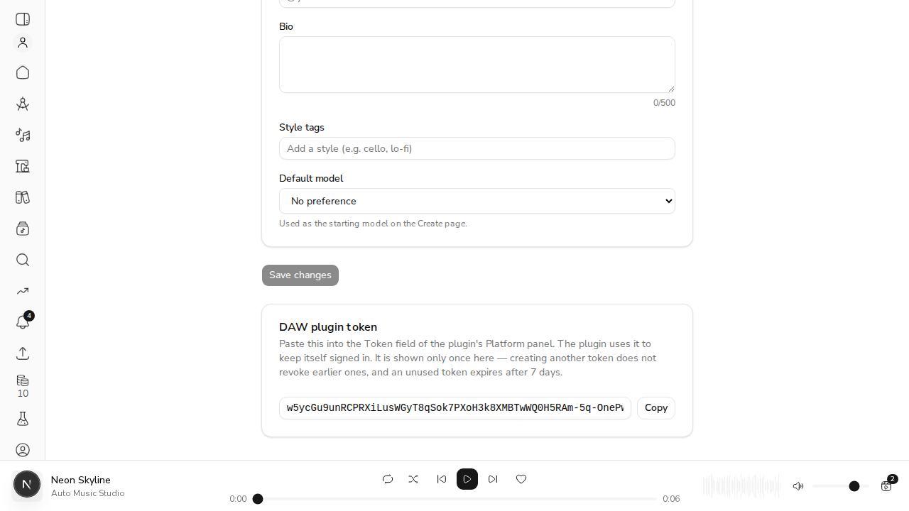

# #445: the plugin stays signed in past the 15-minute token

*2026-09-18T16:50:30Z*

The plugin's platform calls authenticate with a JWT access token that expires. The plugin now holds a **plugin token** (a refresh token), refreshes on a 401, and retries once.

**Setup.** A live local API (`uvicorn`, MongoDB, demo DB `demo_issue_445`) runs with `ACEMUSIC_API_ACCESS_TOKEN_EXPIRE_MINUTES=1`, so an access token dies after 60s instead of 15 minutes. A demo user was minted through the same service layer the OAuth callback uses, and `POST /api/v1/auth/plugin-token` was called with that user's web access token. `Demo445` is a throwaway console app compiled from the plugin's own `PlatformSession.cpp`, `PlatformClient.cpp`, `HttpSupport.cpp` and `ConnectionSettings.cpp`. The code under test is the plugin's; only the button clicks are replaced. Tokens are only ever printed as a hash fingerprint.

```bash
D=/tmp/claude-1000/-home-frankbria-projects-auto-music-studio/62406954-6b99-440f-bd5e-e792c44dd6c7/scratchpad/demo445; curl -s -o /dev/null -w 'plugin-token without a bearer -> HTTP %{http_code}\n' -X POST localhost:8745/api/v1/auth/plugin-token; python3 -c "import json;d=json.load(open('$D/pair.json'));print('plugin-token with a web session -> keys', sorted(d), '| access token lifetime', d['expires_in'], 's')"
```

```output
plugin-token without a bearer -> HTTP 401
plugin-token with a web session -> keys ['access_token', 'expires_in', 'refresh_token', 'token_type'] | access token lifetime 60 s
```

## AC1 + AC4: an idle session keeps working, no pasting

The plugin token goes into a fresh 0600 token file, the way the panel stores a pasted one. The harness lists workspaces, clips and voice models, idles 70s so the access token dies, and lists them again. Nothing is pasted in between.

```bash
D=/tmp/claude-1000/-home-frankbria-projects-auto-music-studio/62406954-6b99-440f-bd5e-e792c44dd6c7/scratchpad/demo445; rm -rf $D/run1 && mkdir -m 700 $D/run1 && install -m 600 $D/plugin.token $D/run1/platform.token; before=$(grep -c 'POST /api/v1/auth/refresh' $D/api.log); $D/harness/build/Demo445_artefacts/Release/Demo445 http://localhost:8745 $D/run1/platform.token 70; echo; echo "server side: $(( $(grep -c 'POST /api/v1/auth/refresh' $D/api.log) - before )) refreshes; statuses seen:"; tail -n 20 $D/api.log | grep -oE '"(GET|POST) /api/v1/[a-z/_-]+(\?[^ ]*)? HTTP/1.1" [0-9]{3}' | sed -E 's/\?[^ ]*//'
```

```output
plugin token on disk: fingerprint 179d4ae1
first use (no access token yet):
  workspaces   ok, 2
  clips        ok, 0
  voice models ok, 0
idle for 70s, past the 60s access-token lifetime...
after the idle:
  workspaces   ok, 2
  clips        ok, 0
  voice models ok, 0
token on disk rotated: yes (fingerprint 9df3930c), mode 600
log lines mentioning either token: 0

server side: 2 refreshes; statuses seen:
"GET /api/v1/health HTTP/1.1" 200
"GET /api/v1/health HTTP/1.1" 200
"POST /api/v1/auth/plugin-token HTTP/1.1" 401
"POST /api/v1/auth/plugin-token HTTP/1.1" 200
"POST /api/v1/auth/plugin-token HTTP/1.1" 401
"GET /api/v1/workspaces HTTP/1.1" 401
"POST /api/v1/auth/refresh HTTP/1.1" 200
"GET /api/v1/workspaces HTTP/1.1" 200
"GET /api/v1/clips HTTP/1.1" 200
"GET /api/v1/voice-models HTTP/1.1" 200
"GET /api/v1/workspaces HTTP/1.1" 401
"POST /api/v1/auth/refresh HTTP/1.1" 200
"GET /api/v1/workspaces HTTP/1.1" 200
"GET /api/v1/clips HTTP/1.1" 200
"GET /api/v1/voice-models HTTP/1.1" 200
```

## AC3: a genuinely rejected credential says so, and is not retried forever

The original plugin token was spent by the first refresh above (tokens are single-use and rotate), so the platform now refuses it. Each call makes exactly one refresh attempt, then stops with a message the musician can act on.

```bash
D=/tmp/claude-1000/-home-frankbria-projects-auto-music-studio/62406954-6b99-440f-bd5e-e792c44dd6c7/scratchpad/demo445; rm -rf $D/run2 && mkdir -m 700 $D/run2 && install -m 600 $D/plugin.token $D/run2/platform.token; before=$(grep -c 'POST /api/v1/auth/refresh' $D/api.log); calls=$(grep -cE 'GET /api/v1/(workspaces|clips|voice-models)' $D/api.log); timeout 60 $D/harness/build/Demo445_artefacts/Release/Demo445 http://localhost:8745 $D/run2/platform.token 0 | grep -v '^idle\|rotated\|fingerprint'; echo; echo "API calls: $(( $(grep -cE 'GET /api/v1/(workspaces|clips|voice-models)' $D/api.log) - calls )), refresh attempts: $(( $(grep -c 'POST /api/v1/auth/refresh' $D/api.log) - before )), one each, then stop"
```

```output
first use (no access token yet):
  workspaces   FAILED: Plugin token rejected - create a new one in Settings on the web app
  clips        FAILED: Plugin token rejected - create a new one in Settings on the web app
  voice models FAILED: Plugin token rejected - create a new one in Settings on the web app
after the idle:
  workspaces   FAILED: Plugin token rejected - create a new one in Settings on the web app
  clips        FAILED: Plugin token rejected - create a new one in Settings on the web app
  voice models FAILED: Plugin token rejected - create a new one in Settings on the web app
log lines mentioning either token: 0

API calls: 6, refresh attempts: 6, one each, then stop
```

## AC2: a voiced generation that outlives the token completes

A live voiced render needs an ACE-Step GPU worker behind the platform, and there isn't one here. So this criterion is shown with the plugin's real `GenerationManager` over real loopback HTTP. The stub serves the platform's generate, poll and download routes and enforces bearer tokens like the platform does. While the job is running, the test expires the access token and rotates the refresh endpoint's answer. The next poll gets a 401, refreshes, and the run completes with its clip. The rest of the #445 tests (the session, the panel, and the stop signal) run in the same pass.

```bash
cd plugin && xvfb-run -a build/AceMusicPluginTests_artefacts/Release/AceMusicPluginTests 2>&1 > /tmp/claude-1000/-home-frankbria-projects-auto-music-studio/62406954-6b99-440f-bd5e-e792c44dd6c7/scratchpad/demo445/suite.log; echo "exit $?"; grep -E 'Completed tests in (PlatformSession|VoiceGeneration / AC: a voiced generation that outlives|PlatformPanel / (AC: an idle|AC: a rejected token|credentials persist|a pre-#445))' /tmp/claude-1000/-home-frankbria-projects-auto-music-studio/62406954-6b99-440f-bd5e-e792c44dd6c7/scratchpad/demo445/suite.log | sed 's/Completed tests in /PASS  /'; echo "failures: $(grep -c '^FAILED' /tmp/claude-1000/-home-frankbria-projects-auto-music-studio/62406954-6b99-440f-bd5e-e792c44dd6c7/scratchpad/demo445/suite.log), suites run: $(grep -c 'Completed tests' /tmp/claude-1000/-home-frankbria-projects-auto-music-studio/62406954-6b99-440f-bd5e-e792c44dd6c7/scratchpad/demo445/suite.log)"
```

```output
exit 0
PASS  PlatformPanel / credentials persist, so they survive the window closing
PASS  PlatformPanel / AC: an idle session still lists workspaces, clips and voices after the token expires
PASS  PlatformPanel / a pre-#445 access token left in the settings file is removed
PASS  PlatformPanel / AC: a rejected token is reported on the panel, not swallowed
PASS  PlatformSession / AC: an expired access token is refreshed and the call retried, unseen
PASS  PlatformSession / AC: the rotated refresh token replaces the old one on disk, at 0600
PASS  PlatformSession / AC: a rejected refresh token says so and is tried exactly once
PASS  PlatformSession / a fresh token that is still refused is not refreshed again
PASS  PlatformSession / with no plugin token a 401 asks for one instead of saying 'rejected'
PASS  PlatformSession / another plugin instance's rotation is picked up from disk
PASS  PlatformSession / concurrent 401s share one refresh
PASS  PlatformSession / a stopping queue does not start a refresh
PASS  PlatformSession / pasting a token forgets the old access token and persists the new one
PASS  VoiceGeneration / AC: a voiced generation that outlives the access token completes
failures: 0, suites run: 288
```

## Getting a token: Settings → DAW plugin token (web)

A real browser session against the same API. The user was signed in via the httpOnly refresh cookie, went to `/settings` and pressed **Create plugin token**. The card shows the token once, with a Copy button:



That browser-minted token then goes into the plugin harness, which proves it is a working plugin token end to end. This also spends the token in the screenshot: the first refresh consumes it.

```bash
D=/tmp/claude-1000/-home-frankbria-projects-auto-music-studio/62406954-6b99-440f-bd5e-e792c44dd6c7/scratchpad/demo445; rm -rf $D/run3 && mkdir -m 700 $D/run3 && install -m 600 $D/browser.token $D/run3/platform.token; timeout 60 $D/harness/build/Demo445_artefacts/Release/Demo445 http://localhost:8745 $D/run3/platform.token 0 | sed -n '2,5p'
```

```output
first use (no access token yet):
  workspaces   ok, 2
  clips        ok, 0
  voice models ok, 0
```

The web session is untouched: after the plugin token was spent above, reloading `/settings` still restores the signed-in session from the browser's own refresh cookie, and the page fetches `/api/users/me`, which only happens with an access token.

```bash
agent-browser open http://localhost:3745/settings >/dev/null; sleep 4; agent-browser eval "JSON.stringify({signedIn: performance.getEntriesByType('resource').some(e => e.name.includes('/api/users/me')), tokenCard: !!document.evaluate('//*[text()=\"DAW plugin token\"]', document, null, 9, null).singleNodeValue})"
```

```output
"{\"signedIn\":true,\"tokenCard\":true}"
```

## Acceptance criteria → evidence

| Criterion | Evidence |
| --- | --- |
| Idle past the access-token lifetime still lists workspaces, clips, voice models without pasting | Live: 70s idle against 60s tokens, all three listings ok, one 401 → refresh → retry in the server log |
| A voiced generation that outlives the token completes | Real `GenerationManager` over loopback HTTP; token expired mid-render, run completed with its clip (no GPU worker here for a live render) |
| A genuinely rejected credential says so, not retried forever | Live: a spent token gives 'Plugin token rejected…', exactly one refresh attempt per call, then stop |
| Stored credential stays 0600 and never in a log | Live: rotated token file mode 600; captured JUCE log has no token; the panel never echoes it; the settings file no longer holds it |
