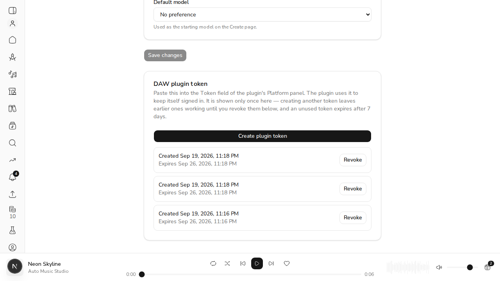
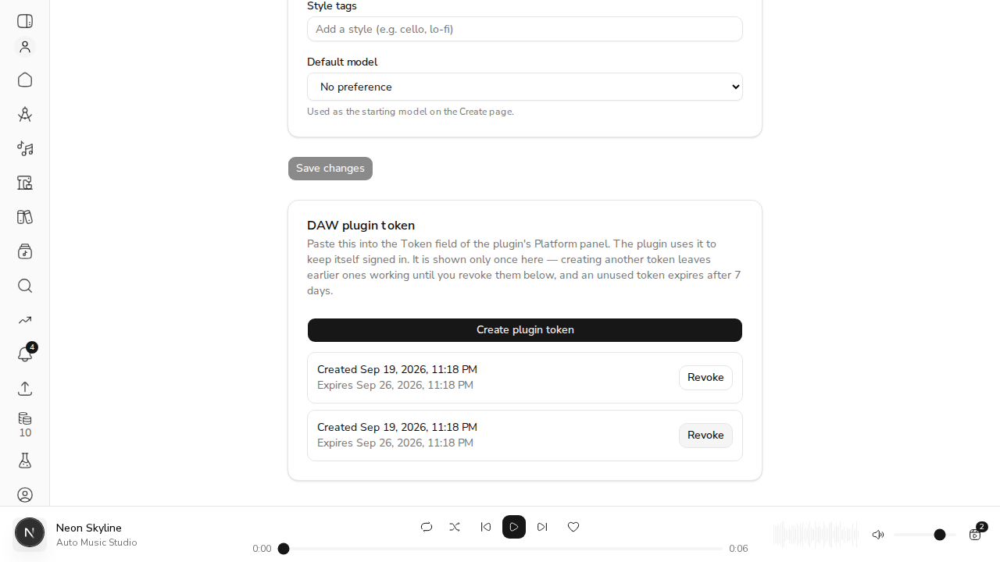

# Issue #515 — plugin tokens can be listed and revoked

**Setup.** A live local API (`uvicorn`, MongoDB, demo DB `demo_issue_515`) runs with
`ACEMUSIC_API_ACCESS_TOKEN_EXPIRE_MINUTES=1`, so an access token dies after 60s instead of
15 minutes — the plugin is forced to refresh inside the demo. A demo user was minted
through the same service layer the OAuth callback uses, and the Next.js app runs against
that API. `Demo515` is a throwaway console app compiled from the plugin's own
`PlatformSession.cpp`, `PlatformClient.cpp`, `HttpSupport.cpp` and `ConnectionSettings.cpp`
— the code under test is the plugin's; only the button clicks are replaced. Tokens are
only ever printed as a hash fingerprint.

| Criterion | Evidence |
| --- | --- |
| Revoking a plugin token makes the plugin's next refresh fail with the existing "Plugin token rejected" message | **Live**: the plugin's own `Platform::Session` lists three endpoints fine, the token is revoked over HTTP mid-run, and the next refresh reports exactly that message |
| Rotation keeps the token in the list (same entry, not a new one) | **Live**: the credential is rotated three times over `/auth/refresh`; the listing stays one entry with the same id and `created_at`, and only `expires_at` moves |
| Web sessions are not listed and cannot be revoked from this UI | **Live**: a browser refresh token stored the way the OAuth callback stores it is absent from the listing, its id `DELETE`s as 404, and it still refreshes afterwards |

## AC1 — revoke, and the plugin says so

`Demo515` lists workspaces, clips and voice models, then idles 70s past the 60s
access-token lifetime and lists them again. The revoke lands during the idle — the same
`DELETE /api/v1/auth/plugin-tokens/{id}` the Revoke button sends.

```bash
$CLAUDE_JOB_DIR/tmp/demo515/ac1.sh
```

```output
listed plugin token entry: 6aaf7985c6c990525ec6d7a6
plugin token on disk: fingerprint ac42fa71
first use (no access token yet):
  workspaces   ok, 2
  clips        ok, 0
  voice models ok, 0
idle for 70s, past the 60s access-token lifetime...

>>> musician clicks Revoke in Settings: DELETE /api/v1/auth/plugin-tokens/6aaf7985c6c990525ec6d7a6
    revoke -> HTTP 204
    remaining entries: []

after the idle:
  workspaces   FAILED: Plugin token rejected - create a new one in Settings on the web app
  clips        FAILED: Plugin token rejected - create a new one in Settings on the web app
  voice models FAILED: Plugin token rejected - create a new one in Settings on the web app
token on disk rotated: yes (fingerprint b8f7f39e), mode 600
log lines mentioning either token: 0
```

The outcome, not the mechanism: before the revoke the plugin worked; after it, the message
the plugin already had for a rejected credential is what the musician sees. Nothing in the
plugin changed for this issue — the revoke is what makes its existing path fire.

Note the fingerprint on disk (`ac42fa71`) differs from the one that was pasted in, and
differs again afterwards (`b8f7f39e`): the credential rotated twice during the run, and
the entry that was listed and revoked is the same one throughout. That is AC2 falling out
of AC1's run, and it is measured directly below.

## AC2 + AC3 — one entry across rotations; web sessions untouchable

```bash
uv run python $CLAUDE_JOB_DIR/tmp/demo515/ac23.py
```

```output
=== AC2: rotation keeps the same entry ===
after minting          : 1 entry  id=6aaf7a38c6c990525ec6d7a7  created=2026-09-20T06:16:24.683000
after refresh #1       : 1 entry  id=6aaf7a38c6c990525ec6d7a7  created=2026-09-20T06:16:24.683000  expires=2026-09-27T06:16:24.688000
after refresh #2       : 1 entry  id=6aaf7a38c6c990525ec6d7a7  created=2026-09-20T06:16:24.683000  expires=2026-09-27T06:16:24.692000
after refresh #3       : 1 entry  id=6aaf7a38c6c990525ec6d7a7  created=2026-09-20T06:16:24.683000  expires=2026-09-27T06:16:24.696000
  credential changed 3 times, list entries: 1
  same id      : True
  same created : True
  expiry extended by rotation: True

=== AC3: web sessions are not listed and cannot be revoked here ===
browser session refresh token stored, document id=6aaf7a38ecbe59cdbef0638e, kind='web'
GET /auth/plugin-tokens -> 1 entry: ['6aaf7a38c6c990525ec6d7a7']
  web session in the list: False
DELETE /auth/plugin-tokens/6aaf7a38ecbe59cdbef0638e -> HTTP 404 {'detail': 'Plugin token not found.'}
browser session still refreshes: HTTP 200
  and it is still the same document, still kind='web': True

=== a second account cannot see or revoke this one's tokens ===
intruder GET  -> []
intruder DELETE on the musician's token -> HTTP 404 {'detail': 'Plugin token not found.'}
musician's token survives: True
```

The credential really does change on every refresh (the script asserts the returned token
differs each time, so this is rotation, not a no-op) and the listing still shows one entry.
Before this change each refresh inserted a new document, so a token in daily use would
have grown a new list entry every time it was used.

## The Settings card, in a browser

A real browser session against the same API — signed in through the httpOnly refresh
cookie, on `/settings`. Three plugin tokens were minted, so the list has something to
choose between:



Pressing **Revoke** on the oldest row removes it, and the server records the real call:

```bash
grep "DELETE /api/v1/auth/plugin-tokens" api.log | tail -1
```

```output
INFO:     127.0.0.1:47844 - "DELETE /api/v1/auth/plugin-tokens/6aaf7a38c6c990525ec6d7a7 HTTP/1.1" 204 No Content
```



And the database afterwards — the revoked plugin token is flagged, the two remaining
plugin tokens are live, and both `kind=web` browser sessions were never touched or listed:

```output
6aaf7ab2362affd9d75f9fed  kind=plugin  revoked=False created=2026-09-20 06:18:26.202000
6aaf7ab2362affd9d75f9fec  kind=plugin  revoked=False created=2026-09-20 06:18:26.199000
6aaf7ab2b0b2192a821bf55e  kind=web     revoked=False created=2026-09-20 06:18:26.161000
6aaf7a38ecbe59cdbef0638e  kind=web     revoked=False created=2026-09-20 06:16:24.703000
6aaf7a38c6c990525ec6d7a7  kind=plugin  revoked=True  created=2026-09-20 06:16:24.683000
6aaf7985c6c990525ec6d7a6  kind=plugin  revoked=True  created=2026-09-20 06:13:25.612000
```

## Two defects the demo found, which the tests had not

- **Timestamps serialized without an offset.** MongoDB returns naive UTC datetimes, so the
  listing emitted `2026-09-20T06:16:24.683000`. JavaScript reads an offset-less date-time
  as *local* time, which slides the displayed day across the timezone boundary — and the
  date is what the listing is read for. The endpoint now emits `...683000Z`, checked in
  `tests/test_auth_routes.py`.
- **Every row showed the same date.** Three tokens made on one day rendered as three
  identical "Created Sep 19, 2026" rows with nothing to choose between them. The rows now
  carry the time as well, which is what the screenshots above show.

## Tests

```bash
uv run pytest tests/test_auth_routes.py tests/test_auth_services.py tests/test_auth_models.py tests/test_auth_tokens.py -m "integration or not integration" --cov=src/acemusic/api --cov-report=xml
uvx diff-cover coverage.xml --compare-branch=origin/main --fail-under=85
cd web && npm run typecheck && npm run lint && npx vitest run
```

```output
75 passed

src/acemusic/api/auth/services.py (100%)
src/acemusic/api/models/refresh_token.py (100%)
src/acemusic/api/routers/auth.py (100%)
Total:   33 lines
Missing: 0 lines
Coverage: 100%
```

Mutation checks — 12 mutations, each caught by at least one test: dropping the `revoked`
and the expiry guard from the rotation filter; dropping the owner, `kind` and 404 guards
from revoke; dropping the `kind` filter from the listing; minting without
`kind="plugin"`; defaulting `kind` to `"plugin"`; reverting rotation to the old
consume-then-insert (this one fails the AC2 test, which is the point); and on the web
side, a revoke that does not remove the row, a list that never renders, a DELETE proxy
that drops the bearer, and a GET proxy that skips its 401 guard.
