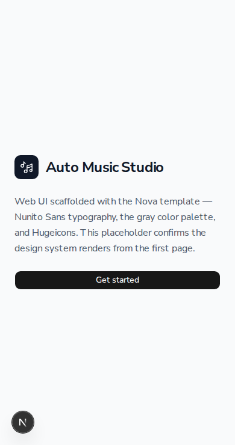

# Demo — US-15.1: Next.js Project Scaffold (Nova template)

Bootstraps `web/` with the Nova template: Shadcn/UI (radix-nova), Tailwind CSS v4,
Hugeicons, and Nunito Sans. The placeholder index page proves the design system
renders from the first page.

## Setup

```bash
cd web
npm install        # already run during scaffold
npm run dev        # http://localhost:3000
```

## Acceptance criteria — outcome evidence

| # | Criterion | Evidence |
|---|-----------|----------|
| 1 | `npm run dev` starts without errors | `✓ Ready in 184ms`; `curl localhost:3000` → HTTP 200 |
| 2 | Index renders with Nunito Sans | `font-family: "Nunito Sans"` in served HTML; `--font-sans` → Nunito Sans via `next/font/google`; visible in screenshot |
| 3 | Gray palette active (not zinc/slate) | Page uses `bg-gray-50`, `bg-gray-900`, `text-gray-600/900`; shadcn `baseColor: neutral` (plain gray, not zinc/slate) |
| 4 | Hugeicons icon renders | `MusicNote01Icon` via `<HugeiconsIcon>` → `<svg viewBox="0 0 24 24">` music-note paths in HTML; visible in screenshot |
| 5 | Shadcn uses Nova styling | `components/ui/button.tsx` emits `data-slot="button"`; focus ring `focus-visible:ring-3` (= 3px, Tailwind v4 equivalent of `ring-[3px]`) |

## Build / lint

```bash
npm run typecheck   # clean
npm run lint        # clean
npm run build       # ✓ Compiled successfully; / and /_not-found prerendered
```

## Screenshot



The screenshot shows Nunito Sans typography, the gray palette (gray-50 background,
gray-900 icon badge + button, gray-600 body copy), the rendered Hugeicons music
note, and the Nova primary Button.

## Notes

- shadcn no longer offers a `gray` baseColor (enum is `neutral | stone | zinc |
  mauve | olive | mist | taupe`). `neutral` is the plain, untinted gray and
  satisfies "gray, not zinc/slate"; Tailwind's built-in `gray-*` utilities are
  used on the page for the explicit gray palette.
- Tailwind v4 has no `tailwind.config.ts` — theme tokens live in `app/globals.css`
  (`@theme`). Nunito Sans is wired to `--font-sans` / `font-sans` there.
- Nova emits `ring-3` (3px) rather than the older `ring-[3px]` arbitrary syntax;
  same rendered 3px focus ring.
- `web/` is not yet wired into CI (no test surface in a scaffold) — deferred.
