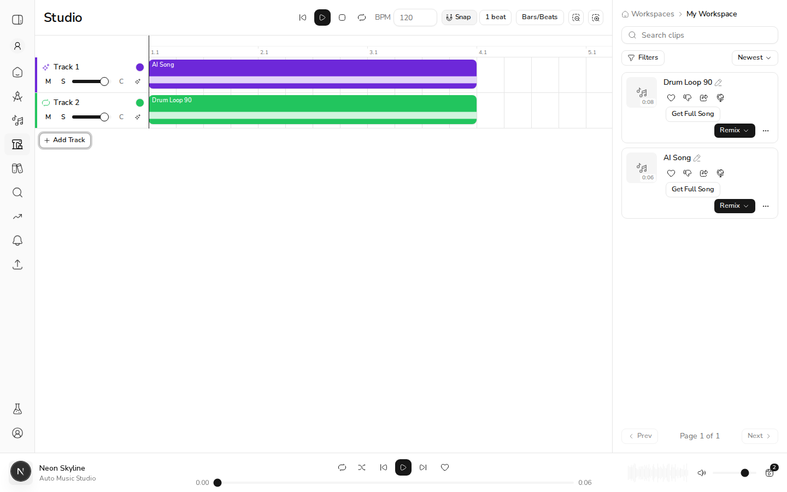
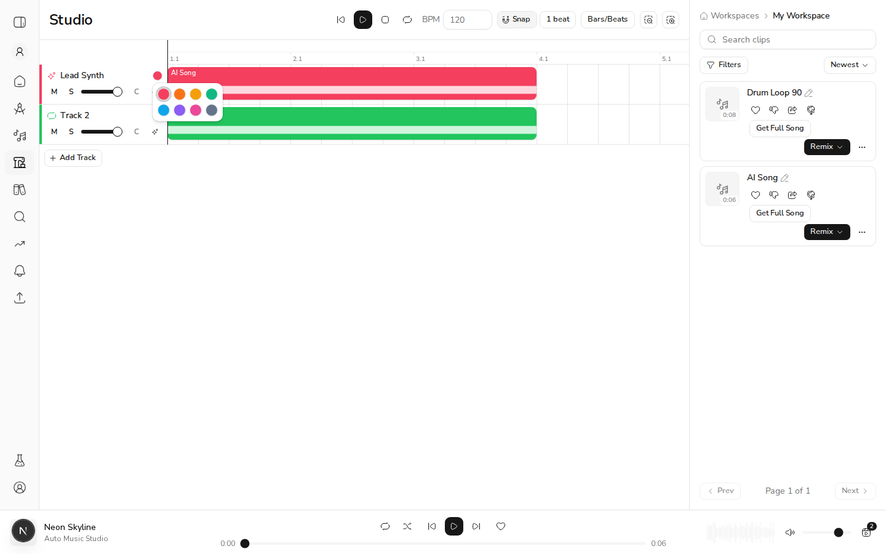
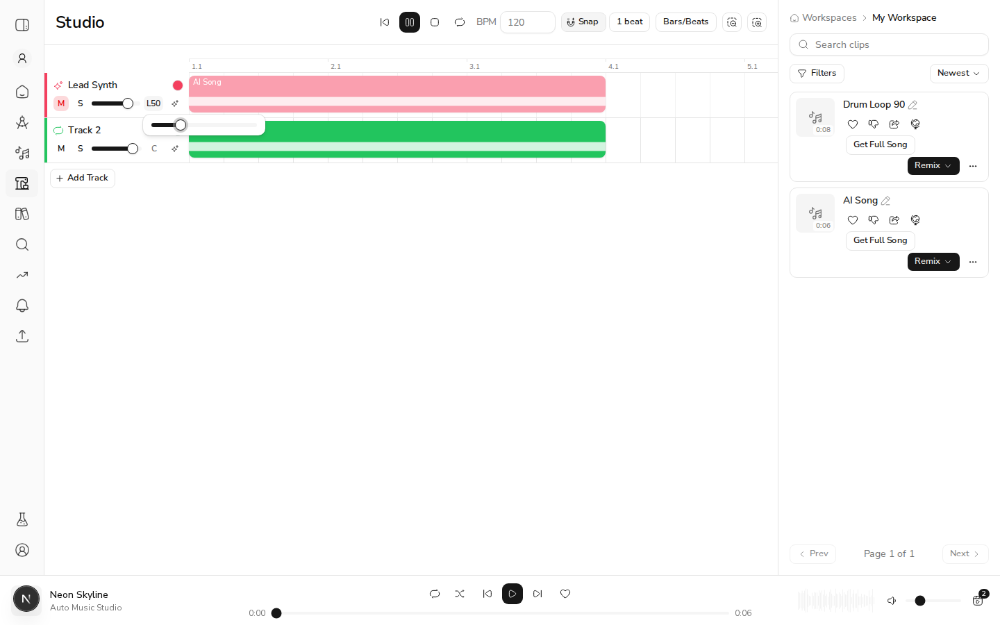
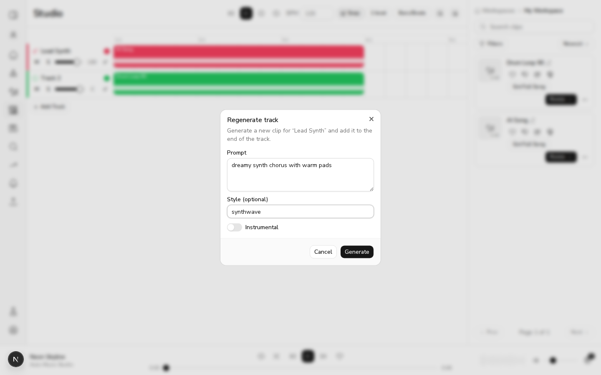
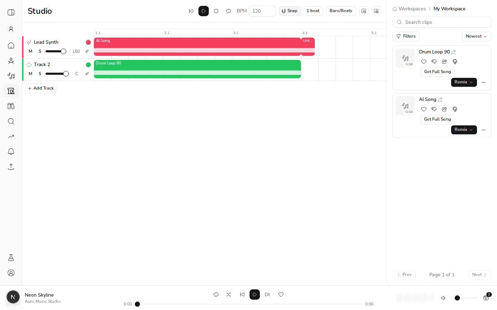

# US-19.4 — Per-Track Controls (volume, pan, mute/solo, color, AI regenerate)

*2026-07-13T20:52:40Z*

*PR #279, verified at commit 896b9ec on 2026-07-13.*

Verified live against the full local stack: FastAPI backend (port 8214, MongoDB db `acemusic_demo_us194`), `next dev` (port 3214), an ACE-Step-contract compute stub (port 8215) so the real generation job pipeline runs end-to-end without a GPU, driven with agent-browser as an authenticated demo user. The workspace holds two seeded WAV clips: **AI Song** (6s, `generation_mode="song"`) and **Drum Loop 90** (8s, `"sound"`, bpm=90).

First, evidence the stack is real: the BFF lists the seeded clips for the authenticated user.

```bash
curl -s http://localhost:3214/api/clips -H 'Authorization: Bearer $DEMO_ACCESS_TOKEN' | python3 -c 'import json,sys; d=json.load(sys.stdin); print(*[(c["title"], c["duration"], c["generation_mode"], c["bpm"]) for c in d["clips"]], sep="\n")'
```

```output
('Drum Loop 90', 8, 'sound', 90)
('AI Song', 6, 'song', None)
```

Two typed tracks were created (AI-Generated + Sound/Loop) and the seeded clips dragged onto their matching lanes. Each lane now has the new US-19.4 control strip: color swatch, M/S buttons, volume fader, pan readout, and the AI Regenerate button.

```bash {image}
echo us194-strips.png
```



**AC6 — Track name is editable inline.** Clicking the name swapped it for an input; typing "Lead Synth" and pressing Enter committed the rename. Reading the live lanes:

```bash
agent-browser eval 'JSON.stringify([...document.querySelectorAll("[aria-label=\"Edit track name\"]")].map(b => b.textContent))'
```

```output
"[\"Lead Synth\",\"Track 2\"]"
```

**AC4 — Track color is selectable and visually applied.** The swatch button on "Lead Synth" opened an 8-color popover; picking **Rose** recolored the strip accent border from the AI-type purple to rose, while Track 2 kept its loop-green. Live border styles:

```bash
agent-browser eval 'JSON.stringify([...document.querySelectorAll("[data-testid=track-strip]")].map(s => s.style.borderLeft))'
```

```output
"[\"4px solid rgb(244, 63, 94)\",\"4px solid rgb(34, 197, 94)\"]"
```

```bash {image}
echo us194-color.png
```



**Setup for the audio criteria.** `AudioContext.prototype` was instrumented in the live page (recording every gain/panner/source node the engine creates), then Play was pressed. Baseline: 2 buffer sources (one per clip), 3 gain nodes — the master plus one per track at unity gain — and 2 stereo panners centered:

```bash
agent-browser eval 'JSON.stringify({sources: window.__sources, gains: window.__gains.map(g => g.gain.value), panners: window.__panners.map(p => p.pan.value)})'
```

```output
"{\"sources\":2,\"gains\":[1,1,1],\"panners\":[0,0]}"
```

**AC1 — Volume fader changes the track's playback level.** With audio still playing, the Lead Synth fader was lowered 6 steps to -6 dB. The track's live GainNode moved to 10^(-6/20) ≈ 0.501 — and the source count stayed at 2 with no reschedule, so the level changed in place, mid-playback:

```bash
agent-browser eval 'JSON.stringify({sources: window.__sources, trackGain: window.__gains[1].gain.value, faderTitle: document.querySelector("[data-slot=slider][title]")?.title})'
```

```output
"{\"sources\":2,\"trackGain\":0.5011872053146362,\"faderTitle\":\"-6 dB\"}"
```

**AC2 — Pan shifts the track's stereo position.** The pan control (popover slider on the Lead Synth strip) was dragged to L50. The track's live StereoPannerNode moved to -0.5 (UI -100..+100 maps to the node's -1..+1), the strip readout shows `L50`, and again no sources were rescheduled:

```bash
agent-browser eval 'JSON.stringify({panner: window.__panners[0].pan.value, trigger: document.querySelectorAll("[aria-label=\"Track pan\"]")[0].textContent, sources: window.__sources})'
```

```output
"{\"panner\":-0.5,\"trigger\":\"L50\",\"sources\":2}"
```

**AC3a — Mute silences the track (with a visual indicator).** Clicking M on Lead Synth mid-playback drove its gain node to 0 while Track 2 stayed at unity; the button reports `aria-pressed=true` and the lane dims (`opacity-50`):

```bash
agent-browser eval 'JSON.stringify({t1gain: window.__gains[1].gain.value, t2gain: window.__gains[2].gain.value, t1pressed: document.querySelectorAll("[aria-label=\"Mute track\"]")[0].getAttribute("aria-pressed"), t1laneDimmed: [...document.querySelectorAll("[role=region]")].find(r => /Lead Synth/.test(r.getAttribute("aria-label"))).className.includes("opacity-50")})'
```

```output
"{\"t1gain\":0,\"t2gain\":1,\"t1pressed\":\"true\",\"t1laneDimmed\":true}"
```

```bash {image}
echo us194-mute.png
```



**AC3b — Solo mutes all non-soloed tracks; multiple solos allowed.** With Lead Synth unmuted again, soloing Track 2 silenced Lead Synth (gain 0) while Track 2 kept playing. Then soloing Lead Synth *as well* brought it back at its own fader level (-6 dB → 0.501) — both solos active at once, and still no source restarts:

```bash
agent-browser eval 'JSON.stringify({soloT2only: {t1gain: window.__gains[1].gain.value, t2gain: window.__gains[2].gain.value}})'
```

```output
"{\"soloT2only\":{\"t1gain\":0,\"t2gain\":1}}"
```

```bash
agent-browser eval 'JSON.stringify({bothSoloed: {t1gain: window.__gains[1].gain.value, t2gain: window.__gains[2].gain.value}, sources: window.__sources})'
```

```output
"{\"bothSoloed\":{\"t1gain\":0.5011872053146362,\"t2gain\":1},\"sources\":2}"
```

**AC5 — AI Regenerate opens a prompt and generates a new clip for the track.** The sparkle button on the Lead Synth strip opened the regenerate dialog (prompt, optional style, Instrumental switch). It was submitted with prompt "dreamy synth chorus with warm pads", style "synthwave", Instrumental on:

```bash {image}
echo us194-regen-dialog.png
```



The request ran the *real* generation pipeline — BFF proxy → FastAPI `/api/v1/generate` (202 + job id) → in-process job processor → ACE-Step-contract compute stub → local storage → job poll → clip-metadata fetch → `ADD_CLIP`. (A first attempt returned a real 503 — the demo backend was missing `ACEMUSIC_API_LOCAL_URL` for the routing health probe — and the dialog surfaced the error and re-enabled Generate: the error path works.) On completion the dialog closed itself and the new clip appeared on the Lead Synth lane at 600px = exactly appended after the 6-second AI Song:

```bash
agent-browser eval 'JSON.stringify([...document.querySelectorAll("[data-testid=track-lane]")].map(l => [...l.querySelectorAll("[data-testid=clip-block]")].map(b => ({title: b.textContent.slice(0,15), left: b.style.left, width: b.style.width}))))'
```

```output
"[[{\"title\":\"AI Song\",\"left\":\"0px\",\"width\":\"600px\"},{\"title\":\"Untitled clip\",\"left\":\"600px\",\"width\":\"40px\"}],[{\"title\":\"Drum Loop 90\",\"left\":\"0px\",\"width\":\"600px\"}]]"
```

Backend evidence that the clip is real (persisted by the job processor, listed by the API — the new `song` clip at the top; its duration is null only because this WSL host lacks ffprobe for metadata extraction, which is why the block renders at minimum width):

```bash
curl -s http://localhost:3214/api/clips -H 'Authorization: Bearer $DEMO_ACCESS_TOKEN' | python3 -c 'import json,sys; d=json.load(sys.stdin); print(*[(c["title"], c["generation_mode"], c["duration"], c["id"]) for c in d["clips"]], sep="\n")'
```

```output
(None, 'song', None, '6a5552f94f9224290f7e4b3a')
('Drum Loop 90', 'sound', 8, '6a554f6ccea780f62e350e62')
('AI Song', 'song', 6, '6a554f6ccea780f62e350e61')
```

```bash {image}
echo us194-regen-done.png
```



**Verdict: all six acceptance criteria verified with live outcome evidence** — real gain/panner node values mid-playback (no source restarts), visual dimming and color application in the DOM, inline rename, and a regenerated clip that exists in the backend and landed appended on its track.

*(Note: the short-lived demo JWTs in the curl commands above were redacted to `$DEMO_ACCESS_TOKEN` before committing; everything else is verbatim captured output.)*
