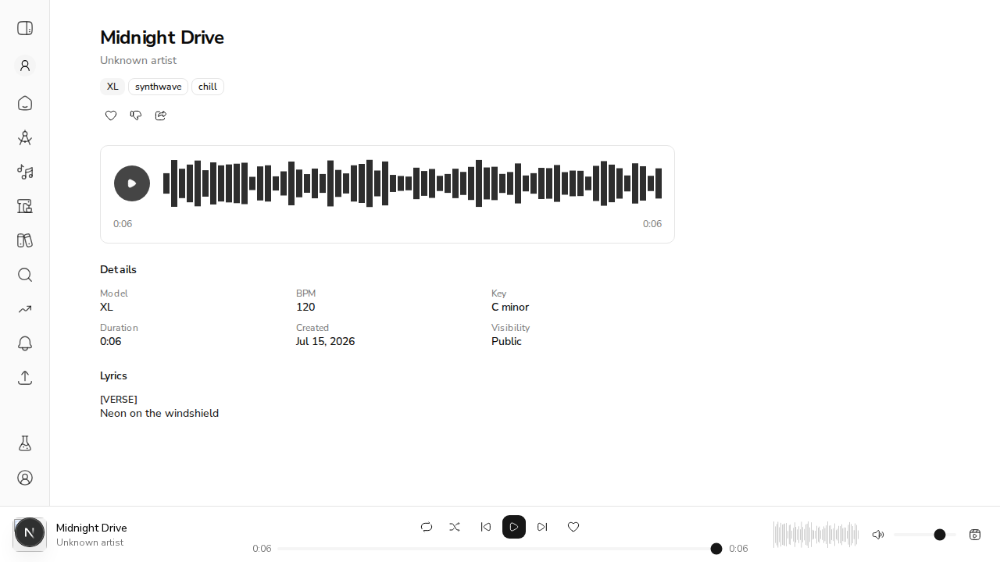
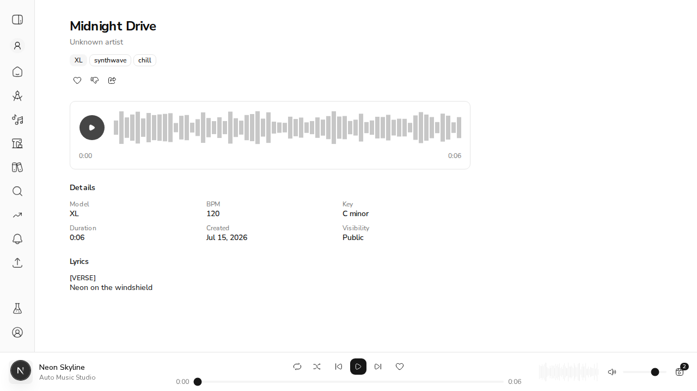
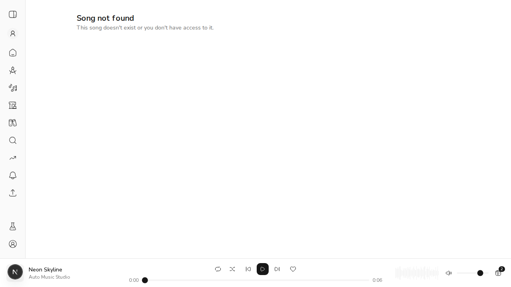
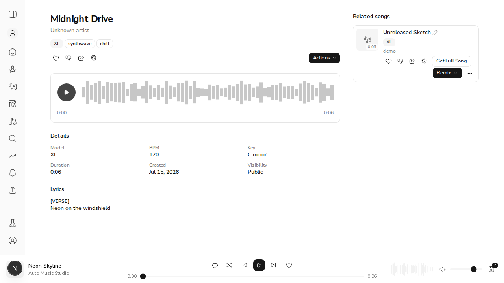

# US-20.0 — Public Song Page & Anonymous Public Read

Demo of issue #250. Every acceptance criterion below is backed by observed
outcome, not by "the page rendered" or "the test exited 0".

## Setup

A throwaway stack: API on `:8077` (Mongo on `:27018`, local storage), web on
`:3077`. Two clips seeded for one owner (no clip-ingest API exists, so they go in
via Beanie + storage):

| Clip | Visibility | Id |
|---|---|---|
| Midnight Drive | **public** | `6a570edf801c407af6acb010` |
| Unreleased Sketch | **private** | `6a570edf801c407af6acb011` |

Both carry a real 6-second WAV tone, a title, style tags, lyrics, and a
generation recipe (`seed=4242`, `inference_steps=30`).

## AC1 — A signed-out visitor opening a public clip's link sees the song page

Opened `/song/6a570edf801c407af6acb010` in a browser with **no cookies at all**
(`document.cookie` → empty). No redirect to `/login`; `location.pathname` stayed
on the song URL.



Title, style tags (`synthwave`, `chill`), Details (Model / BPM 120 / Key C minor
/ Duration / Visibility Public) and lyrics all render.

**Playable audio — actually played, not just present.** The engine builds the
`<audio>` element with `new Audio()`, so it is never in the DOM and "an element
exists" would prove nothing. Instead:

- The browser fetched `/api/clips/{id}/stream` and transferred **529,544 bytes**
  (the full WAV) with no `Authorization` header.
- After a real click on Play, the transport flipped to **Pause** and the elapsed
  time advanced **0:00 → 0:03**. Duration read `0:06`, matching the seeded tone.

Range requests work through the proxy, so seeking is real:

```
$ curl -sD- -H "Range: bytes=0-99" localhost:3077/api/clips/{id}/stream
HTTP/1.1 206 Partial Content
content-range: bytes 0-99/529244
```

## AC2 — A non-owner authenticated user can open a public clip's page

Signed in as a second account (`stranger@example.com`) via a real rotating
refresh-token session. Confirmed genuinely authenticated — the app fetched
`/api/users/me`, which it only does when it holds an access token:

```json
{ "AUTHENTICATED": true, "title": "Midnight Drive",
  "ownerControls": [], "actionsDropdown": false }
```



## AC3 — Private clips still 404 for non-owners / anonymous (no metadata leak)

Anonymous visitor opening the **private** clip's link:



Asserted the page leaks neither the title nor the lyrics:

```json
{ "notFound": true, "heading": "Song not found",
  "leaksTitle": false, "leaksLyrics": false }
```

At the API, a stranger cannot even tell the clip exists — anonymous gets an
indistinguishable 404 (not a 403):

```
$ curl -s localhost:8077/api/v1/clips/{private}/public
{"detail":"Clip not found."}    # status=404
```

## AC4 — Owner-only actions are hidden for non-owners

The same clip at the same URL, by viewer:

| Viewer | Publish toggle | Actions menu | Like / Dislike / Share |
|---|---|---|---|
| Anonymous | hidden | hidden | shown |
| Authenticated non-owner | hidden | hidden | shown |
| **Owner** | **shown** | **shown** | shown |

The owner's view — note the 4th (globe) icon and the **Actions** dropdown that
visitors don't get:



This is the load-bearing half of the check: the controls appear *only* when the
server says `is_owner`, so they are genuinely gated rather than globally absent.

## AC5 — Owner-scoped CRUD read is preserved; the public read is distinct

`GET /clips/{id}` is untouched and still 404s on another user's clip even when it
is public — `tests/test_clips_crud_api.py::TestGetClip::test_other_users_clip_returns_404_even_when_public`
passes unchanged (40/40 CRUD tests green).

The redaction is asymmetric on the same endpoint:

```
anonymous  → workspace_id: null,  seed: null,  inference_steps: null,  is_owner: false
owner      → workspace_id: "…00f", seed: 4242, inference_steps: 30,    is_owner: true
```

Neither response ever carries `user_id` — ownership travels only as `is_owner`.

## Tests

- Backend: 13 new (`TestGetClipPublic`) covering the visibility matrix,
  redaction, and rate limiting. 80/80 clips integration tests green; 1674 unit
  tests green.
- Web: 14 new BFF route tests + 7 new public-page tests. 1124/1124 green;
  typecheck, lint and `next build` all clean.

Mutation-checked the three claims that matter most — deleting the redaction,
bypassing the visibility helper, and re-introducing the `accessToken` gate in the
hook's `loading` formula each fail a test.

## Known limitations

- **Private-clip playback is still broken** (pre-existing, not a regression): an
  `<audio src>` cannot attach a Bearer token, so a private clip 404s at the
  stream endpoint. It was equally broken before this change, when `clipAudioUrl`
  pointed at a path this app never served. Fixing it needs cookie-auth on the
  proxy — its own story.
- **Cover art does not load** — `clipArtworkUrl` still builds a bare `/api/v1`
  path with no proxy route behind it. Out of scope here.
- **Authenticated non-owners lose Download** on a public clip, because the whole
  actions menu is hidden. Not a regression (the page didn't open for them at
  all before).
- `unlisted` is deferred to US-20.7 — `Clip` has no such field; that's the
  write side of visibility.
- Related songs / lineage panels are hidden for anonymous visitors: both are
  owner-scoped, authenticated reads and degrade quietly to nothing.
