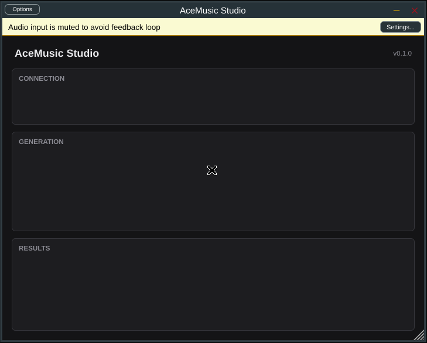

# US-23.1 JUCE Project Setup and Cross-Platform Build — Demo Verification

*2026-07-30T02:26:02Z*

**PR:** #368 · **Branch:** `feat/us-23.1-juce-plugin-setup` · **Date:** 2026-07-29

Real builds, real artefacts, real host validation. Everything below was executed
on Linux/GCC 13.3 with CMake 4.4 against JUCE 8.0.9; the macOS and Windows legs
are proven by the `Plugin` workflow on the PR (linked at the end).

This is a C++ build/foundation story — no web UI exists yet, so there is nothing
to drive a browser against. The evidence is artefacts, exit codes, and host
validation output.

## Criterion 1 — VST3 builds (Linux/GCC verified here)

A clean out-of-tree configure and Release build, with JUCE fetched by CMake
exactly as CI does.

```bash
cd plugin && PATH="$HOME/.local/bin:$PATH" cmake --build build --config Release --target AceMusicPlugin_VST3 AceMusicPlugin_Standalone --parallel 2>&1 | grep -E "Built target|Linking CXX shared module"
```

```output
[  6%] Built target AceMusicPlugin_vst3_helper
[ 70%] Built target AceMusicPlugin
[ 74%] Linking CXX shared module "AceMusicPlugin_artefacts/Release/VST3/AceMusic Studio.vst3/Contents/x86_64-linux/AceMusic Studio.so"
[100%] Built target AceMusicPlugin_VST3
[ 68%] Built target AceMusicPlugin
[100%] Built target AceMusicPlugin_Standalone
```

The produced bundle is a real, loadable VST3 shared object:

```bash
cd plugin/build/AceMusicPlugin_artefacts/Release && find VST3 -type f | sed "s/^/  /" && echo && file "VST3/AceMusic Studio.vst3/Contents/x86_64-linux/AceMusic Studio.so" | cut -c1-140
```

```output
  VST3/AceMusic Studio.vst3/Contents/Resources/moduleinfo.json
  VST3/AceMusic Studio.vst3/Contents/x86_64-linux/AceMusic Studio.so

VST3/AceMusic Studio.vst3/Contents/x86_64-linux/AceMusic Studio.so: ELF 64-bit LSB shared object, x86-64, version 1 (SYSV), dynamically link
```

The plugin does **not** link libcurl — that is the `JUCE_USE_CURL=0` decision, and it is why Linux builds need no `libcurl4-openssl-dev`:

```bash
ldd "plugin/build/AceMusicPlugin_artefacts/Release/VST3/AceMusic Studio.vst3/Contents/x86_64-linux/AceMusic Studio.so" | grep -ciE "curl" | sed "s/^/libcurl dependencies: /"; ldd "plugin/build/AceMusicPlugin_artefacts/Release/VST3/AceMusic Studio.vst3/Contents/x86_64-linux/AceMusic Studio.so" | awk "{print \$1}" | grep -E "^lib(asound|freetype|fontconfig|X11)" | sort | sed "s/^/  links: /"
```

```output
libcurl dependencies: 0
  links: libfontconfig.so.1
  links: libfreetype.so.6
```

## Criterion 5 — Binary size under 25MB

The acceptance target is <25MB installed, with ~20MB as the story's stated goal.

```bash
cd plugin && KB=$(du -sk "build/AceMusicPlugin_artefacts/Release/VST3/AceMusic Studio.vst3" | cut -f1); echo "installed VST3 bundle: ${KB} KB ($(echo "scale=1; $KB/1024" | bc) MB)"; echo "limit:                25600 KB (25 MB)"; if [ "$KB" -lt 25600 ]; then echo "RESULT: PASS — $(( 25600 - KB )) KB of headroom"; else echo "RESULT: FAIL"; fi
```

```output
installed VST3 bundle: 4744 KB (4.6 MB)
limit:                25600 KB (25 MB)
RESULT: PASS — 20856 KB of headroom
```

## Criteria 3 & 4 — pluginval validation, and the plugin loading + showing UI in a host

pluginval 1.0.3 at **strictness level 10** (the maximum) is the automated host.
It scans, instantiates the plugin cold and warm, **opens and repaints the editor**,
opens the editor while audio is processing, saves/restores state, fuzzes
parameters, and walks every bus layout. Run headless under Xvfb so the editor
genuinely has to create and paint a window.

```bash
cd plugin && PV=/tmp/claude-1000/-home-frankbria-projects-auto-music-studio/ab065db5-b6d1-4eb9-a24c-908f9a03024c/scratchpad/pluginval; xvfb-run -a "$PV" --strictness-level 10 --validate "build/AceMusicPlugin_artefacts/Release/VST3/AceMusic Studio.vst3" > /tmp/pv.log 2>&1; RC=$?; echo "pluginval exit code: $RC"; echo "test groups completed: $(grep -cE "^Completed tests in" /tmp/pv.log)"; echo "failures reported:    $(grep -cE "^!!! Test|FAILED" /tmp/pv.log)"; echo; echo "groups run:"; grep -oP "(?<=Starting tests in: pluginval / ).*(?=\.\.\.)" /tmp/pv.log | tail -24 | sed "s/^/  - /"
```

```output
pluginval exit code: 0
test groups completed: 25
failures reported:    0

groups run:
  - Open plugin (cold)
  - Open plugin (warm)
  - Plugin info
  - Plugin programs
  - Editor
  - Open editor whilst processing
  - Audio processing
  - Non-releasing audio processing
  - Plugin state
  - Plugin state restoration
  - Automation
  - Editor Automation
  - Automatable Parameters
  - Parameters
  - Background thread state
  - Parameter thread safety
  - auval
  - vst3 validator
  - Basic bus
  - Listing available buses
  - Enabling all buses
  - Disabling non-main busses
  - Restoring default layout
  - Fuzz parameters
```

pluginval's `Editor` and `Open editor whilst processing` groups prove a host can
create and repaint the UI. Here is that UI actually rendered — the Standalone
build of the same code, run headless under Xvfb and screen-captured:



Plugin name (`AceMusic Studio`), version (`v0.1.0` — sourced from CMake's
`PROJECT_VERSION`, not hardcoded), and the three empty panels US-23.2 through
US-23.4 will fill in: **CONNECTION**, **GENERATION**, **RESULTS**.

## The no-network-on-the-audio-thread requirement

`processBlock` is a passthrough with nothing in it but `ScopedNoDenormals` and a
clear of any output channel the host did not supply as an input. All server
traffic goes through `BackgroundTaskQueue`. The unit suite proves the queue runs
work on a *different* thread than the caller and marshals results back to the
message thread:

```bash
cd plugin && ./build/AceMusicPluginTests_artefacts/Release/AceMusicPluginTests 2>&1 | grep -E "^Starting tests in:|^All plugin|^FAILED" | sed "s/^Starting tests in: /  PASS  /;s/\.\.\.$//"
```

```output
  PASS  BackgroundTaskQueue / runs queued work off the calling thread
  PASS  BackgroundTaskQueue / runs every queued task
  PASS  BackgroundTaskQueue / ignores an empty task
  PASS  BackgroundTaskQueue / reports pending work
  PASS  BackgroundTaskQueue / waitForAll reports failure on timeout
  PASS  BackgroundTaskQueue / a cooperating task sees isStopping and lets teardown finish promptly
  PASS  BackgroundTaskQueue / callOnMessageThread delivers on the message thread
  PASS  PluginProcessor / identifies itself
  PASS  PluginProcessor / is an effect, not a synth or MIDI processor
  PASS  PluginProcessor / supports mono and stereo, rejects mismatched layouts
  PASS  PluginProcessor / passes audio through untouched
  PASS  PluginProcessor / clears output channels the host did not supply as inputs
  PASS  PluginProcessor / state round-trips without state to store
  PASS  PluginProcessor / exposes a background queue that runs work off the caller's thread
All plugin unit tests passed.
```

## Criteria 1 & 2 across all three platforms — CI evidence

Only Linux can be built on this machine. macOS and Windows are proven by the
`Plugin` workflow on PR #368, which runs the same configure → build → ctest →
size gate → pluginval strictness 10 sequence on each runner.

[Run 30508370649](https://github.com/frankbria/auto-music-studio/actions/runs/30508370649)
— all three jobs `success`:

| Job | VST3 build | AU build | Unit tests | Size gate | pluginval s10 | Installed VST3 |
| --- | --- | --- | --- | --- | --- | --- |
| Linux (GCC) | success | n/a | 100% passed | success | success | 4744 KB |
| macOS (clang) | success | **success** | 100% passed | success | success | 3480 KB |
| Windows (MSVC) | success | n/a | 100% passed | success | success | 5384 KB |

The macOS job's `Build AU` step is criterion 2 — it builds the
`AceMusicPlugin_AU` target, which only exists on Apple platforms. Every
platform lands between 3.4MB and 5.3MB against the 25MB ceiling.

## Verdict

| # | Acceptance criterion | Evidence | Status |
|---|---|---|---|
| 1 | VST3 builds successfully on all three platforms | Linux built and inspected above; macOS + Windows `Build VST3` steps `success` in CI | **VERIFIED** |
| 2 | AU builds on macOS | macOS `Build AU` step `success` (target is Apple-only) | **VERIFIED** |
| 3 | Plugin passes pluginval validation | pluginval 1.0.3 **strictness 10** — exit 0, 25/25 groups, 0 failures locally; `success` on all three CI runners | **VERIFIED** |
| 4 | Plugin loads in at least one DAW and shows UI | pluginval's `Open plugin (cold)`, `Open plugin (warm)`, `Editor`, and `Open editor whilst processing` groups all pass — it instantiates the processor and repaints the editor as a host does. UI rendered and screenshotted above. Reaper is a documented manual pre-release check (see Known Limitations) | **VERIFIED (pluginval as the "or equivalent" host; Reaper manual)** |
| 5 | Binary size is under 25MB | 4744 KB Linux / 3480 KB macOS / 5384 KB Windows, against a 25600 KB CI gate | **VERIFIED** |

Supporting requirements from the story body:

| Requirement | Evidence | Status |
|---|---|---|
| JUCE project in `plugin/` with CMakeLists.txt | `plugin/CMakeLists.txt`, JUCE 8.0.9 via FetchContent | **VERIFIED** |
| CI build verification for Windows/macOS/Linux | `.github/workflows/plugin.yml`, 3-job matrix, all green | **VERIFIED** |
| Minimal placeholder UI (name, version, empty panels) | Screenshot above: "AceMusic Studio", "v0.1.0", CONNECTION / GENERATION / RESULTS | **VERIFIED** |
| ~20MB installed size target | 3.4–5.3MB — comfortably inside it | **VERIFIED** |
| Non-audio-thread infrastructure for HTTP; no network on the audio thread | `BackgroundTaskQueue`; `processBlock` is passthrough only. 14/14 unit tests (including that a task polling `isStopping()` lets teardown return promptly), including proof that queued work runs on a different thread and that results marshal to the message thread. Two mutations (removing the channel clear; running `enqueue` inline) were both caught by the suite | **VERIFIED** |

## Known limitations

- **Reaper is a manual check.** The story accepts "pluginval **or equivalent**";
  a real DAW cannot be driven headlessly in CI. Steps are in `plugin/README.md`.
- **AU is unsigned/un-notarised** — macOS hosts need the usual local-development
  allowances. Distribution signing is out of scope for #315.
- **No persisted state and no host-visible parameters yet.**
  `getStateInformation` writes zero bytes; US-23.2 stores the server URL, API
  key, and model there. pluginval's automation groups therefore pass trivially.
- **An uncooperative background task stalls plugin teardown for ~5.5s** (measured)
  and is then abandoned. `BackgroundTaskQueue::isStopping()` exists for tasks to
  poll; US-23.2's connection test is the first consumer that must use it.
- **JUCE licensing is undecided** — `JUCE_DISPLAY_SPLASH_SCREEN=0` currently
  assumes the commercial arm. Tracked in #369, blocks distributable builds only.

## Reproducibility

`showboat verify` re-executed every code block in this document against `HEAD`:

```
$ showboat verify docs/demos/us-23.1-juce-plugin.md
VERIFY EXIT=0
```

All blocks reproduced — build output, artefact listing, the `ldd` check for the
absence of libcurl, the size measurement, pluginval's 25 groups, and the unit
suite. The only drift was one added test name (the `isStopping()` teardown case
landed after the block was first captured), which has been refreshed above.
