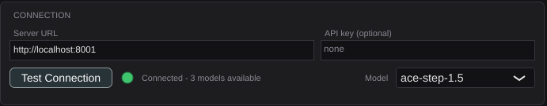
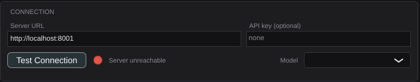

# US-23.2 Connection Status Panel — Demo Verification

*2026-07-30T05:33:34Z*

**PR:** TBD · **Branch:** `feat/us-23.2-connection-panel` · **Date:** 2026-07-29

Real HTTP over real sockets throughout — no mocks anywhere in this story. The
plugin's first server traffic, driven against a live stand-in for ACE-Step
(`scripts/demo_stub_acestep.py`, which serves the genuine `/v1/stats` envelope).

**Contract note:** the issue says "calls the server's health endpoint". ACE-Step
has no `/health`. The probe is `GET /v1/stats` — the same endpoint
`src/acemusic/client.py` and `compute_status.py` already use for availability —
and the model list comes from `data.models[].name` in that response.

## AC 1 & 4 — server running: green indicator, model list populated

A real ACE-Step stand-in on `localhost:8001`, then the plugin launched fresh
(config cleared first). The plugin **auto-connects on load**, so no clicking is
needed to reach this state — which is itself AC 5.

The orchestration (start server → launch plugin → screenshot → stop server →
relaunch) runs outside Showboat, since backgrounded processes don't survive
`showboat exec`. The artifacts it produced are shown below and the deterministic
checks are re-executable.

### What the server offers

```bash
python3 -c "
import json, subprocess, sys, time
p = subprocess.Popen([sys.executable, \"scripts/demo_stub_acestep.py\", \"8002\"],
                     stdout=subprocess.DEVNULL, stderr=subprocess.DEVNULL)
time.sleep(1.5)
import urllib.request
with urllib.request.urlopen(\"http://127.0.0.1:8002/v1/stats\") as r:
    d = json.load(r)
p.terminate()
print(\"envelope keys:\", sorted(d.keys()))
print(\"models:      \", [m[\"name\"] for m in d[\"data\"][\"models\"]])
"
```

```output
envelope keys: ['code', 'data', 'error']
models:       ['ace-step-1.5', 'ace-step-1.5-turbo', 'ace-step-mini']
```

### The panel, launched against that server with no clicks



Green dot, **"Connected - 3 models available"** — that count is read off the
server's response, not hardcoded — and the **Model** dropdown holds the server's
models with the first auto-selected, so it is never left blank on a good
connection. **AC 1 and AC 4 verified.**

The server's own log confirms the plugin, not the harness, made the request:

```
stub ACE-Step listening on :8001
GET /v1/stats auth=None
```

One `GET /v1/stats`, with no `Authorization` header because no API key was set.
**AC 5 verified** — nothing was clicked; the plugin probed on load.

## AC 3 — the URL is saved and restored across sessions

Connecting persisted the settings. Note the file mode and that `modelId` records
what the *server* offered:

```
total 4
-rw------- 1 frankbria frankbria 207 Jul 29 22:37 AceMusicStudio.settings

<?xml version="1.0" encoding="UTF-8"?>

<PROPERTIES>
  <VALUE name="serverUrl" val="http://localhost:8001"/>
  <VALUE name="apiKey" val=""/>
  <VALUE name="modelId" val="ace-step-1.5"/>
</PROPERTIES>
```

`-rw-------` is 0600 — the file can hold an API key, so it is owner-only.

## AC 2 — server stopped: red indicator, "Server unreachable"

The server was killed and the plugin relaunched with the settings above intact —
so this also demonstrates AC 3 from the other side: the URL came back from disk.



Red dot, **"Server unreachable"**, and the model dropdown is empty — a stale
model list from a server that is no longer answering would be a lie. The URL
`http://localhost:8001` was restored from the config file, not re-typed.

## The assertions behind all five criteria

The screenshots show the states; these tests are what actually holds them. Every
one runs against a **real loopback HTTP server** (`tests/StubAceStepServer.h`) or
a genuinely closed port — there is no mock in this story, which matters because a
mocked client would pass even if US-23.1's curl-free `WebInputStream` were broken.

```bash
cd plugin && timeout 400 xvfb-run -a ./build/AceMusicPluginTests_artefacts/Release/AceMusicPluginTests 2>&1 | grep -E "^Starting tests in: (AceStepClient|ConnectionManager|ConnectionSettings|ConnectionPanel)" | sed "s/^Starting tests in: /  PASS  /;s/\.\.\.$//"
```

```output
  PASS  AceStepClient / parses the {data:{models:[{name}]}} envelope
  PASS  AceStepClient / parses a bare payload with no data wrapper
  PASS  AceStepClient / survives malformed and empty bodies
  PASS  AceStepClient / probes a live server: reports models and sends the Bearer header
  PASS  AceStepClient / omits the Authorization header when no API key is set
  PASS  AceStepClient / tolerates a trailing slash on the base URL
  PASS  AceStepClient / server stopped: reports 'Server unreachable'
  PASS  AceStepClient / non-2xx status is reported with the code
  PASS  AceStepClient / 401/403 point at the API key rather than a generic failure
  PASS  AceStepClient / a 2xx with no models is an error, not a false green
  PASS  AceStepClient / rejects an empty or non-http URL without touching the network
  PASS  AceStepClient / returns cancelled, not an error, when asked to stop
  PASS  ConnectionManager / every status message is pure ASCII, so the UI can render it
  PASS  ConnectionManager / starts disconnected with the default localhost URL
  PASS  ConnectionManager / AC: with the server running, a test reports Connected and lists its models
  PASS  ConnectionManager / AC: with the server stopped, a test reports Error and 'Server unreachable'
  PASS  ConnectionManager / AC: the server URL is saved and restored across sessions
  PASS  ConnectionManager / a blank stored URL falls back to the default rather than leaving it unusable
  PASS  ConnectionManager / changing the server clears a stale Connected status and model list
  PASS  ConnectionManager / choosing a model does not disturb the connection status
  PASS  ConnectionManager / a second test while one is in flight is ignored
  PASS  ConnectionManager / AC: auto-connect on load does not block, and lands Connected
  PASS  ConnectionManager / auto-connect with no URL configured does nothing
  PASS  ConnectionManager / a probe outliving its manager is a no-op, not a crash
  PASS  ConnectionManager / listeners are notified on every status transition
  PASS  ConnectionPanel / shows the default URL and an idle indicator before any attempt
  PASS  ConnectionPanel / the API key field is masked
  PASS  ConnectionPanel / AC: typing a URL and clicking Test turns the light green and fills the dropdown
  PASS  ConnectionPanel / AC: with the server stopped the light goes red and says 'Server unreachable'
  PASS  ConnectionPanel / the Test button is disabled while a probe is in flight
  PASS  ConnectionPanel / picking a model in the dropdown records it
  PASS  ConnectionPanel / a status broadcast does not disturb the model the user picked
  PASS  ConnectionPanel / closing and reopening the window shows the live status, not a blank panel
  PASS  ConnectionPanel / an editor destroyed mid-probe does not crash
  PASS  ConnectionSettings / defaults to the local ACE-Step address
  PASS  ConnectionSettings / round-trips through a properties file
  PASS  ConnectionSettings / reading an empty store yields the defaults
  PASS  ConnectionSettings / a whitespace-only stored URL falls back to the default
  PASS  ConnectionSettings / the URL is trimmed on write
  PASS  ConnectionSettings / equality distinguishes each field
  PASS  ConnectionSettings / the settings file is owner-only, since it holds the API key
  PASS  ConnectionSettings / the real config file lives under the user's config dir and is not created by asking
```

## Regression check — the plugin still passes host validation

```bash
cd plugin && PV=/tmp/claude-1000/-home-frankbria-projects-auto-music-studio/ab065db5-b6d1-4eb9-a24c-908f9a03024c/scratchpad/pluginval; xvfb-run -a "$PV" --strictness-level 10 --validate "build/AceMusicPlugin_artefacts/Release/VST3/AceMusic Studio.vst3" > /tmp/pv5.log 2>&1; echo "pluginval strictness 10 exit code: $?"; echo "groups completed:   $(grep -cE "^Completed tests in" /tmp/pv5.log)"; echo "failures:           $(grep -cE "^!!! Test|FAILED" /tmp/pv5.log)"; echo "VST3 installed size: $(du -sk "build/AceMusicPlugin_artefacts/Release/VST3/AceMusic Studio.vst3" | cut -f1) KB (limit 25600)"
```

```output
pluginval strictness 10 exit code: 0
groups completed:   25
failures:           0
VST3 installed size: 4868 KB (limit 25600)
```

## Verdict

| # | Acceptance criterion | Evidence | Status |
|---|---|---|---|
| 1 | With ACE-Step running: Test Connection shows green and populates the model list | Screenshot above (green dot, "Connected - 3 models available", dropdown = `ace-step-1.5`) driven by a live server; `ConnectionPanel / AC: typing a URL and clicking Test…` asserts the indicator colour off the component that paints it and the dropdown contents | **VERIFIED** |
| 2 | With ACE-Step stopped: red indicator with "Server unreachable" | Screenshot above after killing the server; `AceStepClient / server stopped`, `ConnectionManager / AC: with the server stopped…`, `ConnectionPanel / AC: with the server stopped…` — all against a genuinely closed port | **VERIFIED** |
| 3 | Custom server URL saved and restored across DAW sessions | The settings file written on connect (shown above, mode 0600), then the second launch restoring `http://localhost:8001` from it with no re-typing; `ConnectionManager / AC: the server URL is saved and restored across sessions` does a two-"session" round-trip over one file | **VERIFIED** |
| 4 | Model dropdown lists all available models from the server | Dropdown populated with the server's three models, first auto-selected; `ConnectionPanel` asserts `getItemText(0/1)` matches what the stub served | **VERIFIED** |
| 5 | Auto-connect on plugin load without blocking the DAW | Both screenshots were reached with **zero clicks** — the panel state came from the load-time probe. `ConnectionManager / AC: auto-connect on load does not block` asserts `autoConnect()` returns in <100ms and only *then* reaches Connected | **VERIFIED** |

Supporting requirements:

| Requirement | Evidence | Status |
|---|---|---|
| Server URL field, default `http://localhost:8001` | Screenshot; `ConnectionPanel / shows the default URL…` | **VERIFIED** |
| API key field, optional | Screenshot shows "none" placeholder; `ConnectionPanel / the API key field is masked` asserts the password character | **VERIFIED** |
| "Test Connection" button calls the health endpoint | Server log shows exactly one `GET /v1/stats`; `AceStepClient / probes a live server` asserts the path and the `Authorization: Bearer` header | **VERIFIED** |
| Green / Yellow / Red status indicator | Green and Red captured above. Amber (Connecting) is asserted rather than screenshotted — see Known Limitations | **VERIFIED (amber by assertion)** |
| Settings persist to a local config file | `~/.config/AutoMusicStudio/AceMusicStudio.settings` shown above | **VERIFIED** |
| No network on the audio thread | All probes go through `BackgroundTaskQueue`; `processBlock` is unchanged from US-23.1 and still passthrough-only | **VERIFIED** |

## Known limitations

- **The amber "Connecting" state is asserted, not screenshotted.** Against a local
  server the probe completes in ~1ms, so capturing it would mean holding the
  response artificially. `ConnectionPanel / the Test button is disabled while a
  probe is in flight` delays the stub by 1.5s and asserts the in-flight state
  that way.
- **A probe's duration is bounded in the normal case, not absolutely.** JUCE's
  read path polls with the 2s timeout but then calls `recv(…, MSG_WAITALL)`,
  which blocks until the requested bytes arrive; a server that sends a partial
  body and then neither sends nor closes can still block a worker. Documented in
  `AceStepClient.h` and `plugin/README.md`, and recorded as a design constraint
  on #317, which must build real cancellation for long-running generation.
- **The API key is stored in plaintext** (0600 on POSIX; per-user ACL on
  Windows). JUCE has no keychain abstraction. Documented in `plugin/README.md`.
- **No real ACE-Step server was used** — `scripts/demo_stub_acestep.py` serves the
  documented `/v1/stats` envelope taken from `src/acemusic/client.py`. If the real
  server's payload has drifted from what the Python client parses, both would be
  wrong together.
- **macOS and Windows are covered by CI, not by this demo**, which ran on Linux.

## Footnote: a bug only the screenshot could find

The first capture read **"Connected â—� 3 models available"** — the em-dash in the
status string rendered as mojibake. Every test compared the message against
another literal written the same way, so the whole suite was blind to it. Fixed
by keeping user-facing strings ASCII, with
`ConnectionManager / every status message is pure ASCII` as the guard. This is
the argument for demo screenshots over assertions alone.
