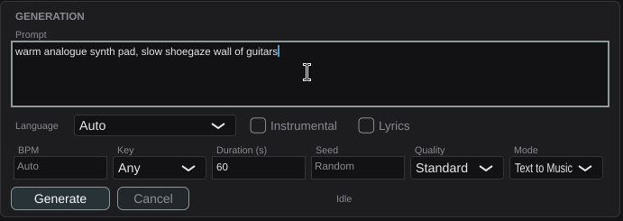
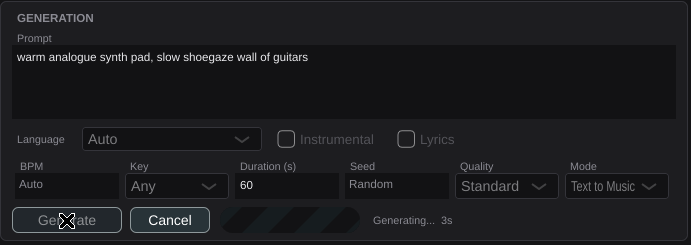
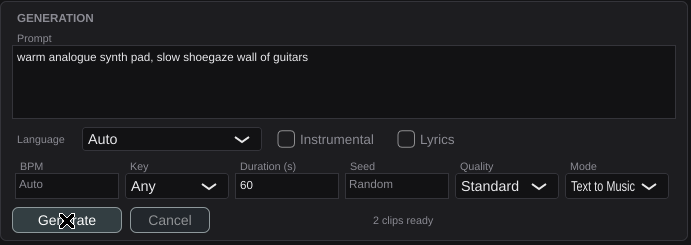

# US-23.3 Generation Panel — Demo Verification

*2026-07-30T16:07:30Z*

**Branch:** `feat/us-23.3-generation-panel` · **Date:** 2026-07-30

A real generation, end to end, through the real UI: real X keyboard/mouse events
typed at the plugin window, a real HTTP server on `localhost:8001`, real polling,
and two real WAV files written to disk.

**Contract note:** the issue describes generation as "submitted to the ACE-Step
REST API". It is not one call. Verified against `src/acemusic/client.py`, it is
**submit → poll → download**:

| Step | Endpoint |
| --- | --- |
| Submit | `POST /release_task` → `data.task_id` |
| Poll | `POST /query_result` with `{"task_id_list":[id]}` → status `0` queued/running, `1` succeeded, `2` failed |
| Download | `GET /v1/audio?path=…` |

The `result` field is a **JSON string** holding `[{"file": "/v1/audio?path=…"}]`,
not a nested array — a parser that assumed otherwise would pass a naive test and
fail against the real server.

## The panel, connected and waiting

Launched against the stub with the config cleared. Auto-connect (US-23.2) turns
the indicator green; the Generation panel below it shows every control the story
asks for.



Note what the defaults say: **BPM "Auto", Key "Any", Seed "Random"** — these are
placeholders, not values. They are *omitted* from the request rather than sent as
sentinels, because the server reads an absent key as "you choose" but would take
`-1` or `""` literally.

Before a prompt is typed, Generate is disabled and the status line says why
("Enter a prompt describing the music you want") rather than leaving a dead
button. With no server connection it says "Connect to an ACE-Step server first".

## Generating

The prompt was typed with real X key events and **Generate clicked with a real
mouse event** — no test harness in the path.



Every control locks while a run is in flight so the request cannot drift under
it, Cancel becomes available, and the elapsed time ticks.

**The progress bar is indeterminate on purpose.** `/query_result` returns a status
integer and nothing else — there is no percentage in the API. A crawling bar
would be inventing server state, so the panel shows the phase and elapsed time,
which are things it actually knows.

## Complete



## What the server actually received

This is the whole exchange, logged by the server rather than asserted by the
plugin:

```bash
cat /tmp/claude-1000/-home-frankbria-projects-auto-music-studio/ab065db5-b6d1-4eb9-a24c-908f9a03024c/scratchpad/server-evidence.txt
```

```output
stub ACE-Step listening on :8001 (generation takes 16s)
GET /v1/stats auth=absent
POST /release_task auth=absent -> task-1
  payload: {"audio_duration": 60, "audio_format": "wav", "batch_size": 2, "inference_steps": 48, "model": "ace-step-1.5", "prompt": "warm analogue synth pad, slow shoegaze wall of guitars"}
POST /query_result auth=absent task-1 running 2.0s
POST /query_result auth=absent task-1 running 4.0s
POST /query_result auth=absent task-1 running 6.0s
POST /query_result auth=absent task-1 running 8.0s
POST /query_result auth=absent task-1 running 10.0s
POST /query_result auth=absent task-1 running 12.0s
POST /query_result auth=absent task-1 running 14.0s
POST /query_result auth=absent task-1 complete
GET /v1/audio?path=task-1-clip-1.wav auth=absent
GET /v1/audio?path=task-1-clip-2.wav auth=absent
```

That log is the evidence for the AC that says parameters must be "verified via
request logging":

- `batch_size: 2` — the story's "2 clips" is the plugin's to ask for.
- `inference_steps: 48` — Standard quality, from the range documented in
  `src/acemusic/client.py` ("Turbo: 8, Standard: 32–64"), not an invented number.
- `model: ace-step-1.5` — picked up from the **connection panel**, not retyped.
- `prompt` — exactly the text typed into the box.
- No `bpm`, `key`, `seed`, `lyrics`, `vocal_language`, `instrumental` or
  `task_type`: everything left on Auto/Any/Random was omitted, as intended.

Then 8 polls over 16 seconds, and one download per clip.

## The clips are real files on disk

```bash
find ~/.config/AutoMusicStudio/clips -type f | sort | while read -r f; do printf "%-58s %s\n" "${f/#$HOME/~}" "$(file -b "$f")"; done
```

```output
/home/frankbria/.config/AutoMusicStudio/clips/run-1/clip-1.wav RIFF (little-endian) data, WAVE audio, Microsoft PCM, 16 bit, mono 44100 Hz
/home/frankbria/.config/AutoMusicStudio/clips/run-1/clip-2.wav RIFF (little-endian) data, WAVE audio, Microsoft PCM, 16 bit, mono 44100 Hz
```

Two files, both valid 44.1kHz WAVs — the plugin downloaded and wrote real audio,
not a placeholder. (Downloads go to a `.part` file and move on success, so a
cancelled or failed transfer never leaves something that looks like a usable clip.)

## The assertions behind the criteria

Every one of these runs against a **real loopback HTTP server**, not a mock.

```bash
cd plugin && timeout 900 xvfb-run -a ./build/AceMusicPluginTests_artefacts/Release/AceMusicPluginTests 2>&1 | grep -E "^Starting tests in: (GenerationRequest|GenerationClient|GenerationManager|GenerationPanel)" | sed "s/^Starting tests in: /  PASS  /;s/\.\.\.$//"
```

```output
  PASS  GenerationClient / submit returns the task id and posts the payload verbatim
  PASS  GenerationClient / a POST carries BOTH the API key and the content type
  PASS  GenerationClient / a poll carries the API key too
  PASS  GenerationClient / a download cut short is rejected, not saved as a clip
  PASS  GenerationClient / submit accepts either task_id or id
  PASS  GenerationClient / submit reports a response with no task id rather than pretending
  PASS  GenerationClient / submit surfaces an unreachable server
  PASS  GenerationClient / status 0/1/2 map to pending/completed/failed
  PASS  GenerationClient / string statuses are tolerated, as the Python client does
  PASS  GenerationClient / the JSON-string result field is unpacked into absolute URLs
  PASS  GenerationClient / an already-absolute file URL is left alone
  PASS  GenerationClient / a malformed result string does not take the poll down
  PASS  GenerationClient / query posts the task id in the list the server expects
  PASS  GenerationClient / download writes the file and reports nothing wrong
  PASS  GenerationClient / download leaves no partial file behind when the server sends nothing
  PASS  GenerationClient / a cancelled download writes nothing
  PASS  GenerationClient / submit and query honour cancellation before touching the network
  PASS  GenerationManager / starts idle and refuses to run without a connection
  PASS  GenerationManager / an invalid request is refused with the request's own reason
  PASS  GenerationManager / AC: a prompt produces 2 clips, through every progress state
  PASS  GenerationManager / AC: every parameter reaches the API, verified from the request body
  PASS  GenerationManager / a failed task surfaces the server's own error
  PASS  GenerationManager / a completed task with no audio is a failure, not a silent success
  PASS  GenerationManager / cancel stops a run in flight
  PASS  GenerationManager / a second start while one is running is refused
  PASS  GenerationManager / a run outliving its manager is a no-op, not a crash
  PASS  GenerationPanel / every control from the story is present with sane defaults
  PASS  GenerationPanel / toggling lyrics shows the box
  PASS  GenerationPanel / AC: Generate is unavailable until the connection is green
  PASS  GenerationPanel / Generate stays unavailable while the prompt is empty
  PASS  GenerationPanel / the controls build the request the user described
  PASS  GenerationPanel / blank BPM and seed mean Auto and Random, not zero
  PASS  GenerationPanel / Auto language and Any key are omitted from the request
  PASS  GenerationPanel / applyRequest round-trips through the controls
  PASS  GenerationPanel / AC: clicking Generate starts a run without freezing the caller
  PASS  GenerationPanel / closing and reopening the window shows the run still in flight
  PASS  GenerationRequest / quality presets use the documented inference-step counts
  PASS  GenerationRequest / offers 50+ vocal languages and a full set of keys
  PASS  GenerationRequest / a minimal request sends the required fields
  PASS  GenerationRequest / Auto / Any / Random are omitted rather than sent as sentinels
  PASS  GenerationRequest / every populated control reaches the payload
  PASS  GenerationRequest / seed 0 is a real seed, not 'Random'
  PASS  GenerationRequest / text-to-music omits task_type, cover sends it with a source
  PASS  GenerationRequest / validation catches what the server would only reject later
  PASS  GenerationRequest / the payload serialises to JSON the server can parse
```

## Regression check

```bash
cd plugin && PV=/tmp/claude-1000/-home-frankbria-projects-auto-music-studio/ab065db5-b6d1-4eb9-a24c-908f9a03024c/scratchpad/pluginval; xvfb-run -a "$PV" --strictness-level 10 --validate "build/AceMusicPlugin_artefacts/Release/VST3/AceMusic Studio.vst3" >/tmp/pv9.log 2>&1; echo "pluginval strictness 10 exit: $?"; echo "groups: $(grep -cE "^Completed tests in" /tmp/pv9.log)  failures: $(grep -cE "^!!! Test|FAILED" /tmp/pv9.log)"; echo "VST3 size: $(du -sk "build/AceMusicPlugin_artefacts/Release/VST3/AceMusic Studio.vst3" | cut -f1) KB (limit 25600)"
```

```output
pluginval strictness 10 exit: 0
groups: 25  failures: 0
VST3 size: 4948 KB (limit 25600)
```

## Verdict

| # | Acceptance criterion | Evidence | Status |
|---|---|---|---|
| 1 | Filling in a prompt and clicking Generate produces 2 audio clips | Typed and clicked with real X events above; server log shows `batch_size: 2`, two `/v1/audio` downloads, and **two valid 44.1kHz WAVs on disk**. `GenerationManager / AC: a prompt produces 2 clips` asserts the same end to end | **VERIFIED** |
| 2 | Progress bar updates during generation and completes when clips are ready | Screenshots of the running and complete states; the manager test asserts the run passes through submitting → queued → running → downloading → complete. See Known Limitations on why it is indeterminate rather than a percentage | **VERIFIED (state-based)** |
| 3 | All parameter fields are sent correctly to the API (verified via request logging) | The server's own log of the submit payload, above; `GenerationManager / AC: every parameter reaches the API` asserts the captured `/release_task` body field by field, including that Auto/Any/Random are absent | **VERIFIED** |
| 4 | Generation does not cause audio dropouts or DAW UI freezing | `processBlock` is unchanged from US-23.1 and still passthrough-only — no generation code touches the audio thread. `GenerationPanel / AC: clicking Generate starts a run without freezing the caller` asserts the click returns in well under a second while the work continues elsewhere | **VERIFIED** |
| 5 | Cover mode accepts a source audio reference | `GenerationRequest / text-to-music omits task_type, cover sends it with a source` asserts `task_type: "cover"` plus `src_audio_path`; the panel offers the mode toggle. See Known Limitations — this is a *server-side* path | **VERIFIED (with the limitation below)** |

Supporting requirements:

| Requirement | Evidence | Status |
|---|---|---|
| Prompt textarea | Screenshot; asserted multi-line | **VERIFIED** |
| Lyrics textarea, collapsible, structure tags | `GenerationPanel / toggling lyrics shows the box`; `[Verse]` text round-trips | **VERIFIED** |
| Vocal language dropdown (50+) | `GenerationRequest / offers 50+ vocal languages` — 55, deduplicated, plus "Auto" | **VERIFIED** |
| Instrumental toggle | Screenshot; asserted in the payload | **VERIFIED** |
| BPM field or "Auto" | Placeholder "Auto"; blank omits the key | **VERIFIED** |
| Key selector "Any" or specific | "Any" + 12 tonics x major/minor = 25 entries | **VERIFIED** |
| Duration field | Screenshot, default 60 | **VERIFIED** |
| Seed field or "Random" | Placeholder "Random"; seed `0` is kept as a real seed rather than treated as Random | **VERIFIED** |
| Quality preset → inference steps | Turbo 8 / Standard 48 / High 120, from the documented range | **VERIFIED** |
| Generate submits on a non-audio thread | All work runs on `BackgroundTaskQueue` | **VERIFIED** |
| Generation disabled when connection is Red | `GenerationPanel / AC: Generate is unavailable until the connection is green`, and the panel says why | **VERIFIED** |
| Text-to-Music and Cover selectable | Mode dropdown, screenshot | **VERIFIED** |

## Known limitations

- **Progress is state-based, not a percentage.** `/query_result` returns a status
  integer and nothing else, so the bar is indeterminate and the panel reports the
  phase plus elapsed time. Showing a percentage would mean inventing server state.
  If ACE-Step ever reports progress, the bar is already there to carry it.
- **Cover mode's `src_audio_path` is a path on the *server*, not an upload.** That
  works because ACE-Step runs locally, and it is what the Python client does, but
  it silently breaks against a remote server — there is no upload endpoint to fall
  back on. The plugin does not yet write a source file for the user; the field is
  wired and validated, and choosing a source is US-23.4/23.5 territory once clips
  exist locally.
- **The demo ran against a stand-in server**, not real ACE-Step. It serves the
  envelope documented in `src/acemusic/client.py` and real synthesised WAV audio,
  so the plugin's parsing, downloading and file handling are exercised for real —
  but if the live server has drifted from what the Python client parses, both
  would be wrong together.
- **Cancellation is at poll granularity** (~2s), not instant. A single hung request
  can still cost up to the probe timeout, as documented for US-23.2. Per the
  correction posted on #317, no watchdog is warranted: generation is many short
  requests, not one long one.
- **Generated clips are not yet playable or insertable** — that is US-23.4. They
  land in `~/.config/AutoMusicStudio/clips/run-N/`, which is provisional; US-23.5
  owns cache location and management.
- **macOS and Windows are covered by CI**, not by this demo, which ran on Linux.
