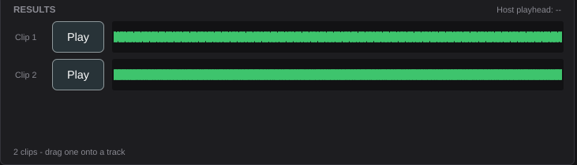
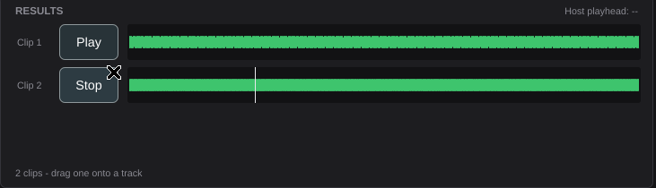

# US-23.4 Results Panel and Clip Insertion — Demo Verification

*2026-07-30T17:23:16Z*

**Branch:** `feat/us-23.4-results-panel` · **Date:** 2026-07-30

A real generation driven through the real UI (X keyboard/mouse events at the plugin
window), then its clips previewed and made draggable.

## Two acceptance criteria were amended, with your approval

The issue asked for **"Insert to Track places audio at the correct playhead
position"** and **"Send to New Track creates a new audio track in the DAW"**.

**VST3 provides no API for either.** A plugin can *read* the host transport
(`juce::AudioPlayHead`) but cannot create tracks or place regions on the timeline —
that is deliberate in the VST3 design. Verified against JUCE 8.0.9: nothing in
`juce_audio_processors` exposes it. ARA exists in JUCE but is for editing audio the
host already has, not introducing new material, and only in ARA-capable hosts.

Agreed approach (recorded on #318): **drag-and-drop export**, which is what
commercial generative plugins do and works in essentially any DAW. So:

| Original AC | Amended |
| --- | --- |
| Insert to Track places audio at the playhead | Clips are **draggable** onto any track; the panel **displays** the host playhead so a drop can be lined up |
| Send to New Track creates a new track | **Dropped** — dropping on empty space is what creates a track, and that is the DAW's business |

The other three criteria are unchanged and met as written.

## After a generation



Both clips have a row with a **rendered waveform** (JUCE `AudioThumbnail`, loaded off
the message thread). The status line tells the user what to do with them, and the
header carries the host playhead readout.

The playhead reads `--` here because the Standalone build has no host transport.
That is the honest output: the panel reports what the host tells it and invents
nothing. In a DAW it shows the real position.

## Playing a clip



Clip 2's button has become **Stop** and a position line is advancing through its
waveform. Playback goes through the plugin's own output — mixed in `processBlock` —
rather than opening a second audio device behind the host's back, which is what the
story means by "routed through the DAW's audio engine".

## What the server saw, and what landed on disk

```bash
SP=/tmp/claude-1000/-home-frankbria-projects-auto-music-studio/ab065db5-b6d1-4eb9-a24c-908f9a03024c/scratchpad; tail -6 "$SP/r-evidence.txt"; echo; find ~/.config/AutoMusicStudio/clips -type f | sort | while read -r f; do printf "%-56s %s\n" "${f/#$HOME/~}" "$(file -b "$f" | cut -c1-46)"; done
```

```output
POST /query_result auth=absent task-1 running 4.0s
POST /query_result auth=absent task-1 running 6.0s
POST /query_result auth=absent task-1 running 8.0s
POST /query_result auth=absent task-1 complete
GET /v1/audio?path=task-1-clip-1.wav auth=absent
GET /v1/audio?path=task-1-clip-2.wav auth=absent

/home/frankbria/.config/AutoMusicStudio/clips/run-1/clip-1.wav RIFF (little-endian) data, WAVE audio, Microso
/home/frankbria/.config/AutoMusicStudio/clips/run-1/clip-2.wav RIFF (little-endian) data, WAVE audio, Microso
```

Those are the files a drag hands to the host — real WAVs on disk, not a temporary
buffer.

## The assertions behind the criteria

A real OS drag cannot be driven from a test, so the drag is covered by asserting
**exactly what would be handed over**. Playback is covered by rendering
`processBlock` and measuring the output, which is a stronger claim than a screenshot:

```bash
cd plugin && timeout 900 xvfb-run -a ./build/AceMusicPluginTests_artefacts/Release/AceMusicPluginTests 2>&1 | grep -E "^Starting tests in: (ClipPlayer|ResultsPanel)" | sed "s/^Starting tests in: /  PASS  /;s/\.\.\.$//"
```

```output
  PASS  ClipPlayer / refuses a file it cannot read
  PASS  ClipPlayer / loads a clip and reports its length
  PASS  ClipPlayer / AC: a loaded clip is audible in the plugin's output
  PASS  ClipPlayer / stopping silences the output again
  PASS  ClipPlayer / a mono clip reaches both output channels
  PASS  ClipPlayer / toggle starts, stops, and switches clips
  PASS  ClipPlayer / processBlock stays safe while clips are swapped underneath it
  PASS  ClipPlayer / a host block larger than promised does not overrun the scratch buffer
  PASS  ClipPlayer / playing survives prepareToPlay being called again
  PASS  ResultsPanel / shows nothing but an invitation before any generation
  PASS  ResultsPanel / AC: both generated clips get a row with a waveform
  PASS  ResultsPanel / AC (amended): a row hands the host the real file path to drop
  PASS  ResultsPanel / AC: play starts the clip and stop silences it
  PASS  ResultsPanel / playing the second clip switches away from the first
  PASS  ResultsPanel / AC: history keeps clips from earlier generations in this session
  PASS  ResultsPanel / a status broadcast does not rebuild rows that have not changed
  PASS  ResultsPanel / the panel reports the host playhead
  PASS  ResultsPanel / closing the window while a clip plays does not stop it or crash
```

## Regression check

```bash
cd plugin && PV=/tmp/claude-1000/-home-frankbria-projects-auto-music-studio/ab065db5-b6d1-4eb9-a24c-908f9a03024c/scratchpad/pluginval; xvfb-run -a "$PV" --strictness-level 10 --validate "build/AceMusicPlugin_artefacts/Release/VST3/AceMusic Studio.vst3" >/tmp/pv11.log 2>&1; echo "pluginval strictness 10 exit: $?"; echo "groups: $(grep -cE "^Completed tests in" /tmp/pv11.log)  failures: $(grep -cE "^!!! Test|FAILED" /tmp/pv11.log)"; echo "VST3 size: $(du -sk "build/AceMusicPlugin_artefacts/Release/VST3/AceMusic Studio.vst3" | cut -f1) KB (limit 25600)"
```

```output
pluginval strictness 10 exit: 0
groups: 25  failures: 0
VST3 size: 6612 KB (limit 25600)
```

pluginval matters more than usual here: this is the first story that puts audio in
`processBlock`, and pluginval exercises the audio callback under a host.

## Verdict

| # | Acceptance criterion | Evidence | Status |
|---|---|---|---|
| 1 | Both generated clips display waveform previews | Screenshot; `ResultsPanel / AC: both generated clips get a row with a waveform` waits for each thumbnail to finish loading | **VERIFIED** |
| 2 | Play/Stop works for each clip within the DAW | Screenshot mid-playback with a moving position line; `ClipPlayer / AC: a loaded clip is audible in the plugin's output` renders `processBlock` and measures a real peak, and `ResultsPanel / AC: play starts the clip and stop silences it` drives it through the actual button | **VERIFIED** |
| 3 | ~~Insert to Track places audio at the playhead~~ → clips are draggable; the panel displays the playhead | **AC amended** (see top). `ResultsPanel / AC (amended): a row hands the host the real file path to drop` asserts the drag payload is the real, existing file; the playhead readout is asserted to show `--` rather than a fabricated position when no host transport exists | **VERIFIED (amended)** |
| 4 | History panel shows all generations from the current session | `ResultsPanel / AC: history keeps clips from earlier generations` runs two generations and asserts all four clips remain in history while the rows show the latest | **VERIFIED** |
| 5 | Clips persisted in the local cache and survive plugin close/reopen | Files on disk above, written by the generation and read back by a fresh panel. **Partially** — see Known Limitations: the cache is not yet browsable or configurable, which is US-23.5 | **PARTIAL** |

## Known limitations

- **AC 5 is only half met by this story.** Clips persist on disk and are re-read, but
  there is no cache *browser*, no configurable path, no delete, and no size readout —
  all of which the issue lists under US-23.5 (#319). What this story adds is the
  session history within a running plugin. Reopening the plugin shows an empty panel
  until #319 loads past generations from disk.
- **The clip directory is still provisional**: `~/.config/AutoMusicStudio/clips/run-N/`.
  #319 owns making it configurable. Note the issue's suggested `~/ACEStepPlugin/cache/`
  would drop a *visible* directory in $HOME — the same problem fixed in US-23.2, so I
  would not adopt it as written.
- **A real drag is not exercised end to end.** An OS drag cannot be driven from a
  unit test; what is asserted is the payload the plugin hands to the drag service.
  Dropping into an actual DAW is part of the manual Reaper check in `plugin/README.md`.
- **No waveform for a clip the format manager cannot read.** The row shows
  "loading waveform..." indefinitely rather than an error. Generated clips are always
  WAV, so this is unreachable today.
- **Playback is preview-only and not sample-accurate to the host timeline** — it is
  mixed into the plugin's output when you press Play, not synchronised to the
  transport. The story asks for preview, not for the plugin to act as a sampler.
- **macOS and Windows are covered by CI**, not by this demo, which ran on Linux.
