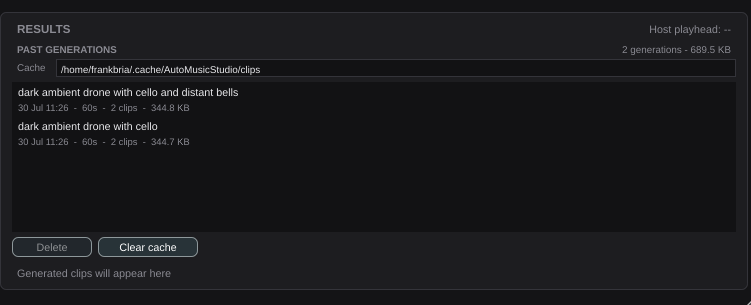

# US-23.5 Local Cache and File Management — Demo Verification

*2026-07-30T18:27:13Z*

**Branch:** `feat/us-23.5-clip-cache` · **Date:** 2026-07-30

Two generations driven through the real UI, the plugin **closed and reopened**, and
the past generations still there — which is the acceptance criterion US-23.4 could
only mark PARTIAL.



Newest first. Each row carries the prompt it was generated from, when, how long, how
many clips and how big. The header reports **2 generations - 689.5 KB**, and the
cache path is editable in place.

## One decision that departs from the issue

The issue specifies `~/ACEStepPlugin/cache/` as the default. **I did not use it.**
JUCE resolves a bare folder name under `$HOME` on Linux, so that path drops a
*visible* directory into the user's home — the same bug fixed for the settings file
in US-23.2. The default is the platform cache tree instead
(`~/.cache/AutoMusicStudio/clips` on Linux), which is also the correct place for
regenerable data. The path remains configurable, as the requirement asks.

## What is on disk

```bash
echo "cache root: ~/.cache/AutoMusicStudio/clips"; echo; ls -1 ~/.cache/AutoMusicStudio/clips; echo; echo "--- one run ---"; d=$(ls -1d ~/.cache/AutoMusicStudio/clips/*/ | head -1); ls -1 "$d"; echo; echo "--- its metadata ---"; python3 -m json.tool "$d/meta.json"
```

```output
cache root: ~/.cache/AutoMusicStudio/clips

20260730-112604-run1
20260730-112620-run2

--- one run ---
clip-1.wav
clip-2.wav
meta.json

--- its metadata ---
{
    "prompt": "dark ambient drone with cello",
    "model": "ace-step-1.5",
    "durationSeconds": 60.0,
    "createdAtMs": 1785435964924
}
```

Run directories are **timestamped**, not `run-1`/`run-2`. The run counter restarts
with the plugin, so a bare index would have had the first generation of a new session
overwrite the first of the last one.

The `meta.json` sidecar exists because the audio files carry none of what the browser
must show — a WAV header has no prompt. A run whose sidecar is missing or corrupt
still lists, labelled `(no description recorded)`: losing a whole generation because
its metadata went missing would be worse than showing it without a prompt.

## The assertions

```bash
cd plugin && timeout 900 xvfb-run -a ./build/AceMusicPluginTests_artefacts/Release/AceMusicPluginTests 2>&1 | grep -E "^Starting tests in: (ClipCache|ResultsPanel / AC|ResultsPanel / deleting|ResultsPanel / delete)" | sed "s/^Starting tests in: /  PASS  /;s/\.\.\.$//"
```

```output
  PASS  ClipCache / the default is a hidden cache location, not a visible home folder
  PASS  ClipCache / AC: a custom cache path is respected, and clearing it restores the default
  PASS  ClipCache / an empty cache lists nothing and reports zero
  PASS  ClipCache / AC: the browser lists runs with the metadata they were made with
  PASS  ClipCache / a run without a sidecar still lists rather than disappearing
  PASS  ClipCache / a corrupt sidecar does not take the whole listing down
  PASS  ClipCache / a directory with no audio is not listed as a generation
  PASS  ClipCache / runs come back newest first
  PASS  ClipCache / AC: the reported size matches what is actually on disk
  PASS  ClipCache / AC: deleting a run removes it from disk and from the listing
  PASS  ClipCache / delete refuses a directory outside the cache
  PASS  ClipCache / clearing removes every run
  PASS  ClipCache / an unusable cache path is reported rather than silently empty
  PASS  ClipCache / metadata round-trips through the sidecar exactly
  PASS  ResultsPanel / AC: both generated clips get a row with a waveform
  PASS  ResultsPanel / AC (amended): a row hands the host the real file path to drop
  PASS  ResultsPanel / AC: play starts the clip and stop silences it
  PASS  ResultsPanel / AC: history keeps clips from earlier generations in this session
  PASS  ResultsPanel / AC: the browser lists past generations with their metadata
  PASS  ResultsPanel / AC: deleting from the browser removes it from disk and the list
  PASS  ResultsPanel / deleting the generation that is playing stops it first
  PASS  ResultsPanel / AC: a custom cache path typed into the panel is honoured
  PASS  ResultsPanel / delete does nothing with no selection
```

## The bug this demo found

The first attempt at this demo generated twice, then showed **"0 generations - 0
bytes"** on reopen. The clips were genuinely gone.

Cause: the generation tests' cleanup helper called `deleteRecursively()` on
`ClipCache::getDefaultDirectory()` — the **user's real cache**. Running the test suite
destroyed whatever was there. It had been doing that since US-23.3 wrote its first
clips, and nothing failed because nothing was checking.

Both suites now point the cache at a throwaway directory. Verified with a canary
rather than by inspection:

```bash
mkdir -p ~/.cache/AutoMusicStudio/clips/canary-run && echo CANARY > ~/.cache/AutoMusicStudio/clips/canary-run/marker.txt
echo "before the suite: $(ls ~/.cache/AutoMusicStudio/clips | tr "\n" " ")"
cd plugin && timeout 900 xvfb-run -a ./build/AceMusicPluginTests_artefacts/Release/AceMusicPluginTests 2>&1 | tail -1
cd ..
echo "after the suite:  $(ls ~/.cache/AutoMusicStudio/clips 2>/dev/null | tr "\n" " ")"
echo "canary contents:  $(cat ~/.cache/AutoMusicStudio/clips/canary-run/marker.txt 2>/dev/null || echo GONE)"
rm -rf ~/.cache/AutoMusicStudio/clips/canary-run
```

```output
before the suite: 20260730-112604-run1 20260730-112620-run2 canary-run 
All plugin unit tests passed.
after the suite:  20260730-112604-run1 20260730-112620-run2 canary-run 
canary contents:  CANARY
```

## Regression check

```bash
cd plugin && PV=/tmp/claude-1000/-home-frankbria-projects-auto-music-studio/ab065db5-b6d1-4eb9-a24c-908f9a03024c/scratchpad/pluginval; xvfb-run -a "$PV" --strictness-level 10 --validate "build/AceMusicPlugin_artefacts/Release/VST3/AceMusic Studio.vst3" >/tmp/pv12.log 2>&1; echo "pluginval strictness 10 exit: $?"; echo "groups: $(grep -cE "^Completed tests in" /tmp/pv12.log)  failures: $(grep -cE "^!!! Test|FAILED" /tmp/pv12.log)"; echo "VST3 size: $(du -sk "build/AceMusicPlugin_artefacts/Release/VST3/AceMusic Studio.vst3" | cut -f1) KB (limit 25600)"
```

```output
pluginval strictness 10 exit: 0
groups: 25  failures: 0
VST3 size: 6756 KB (limit 25600)
```

## Verdict

| # | Acceptance criterion | Evidence | Status |
|---|---|---|---|
| 1 | Generated clips appear in the cache directory after generation | Two runs on disk above, written by real generations, in the **configured** directory | **VERIFIED** |
| 2 | Cache browser lists clips with correct metadata | Screenshot after reopening: prompt, date, duration, clip count, size, newest first. `ClipCache / AC: the browser lists runs with the metadata they were made with` and the panel-level equivalent | **VERIFIED** |
| 3 | Deleting a cached clip removes it from disk and the browser | `ClipCache / AC: deleting a run removes it from disk and from the listing` and `ResultsPanel / AC: deleting from the browser...` assert both halves; deleting the generation that is playing stops it first | **VERIFIED** |
| 4 | Custom cache path is respected after configuration change | `ClipCache / AC: a custom cache path is respected` (including across a fresh cache over the same settings) and `ResultsPanel / AC: a custom cache path typed into the panel is honoured` | **VERIFIED** |
| 5 | Cache size is reported accurately | `ClipCache / AC: the reported size matches what is actually on disk` compares against a real byte count, not a fixture constant | **VERIFIED** |

This also completes **US-23.4's AC 5**, which that story could only mark PARTIAL:
clips now survive plugin close/reopen *and are browsable*.

## Known limitations

- **The cache is unbounded.** Nothing evicts old generations; the user clears them.
  A size cap or age-based eviction would be the obvious next step, but the issue asks
  for delete and clear, which is what is here.
- **No confirmation prompt on Clear cache.** It deletes every generation immediately.
  A modal in a plugin window is its own can of worms (see the JUCE guidance on modal
  loops in hosts), and the issue does not ask for one — but it is a sharp edge worth
  naming.
- **The browser lists runs, not individual clips.** Deleting removes a whole
  generation, since that is the unit the plugin creates and the unit the metadata
  describes. The issue's wording (delete
