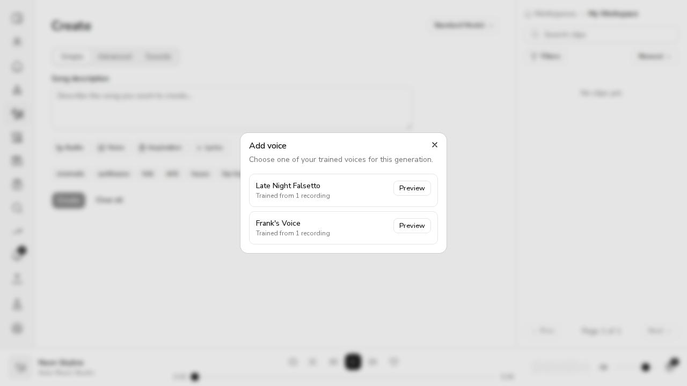
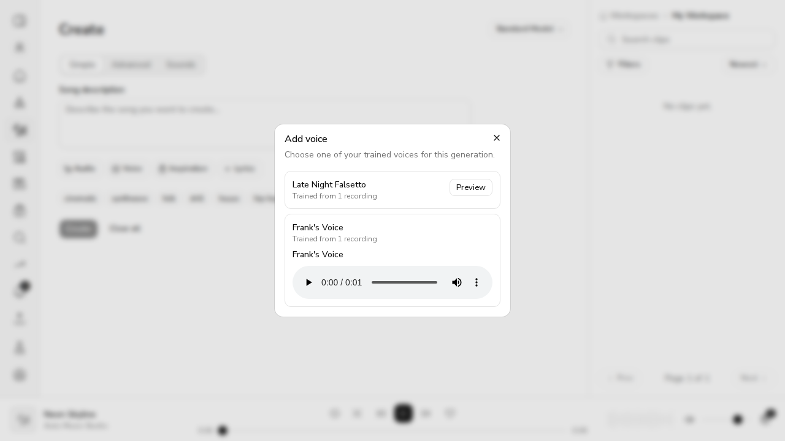
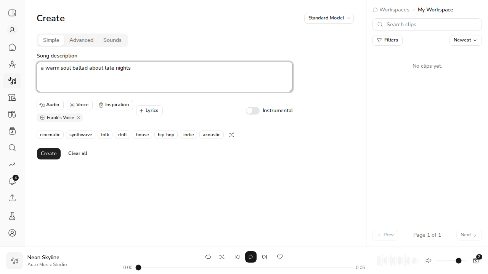
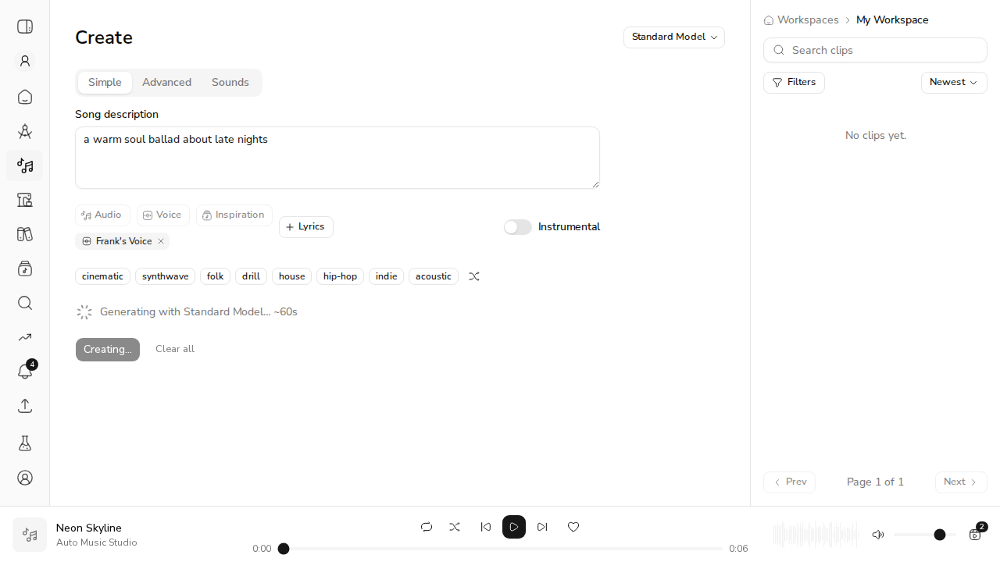

# US-25.4: Voice Selection in Creation Modes

*2026-08-04T05:59:57Z*

A musician who has trained a voice (US-25.1–25.3) can now attach it to a generation in every creation mode, and the generation sings in it.

Five acceptance criteria to show:

1. the voice selection modal appears and lists all trained voices
2. selecting a voice and generating produces audio with the custom vocal timbre
3. voice selection works in all five creation modes
4. removing the voice selection reverts to the default model voice
5. generation without a custom voice works as before

**One honest caveat up front**: there is no ACE-Step GPU host on this machine, so AC2 is shown as far as it can be — the adapter is loaded on the host before the task is submitted and held until it completes — not by listening to the rendered audio. Everything else is real: real MongoDB, real auth tokens, real credit balances, real HTTP.

## The constraint that shaped the design

ACE-Step LoRA is **global handler state**, not a per-task parameter. Its `/release_task` request model has no `lora_path` field, so whichever adapter is loaded conditions every task the host runs. Here is that model, in ACE-Step’s own source:

```bash
grep -c "lora" /home/frankbria/projects/ACE-Step-1.5/acestep/api/http/release_task_models.py; echo "^ occurrences of lora in the release_task request model"
```

```output
0
^ occurrences of lora in the release_task request model
```

Zero. The only way to apply a voice is `POST /v1/lora/load`, which changes the whole host:

```bash
sed -n "56,60p;83,86p" /home/frankbria/projects/ACE-Step-1.5/acestep/api/http/lora_routes.py
```

```output
    wrap_response: Callable[..., Dict[str, Any]],
) -> None:
    """Register LoRA lifecycle endpoints on the provided FastAPI app."""

    @app.post("/v1/lora/load")
    @app.post("/v1/lora/unload")
    async def unload_lora_endpoint(_: None = Depends(verify_api_key)):
        """Unload LoRA adapter and restore base model."""

```

So loading a voice for one job would have put it into anyone else’s job running alongside it. `src/acemusic/api/tasks/voice_adapter.py` exists to own that state.

## What the ACE-Step host is actually told, and when

This drives the real `_AdapterState` against a stub host that records every call.

```bash
uv run python tasks/demo_us_25_4_adapter.py 2>&1
```

```output
== One musician generates twice with the same voice, then once without ==
  song 1 starts   (voice: ./lora/arias-voice/adapter)
  song 1 finishes
  song 2 starts   (voice: ./lora/arias-voice/adapter)
  song 2 finishes
  song 3 starts   (voice: the base model)
  song 3 finishes

  What the ACE-Step host was told:
    POST /v1/lora/load  lora_path=./lora/arias-voice/adapter
    POST /v1/lora/unload

  The adapter is loaded once, not per song, and unloaded when the voice is removed.

== Three generations at once, two of them different voices ==
  Aria's cover             live now: ['./lora/arias-voice/adapter']
  a plain generation       live now: ['base']
  Rex's extend             live now: ['./lora/rexs-voice/adapter']

  What the ACE-Step host was told:
    POST /v1/lora/load  lora_path=./lora/arias-voice/adapter
    POST /v1/lora/unload
    POST /v1/lora/load  lora_path=./lora/rexs-voice/adapter

  Never more than one voice live at a time — the point of the whole module.

== Three generations at once, all on the same voice ==
  peak concurrent generations: 3   LoRA calls made: 1
  A voice costs no throughput once it is loaded.

== A deployment that trains no voices ==
  five plain generations → 0 LoRA calls
```

That is AC2 as far as this machine can carry it: when a job names a voice, that adapter is loaded on the host **before** the task is submitted and stays loaded until the task completes — and no other voice can be live in that window. It is also AC5: a deployment that trains no voices makes zero LoRA calls, so nothing about plain generation changed.

The last block is worth dwelling on. Serializing all generation would have been the easy answer and would have quietly halved throughput; instead only an adapter *change* is exclusive, so three songs on one voice still run three-at-a-time.

## AC1, AC3, AC4 at the API

Real FastAPI app, real MongoDB, real bearer tokens, real credit balances.

```bash
ACEMUSIC_STORAGE_BACKEND=local ACEMUSIC_STORAGE_LOCAL_ROOT=/tmp/claude-1000/-home-frankbria-projects-auto-music-studio/e9e3c62d-a729-4893-b40e-b671581d939c/scratchpad/demo-storage uv run python tasks/demo_us_25_4.py 2>/dev/null
```

```output

== AC1: the library the modal lists ==
  Half-Trained         status=training  references=1
  Frank's Voice        status=ready     references=1
  (the other user's 'Not Yours' is absent: every read is owner-scoped)

== AC1: a reference recording to listen to ==
  owner  → 200 audio/wav 36 bytes
  anyone else → 404 Voice model preview not found.

== AC2 + AC3: the voice reaches the job, in all five modes ==
  Simple  (POST /generate)   → 202  job.voice_model_id=6a717fff153f38babe3bcf1e  compute=local
  Advanced (POST /generate)  → 202  job.voice_model_id=6a717fff153f38babe3bcf1e  compute=local
  Cover                      → 202  job.voice_model_id=6a717fff153f38babe3bcf1e  compute=None
  Add Vocal                  → 202  job.voice_model_id=6a717fff153f38babe3bcf1e  compute=None
  Extend                     → 202  job.voice_model_id=6a717fff153f38babe3bcf1e  compute=None

== AC4: removing the voice reverts to the model's own ==
  no voice_model_id sent      → 202  'voice_model_id' in job params: False

== A voice you cannot use is refused, and costs nothing ==
  someone else's voice                           → 404  {"detail":"Voice model not found."}
  a voice that no longer exists                  → 404  {"detail":"Voice model not found."}
  a voice still training                         → 409  {"detail":"Voice model 'Half-Trained' is not ready to use yet."}
  credits before these three refusals: 44.0   after: 44.0
```

All five modes carry the voice to the job (AC3), sending no voice leaves the field absent so the model uses its own (AC4), and the library only ever shows the caller their own voices (AC1).

Three details worth naming:

- `compute=local` on the two `/generate` rows is not a coincidence. The adapter is a file on the **local** ACE-Step host, so a request that names a voice is pinned there rather than being silently dropped by a remote backend. (The iterative endpoints have no compute target at all — they have always run locally.)
- "someone else’s voice" and "a voice that no longer exists" return the *same* 404. Telling them apart would confirm that another user’s voice exists.
- Credits: 44.0 before those three refusals, 44.0 after. Every one of them is checked before the balance is touched.

## The Add Voice modal, in a browser

Full local stack: this API on :8399, the Next.js app on :3399, a real authenticated session. The seeded library has two ready voices and one still training.

## AC1: the modal, in a browser

Full local stack — this API on :8399, the Next.js app on :3399, a real authenticated session restored from an `ams_refresh_token` cookie. The seeded library holds two ready voices and one still training.

```bash {image}
agent-browser screenshot us254-modal.png >/dev/null && echo us254-modal.png
```



Two ready voices, and the one still training is absent — the backend would refuse it, so offering it would only be a dead end.

Clicking **Preview** fetches a reference recording through the token-forwarding BFF route and drops it into an audio player. A trained LoRA has no renderable sample of its own, and rendering one would cost a GPU run per browse, so what you hear is the recording the voice was trained from.

```bash {image}
agent-browser screenshot /home/frankbria/projects/auto-music-studio/docs/demos/us254-preview.png >/dev/null && echo us254-preview.png
```



## AC3 + AC4: the chip

Selecting a voice closes the modal and shows it as a removable chip on the form. This is the same `AudioInputs` chip row the Simple and Advanced tabs already shared, so both modes get the voice from one place.

```bash {image}
agent-browser screenshot /home/frankbria/projects/auto-music-studio/docs/demos/us254-chip.png >/dev/null && echo us254-chip.png
```



```bash {image}
agent-browser screenshot /home/frankbria/projects/auto-music-studio/docs/demos/us254-generating.png >/dev/null && echo us254-generating.png
```



Pressing **Create** with that chip attached produces a job carrying the voice — read straight out of MongoDB, not from the UI’s own claim:

```bash
uv run python -c "
import asyncio, sys
sys.path.insert(0, \"src\")
from acemusic.api.database import init_db, close_db
from acemusic.api.models import Job
from acemusic.api.settings import ApiSettings
S = ApiSettings(mongodb_url=\"mongodb://127.0.0.1:27017\", mongodb_db_name=\"acemusic_demo_web254\", jwt_secret_key=\"demo-web-secret-at-least-32-bytes-long-x\")
async def m():
    await init_db(S)
    for j in await Job.find_all().sort(\"-created_at\").limit(1).to_list():
        print(f\"job_type={j.job_type}  compute_target={j.compute_target}\")
        print(f\"voice_model_id={j.input_params.get(chr(118)+chr(111)+chr(105)+chr(99)+chr(101)+chr(95)+chr(109)+chr(111)+chr(100)+chr(101)+chr(108)+chr(95)+chr(105)+chr(100))}\")
        print(f\"prompt={j.input_params.get(chr(112)+chr(114)+chr(111)+chr(109)+chr(112)+chr(116))!r}\")
    await close_db()
asyncio.run(m())" 2>/dev/null
```

```output
job_type=generate  compute_target=local
voice_model_id=6a717faedc50713ef66a72d0
prompt='a warm soul ballad about late nights'
```

## AC4: removing the voice reverts to the default

Removing the chip and generating again, from the same form, produces a job with no voice at all. Both jobs, side by side, straight out of MongoDB:

```bash
uv run python -c "
import asyncio, sys
sys.path.insert(0, \"src\")
from acemusic.api.database import init_db, close_db
from acemusic.api.models import Job
from acemusic.api.settings import ApiSettings
S = ApiSettings(mongodb_url=\"mongodb://127.0.0.1:27017\", mongodb_db_name=\"acemusic_demo_web254\", jwt_secret_key=\"demo-web-secret-at-least-32-bytes-long-x\")
P, V = chr(112)+chr(114)+chr(111)+chr(109)+chr(112)+chr(116), chr(118)+chr(111)+chr(105)+chr(99)+chr(101)+chr(95)+chr(109)+chr(111)+chr(100)+chr(101)+chr(108)+chr(95)+chr(105)+chr(100)
async def m():
    await init_db(S)
    for j in reversed(await Job.find_all().sort(chr(45)+chr(99)+chr(114)+chr(101)+chr(97)+chr(116)+chr(101)+chr(100)+chr(95)+chr(97)+chr(116)).limit(2).to_list()):
        print(f\"{j.input_params.get(P)!r:45} voice={j.input_params.get(V)}  compute={j.compute_target}\")
    await close_db()
asyncio.run(m())" 2>/dev/null
```

```output
'a warm soul ballad about late nights'        voice=6a717faedc50713ef66a72d0  compute=local
'the same ballad, no custom voice'            voice=None  compute=local
```

Same form, same session, one field apart.

## Cover, Add Vocal and Extend

Those three are clip-scoped modals rather than the creation page, so they get the same capability through a small `VoiceField` — an Add voice button that becomes the same removable chip. The API-level run above already showed all three carrying `voice_model_id` to their jobs; here is the control itself, from the component tests:

```bash
cd /home/frankbria/projects/auto-music-studio/web && npx vitest run components/song/modals/CoverModal.test.tsx components/song/modals/AddVocalModal.test.tsx components/song/modals/ExtendModal.test.tsx components/create/modals/AddVoiceModal.test.tsx --reporter=verbose 2>&1 | grep -E "✓|×" | head -40
```

```output
 ✓ components/create/modals/AddVoiceModal.test.tsx > AddVoiceModal > lists the musician's trained voices 99ms
 ✓ components/create/modals/AddVoiceModal.test.tsx > AddVoiceModal > hides voices that are not ready to generate with 14ms
 ✓ components/create/modals/AddVoiceModal.test.tsx > AddVoiceModal > selects a voice and closes 42ms
 ✓ components/create/modals/AddVoiceModal.test.tsx > AddVoiceModal > plays a reference recording on demand 37ms
 ✓ components/create/modals/AddVoiceModal.test.tsx > AddVoiceModal > says so rather than failing when a voice has no preview 29ms
 ✓ components/create/modals/AddVoiceModal.test.tsx > AddVoiceModal > asks a signed-out visitor to sign in 8ms
 ✓ components/song/modals/AddVocalModal.test.tsx > AddVocalModal > opens with lyrics + vocal-style controls 108ms
 ✓ components/song/modals/CoverModal.test.tsx > CoverModal > opens with target-style and optional lyrics fields 118ms
 ✓ components/song/modals/CoverModal.test.tsx > CoverModal > disables submit until a target style is entered 35ms
 ✓ components/song/modals/ExtendModal.test.tsx > ExtendModal > opens with an extension-point selector and duration + optional fields 140ms
 ✓ components/song/modals/ExtendModal.test.tsx > ExtendModal > disables submit until a duration is entered 45ms
 ✓ components/song/modals/AddVocalModal.test.tsx > AddVocalModal > disables submit until lyrics are provided 105ms
 ✓ components/song/modals/AddVocalModal.test.tsx > AddVocalModal > submits the add-vocal payload to the add-vocal endpoint and reaches success 84ms
 ✓ components/song/modals/ExtendModal.test.tsx > ExtendModal > submits the extend payload from the end and reaches success 96ms
 ✓ components/song/modals/ExtendModal.test.tsx > ExtendModal > blocks an extend that would exceed the 240s generation cap 52ms
 ✓ components/song/modals/CoverModal.test.tsx > CoverModal > submits the cover payload and reaches success 130ms
 ✓ components/song/modals/AddVocalModal.test.tsx > AddVocalModal > sends the attached voice (US-25.4) 118ms
 ✓ components/song/modals/CoverModal.test.tsx > CoverModal > sends the attached voice, and reverts when it is removed (US-25.4) 134ms
 ✓ components/song/modals/ExtendModal.test.tsx > ExtendModal > sends the attached voice (US-25.4) 105ms
```

## AC5: nothing about ordinary generation changed

The whole Python and web suites, unchanged behaviour included:

```bash
cd /home/frankbria/projects/auto-music-studio && uv run pytest -q --no-cov 2>&1 | tail -1
```

```output
1773 passed, 1010 deselected, 25 warnings in 68.65s (0:01:08)
```

```bash
cd /home/frankbria/projects/auto-music-studio/web && npx vitest run 2>&1 | grep -E "Test Files|Tests " | head -2
```

```output
 Test Files  203 passed (203)
      Tests  1590 passed (1590)
```

```bash
cd /home/frankbria/projects/auto-music-studio && uv run pytest tests/test_voice_adapter.py tests/test_voice_selection_api.py tests/test_generation_api.py tests/test_clips_iterative_api.py -q --no-cov -m integration 2>&1 | tail -1
```

```output
131 passed, 19 deselected, 1 warning in 265.03s (0:04:25)
```

## Scorecard

| Acceptance criterion | Evidence | Verdict |
|---|---|---|
| Voice selection modal appears and lists all trained voices | Browser screenshot: two ready voices listed, the still-training one absent; `GET /voice-models` shows the other user’s voice is not in the list | ✅ |
| Selecting a voice and generating produces audio with the custom vocal timbre | `POST /v1/lora/load lora_path=…` issued before the task is submitted and held until it completes; no other voice can be live in that window | ⚠️ **structural only** — no ACE-Step GPU here, so the rendered audio was not listened to |
| Voice selection works in all five creation modes | Simple, Advanced, Cover, Add Vocal, Extend all persist `voice_model_id` on the job | ✅ |
| Removing the voice selection reverts to the default model voice | Same form, chip removed, next job carries `voice=None` | ✅ |
| Generation without a custom voice works as before | Five plain generations → 0 LoRA calls; 1773 Python + 1590 web tests pass | ✅ |

## What is not here

- **The VST3 plugin voice selector.** The plugin’s `PlatformClient` only browses and uploads clips — it generates straight against ACE-Step rather than through the platform — so a selector there is its own piece of work. Filed as #396.
- **A listen test.** AC2 is the one criterion this machine cannot close. It needs an ACE-Step host with a GPU and a genuinely trained adapter; the platform side of it is shown as far as the boundary.
- **Multi-worker coordination.** The adapter state is tracked per worker process, for one host. Several workers against one host would each believe their own answer, and another client on the same host (the CLI, the plugin) is not covered. The module names this and its upgrade path.
