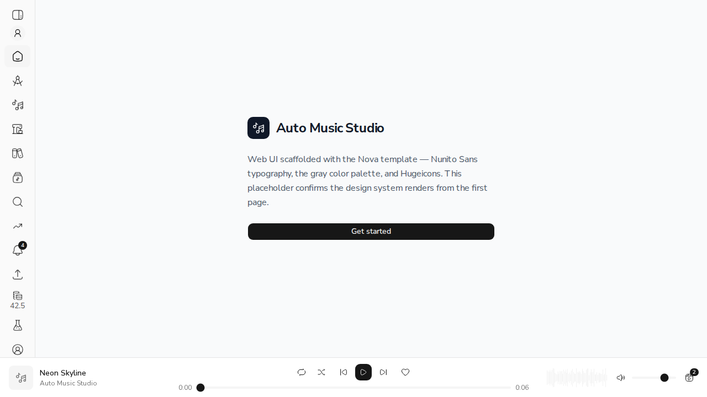
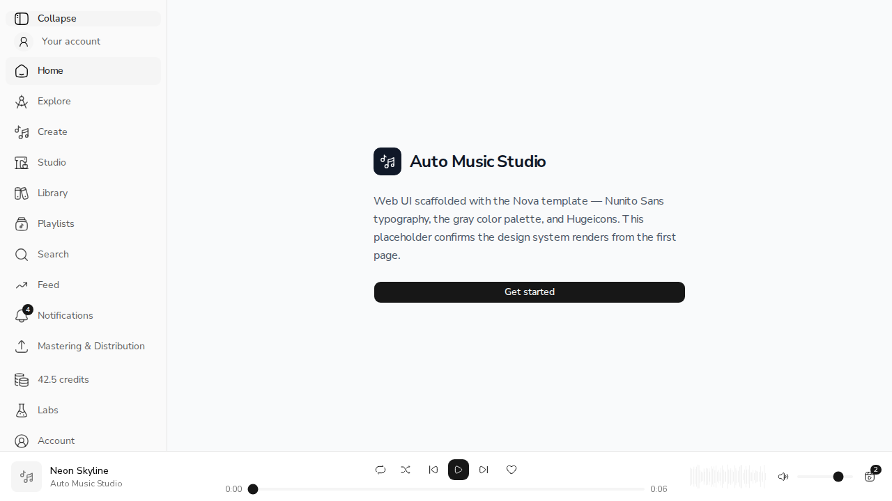

# US-26.1: Credit Tracking and Deduction

*2026-08-04T09:14:39Z*

Five acceptance criteria. Three were already satisfied by earlier stories — atomic deduction, per-action costs, the 402. The other two were not, and neither turned out to be a small addition:

- **"Failed jobs result in automatic credit refund"** — the processor marked a job `FAILED` and never refunded anything. An ordinary failed generation simply kept the credit.
- **"Credit balance is visible at all times"** — the web app never called the credits endpoint at all.

Everything below runs the real FastAPI app against a real MongoDB, with real tokens, real balances and real ledger rows. The only stand-in is ACE-Step (no GPU here), and it appears once, to make a job fail on purpose.

## AC1 + AC2: what each action costs

The story sets a price per action. Three of these — stems, MIDI, remaster — **shipped free**, and both routers documented them that way ("non-generative local CPU work, so no credits are deducted"). Pricing them is the change. The product is not live, so there is no installed base to migrate:

```bash
ACEMUSIC_STORAGE_BACKEND=local ACEMUSIC_STORAGE_LOCAL_ROOT=/tmp/claude-1000/-home-frankbria-projects-auto-music-studio/e9e3c62d-a729-4893-b40e-b671581d939c/scratchpad/demo261 uv run python scripts/demo_us_26_1.py 2>/dev/null | sed -n "/AC1: every action/,/^$/p"
```

```output
== AC1: every action's cost, deducted at enqueue ==
  song  (POST /generate)   -> 202  charged  1.0
  mashup                   -> 202  charged  2.0
  stems   [was free]       -> 202  charged  1.0
  midi    [was free]       -> 202  charged  1.0
  remaster [was free]      -> 202  charged  0.5
  crop    (still free)     -> 202  charged  0.0   (free)
  speed   (still free)     -> 202  charged  0.0   (free)

```

Matching the story: generation 1, mashup 2, stems 1, MIDI 1, remaster 0.5. Crop and speed were free before and stay free.

Every charge is explained in the history — a balance that drops with no row behind it is the complaint this avoids:

```bash
ACEMUSIC_STORAGE_BACKEND=local ACEMUSIC_STORAGE_LOCAL_ROOT=/tmp/claude-1000/-home-frankbria-projects-auto-music-studio/e9e3c62d-a729-4893-b40e-b671581d939c/scratchpad/demo261 uv run python scripts/demo_us_26_1.py 2>/dev/null | sed -n "/AC1: the charge is explained/,/^$/p"
```

```output
== AC1: the charge is explained in the history ==
  stems          -1.0   balance after 9.0
  (a balance that drops with no row to explain it is the complaint this avoids)

```

### Charging for something that used to be free needs boundaries

Two of them, and both are tested rather than assumed. Re-requesting a **cached** result costs nothing — the credit buys the separation, not the lookup, so polling the endpoint cannot bill repeatedly. And a request **rejected for format** is refused before the charge, so a request that was never going to run is free:

```bash
ACEMUSIC_STORAGE_BACKEND=local ACEMUSIC_STORAGE_LOCAL_ROOT=/tmp/claude-1000/-home-frankbria-projects-auto-music-studio/e9e3c62d-a729-4893-b40e-b671581d939c/scratchpad/demo261 uv run python scripts/demo_us_26_1.py 2>/dev/null | sed -n "/What keeps pricing/,/^$/p"
```

```output
== What keeps pricing a previously-free action fair ==
  re-requesting cached MIDI -> 200, charged 0.0
  stems on a non-wav clip   -> 422, charged 0.0

```

## AC3: running out says what to do about it

The story asks for "required credits, current balance, and upgrade prompt". The first two already existed; an error that only says *no* leaves the musician stuck:

```bash
ACEMUSIC_STORAGE_BACKEND=local ACEMUSIC_STORAGE_LOCAL_ROOT=/tmp/claude-1000/-home-frankbria-projects-auto-music-studio/e9e3c62d-a729-4893-b40e-b671581d939c/scratchpad/demo261 uv run python scripts/demo_us_26_1.py 2>/dev/null | sed -n "/AC3: an empty balance/,/^$/p"
```

```output
== AC3: an empty balance says what to do about it ==
  -> 402
     error        insufficient_credits
     required     1.0
     balance      0.0
     message      This action needs 1 credits and you have 0. Top up or upgrade your plan to continue.
     upgrade_url  /settings/billing
  jobs queued without payment: 0

```

Note the last line: nothing was queued. The charge gates the job, not the other way round.

## AC4: a failed job gives the credit back

This is the criterion that exposed the two defects. Watch a generation fail in the worker — ACE-Step is stubbed to report a failed task, since there is no GPU here to fail for real:

```bash
ACEMUSIC_STORAGE_BACKEND=local ACEMUSIC_STORAGE_LOCAL_ROOT=/tmp/claude-1000/-home-frankbria-projects-auto-music-studio/e9e3c62d-a729-4893-b40e-b671581d939c/scratchpad/demo261 uv run python scripts/demo_us_26_1.py 2>/dev/null | sed -n "/AC4: a failed job/,/^$/p"
```

```output
== AC4: a failed job gives the credit back ==
  charged 1 credit, balance now 9.0
  job ran and failed: the model fell over
  balance now 10.0
  history:
    song               -1.0   balance after 9.0
    generate_refund     1.0   balance after 10.0

```

Both movements are in the history. Before this story the refund would have moved the balance and left **no row at all** — the user would see the charge and never the compensation.

That is not a cosmetic fix. It is what makes the blanket refund safe, because three handlers already refund their own partial work (full-song unperformed sections, mastering pre-flight rejection, voice-training failure). A generic "refund on failure" that ignored them would pay twice.

With refunds in the ledger, `owed = charges − refunds`, so the generic path pays only the remainder — **idempotent by construction**, not by a flag:

```bash
ACEMUSIC_STORAGE_BACKEND=local ACEMUSIC_STORAGE_LOCAL_ROOT=/tmp/claude-1000/-home-frankbria-projects-auto-music-studio/e9e3c62d-a729-4893-b40e-b671581d939c/scratchpad/demo261 uv run python scripts/demo_us_26_1.py 2>/dev/null | sed -n "/refunded exactly once/,\$p"
```

```output
== AC4: refunded exactly once, even alongside a handler that already refunded ==
  charged 5, handler already returned 3 -> balance 8.0
  after the generic refund            -> balance 10.0
  after calling it twice more         -> balance 10.0
  (idempotent by construction: its own refund is a ledger row, so there is
   nothing left owed to pay a second time)
```

### The refund that must *not* be ledgered

One case goes the other way. The request paths deduct, create the job, and record the charge **last** — so when their compensating `except` runs, the charge was never recorded. Writing a refund row there would leave a lone positive movement: a credit the user appears to have been granted from nowhere.

Those call `reverse_unrecorded_charge`, a separate function rather than a `ledger=False` flag. A flag gets passed wrong eventually, and this is money:

```bash
sed -n "/^async def reverse_unrecorded_charge/,/^    await User/p" src/acemusic/api/services/credits.py
```

```output
async def reverse_unrecorded_charge(user_id: PydanticObjectId, cost: float) -> None:
    """Undo a deduction whose ledger row was never written — balance only, no row.

    The request paths deduct, create the job, and ledger the charge **last**. So when
    their compensating ``except`` runs, the charge was never recorded, and writing a
    refund row would leave a lone positive movement in the history: a credit the user
    appears to have been granted out of nowhere. A deduction and its reversal that
    both leave no trace are, correctly, invisible.

    Everywhere the charge *was* ledgered, use :func:`refund_credits` instead, so the
    money that moved is money the user can see.
    """
    if cost <= 0:
        raise ValueError("cost must be positive")

    await User.get_pymongo_collection().update_one({"_id": user_id}, {"$inc": {"credits_balance": cost}})
```

## AC5: the balance, visible everywhere

The web app never called the credits endpoint. This is the endpoint the sidebar now reads:

```bash
ACEMUSIC_STORAGE_BACKEND=local ACEMUSIC_STORAGE_LOCAL_ROOT=/tmp/claude-1000/-home-frankbria-projects-auto-music-studio/e9e3c62d-a729-4893-b40e-b671581d939c/scratchpad/demo261 uv run python scripts/demo_us_26_1.py 2>/dev/null | sed -n "/AC5: the balance/,/^$/p"
```

```output
== AC5: the balance the sidebar reads ==
  GET /credits/balance -> 200  {'balance': 14.5, 'tier': 'free', 'upgrade_url': '/settings/billing'}

```

And here it is in the app — the sidebar of a real authenticated session, reading that endpoint. The seeded account holds 42.5 credits, which is also why the display keeps the decimal: `remaster` costs 0.5, so half credits are real balances rather than rounding noise.

```bash {image}
agent-browser screenshot us261-sidebar.png >/dev/null && echo us261-sidebar.png
```



```bash {image}
agent-browser screenshot us261-expanded.png >/dev/null && echo us261-expanded.png
```



## The tests were checked against a mutant, not just run

All 20 pricing tests passed first run, which is exactly when to be suspicious. Mutating the source and re-running is the check that a passing test actually bites.

The first mutant found a real gap: **deleting the compensating reversal from `charge_and_create` killed zero tests.** The existing coverage for "charged ⇒ a job exists or the credit is returned" drove the hand-rolled copies in the routers, not the new helper three endpoints had just started depending on. Six tests later:

```bash
cd /home/frankbria/projects/auto-music-studio
cp src/acemusic/api/services/credits.py /tmp/credits-good.py
python3 - <<PY
import pathlib
p = pathlib.Path("src/acemusic/api/services/credits.py")
s = p.read_text()
# Mutant: a job that fails to create keeps the money.
p.write_text(s.replace("        await reverse_unrecorded_charge(user_id, cost)\n        raise", "        raise", 1))
PY
echo "mutant: drop the compensating reversal in charge_and_create"
uv run pytest tests/test_credit_refunds.py -q --no-cov -m integration 2>&1 | grep -E "^FAILED|passed|failed" | tail -3
cp /tmp/credits-good.py src/acemusic/api/services/credits.py
rm -f /tmp/credits-good.py
```

```output
mutant: drop the compensating reversal in charge_and_create
FAILED tests/test_credit_refunds.py::TestChargeAndCreate::test_a_failure_to_create_gives_the_credit_back
FAILED tests/test_credit_refunds.py::TestChargeAndCreate::test_a_cancelled_request_also_gives_the_credit_back
2 failed, 23 passed in 31.06s
```

Two of the six now die on that mutant. The clamp on `amount_owed_for_job` and the `FAILED`-status guard were mutated too; both die.

## Scorecard

| Acceptance criterion | Evidence | Verdict |
|---|---|---|
| Generating a song deducts exactly 1 credit | Shown above with the whole cost table; matches the story. | ✅ |
| Mashup deducts exactly 2 credits | Same run. | ✅ |
| Insufficient credits returns a 402 with clear messaging | Carries `required`, `balance`, a readable `message` and `upgrade_url`; nothing queued. | ✅ |
| Failed jobs result in automatic credit refund | A real worker failure refunds, both movements ledgered, and refunding again pays nothing. | ✅ |
| Credit balance visible at all times, updating after each action | In the sidebar of a real session, collapsed and expanded; refreshed at enqueue **and** on failure. | ✅ |

## What is not here

- **`upgrade_url` points at `/settings/billing`, which does not do anything yet.** US-26.4 (credit top-up purchase) is what makes it useful. It is served from the API rather than hardcoded in the client so it can move without a frontend release.
- **Five other call sites still hand-roll the charge/create/compensate/ledger dance** (generation, iterative, videos, mastering, batch mastering). Adopting `charge_and_create` there is a behaviour-preserving refactor I deliberately kept out of a money-behaviour PR.
- **Refunds are best-effort at the edges.** A refund that itself fails is logged and never masks the original job failure, consistent with the handlers that already worked that way.
