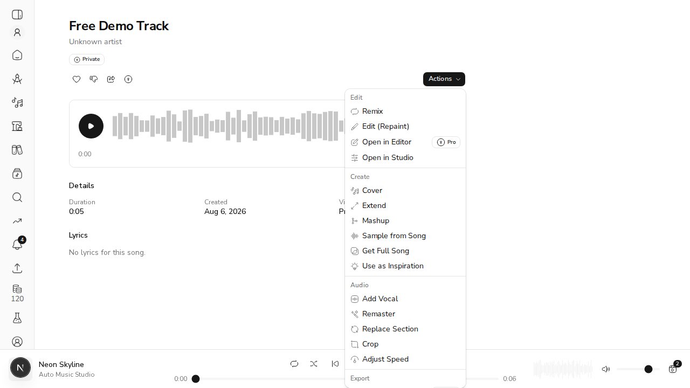
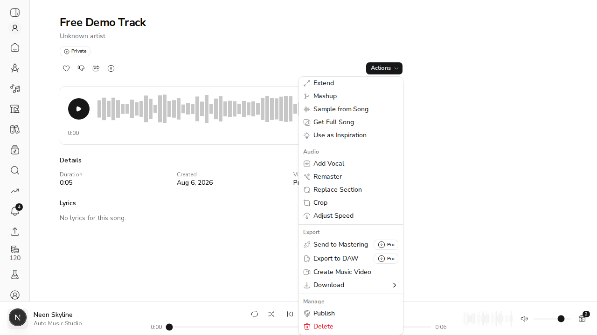
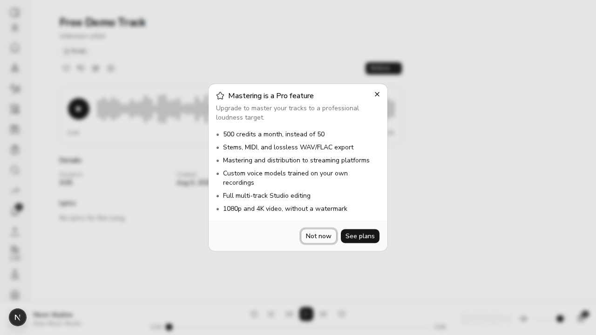
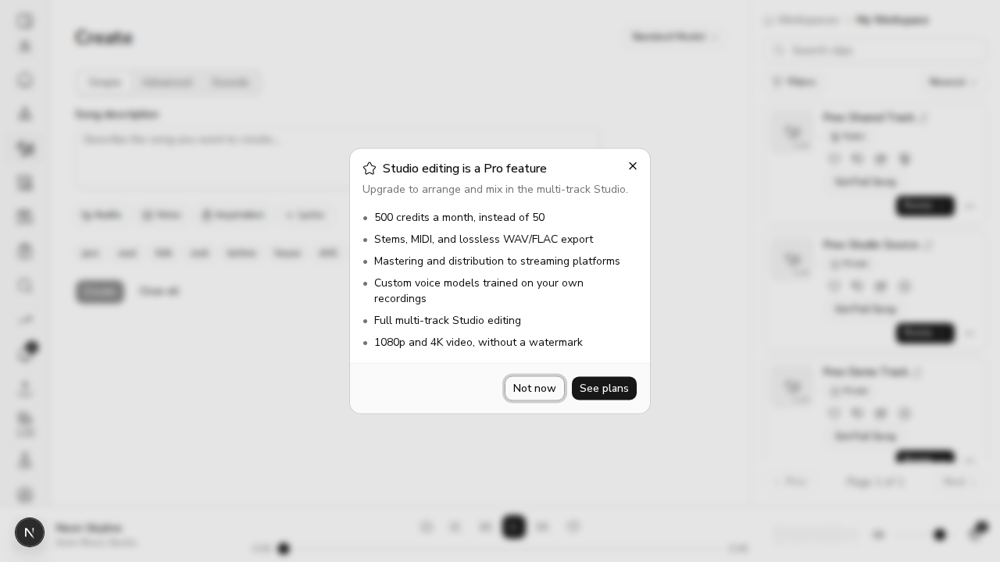
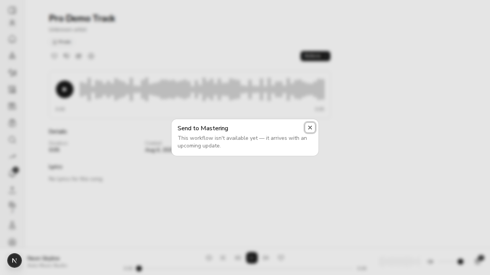

# US-26.2 Subscription Tiers and Feature Gating — Demo Verification

**PR:** #399 · **Issue:** #330 · **Branch:** `feat/us-26.2-subscription-tiers` · **Date:** 2026-08-06

Full local stack — real FastAPI backend, real MongoDB, real Next.js frontend, real browser
(agent-browser / headless Chromium) with a genuine authenticated session. Two seeded
accounts, `free@` and `pro@`, each with an mp3 clip, a wav clip and a public clip, so every
gate could be exercised on a source format that makes it fire for real.

## Setup

| | Free account | Pro account |
|---|---|---|
| `subscription_tier` | `free` | `pro` |
| Clips | mp3 (lossy source, so wav/flac is a genuine *conversion*), wav (stems/MIDI need a wav source), public mp3 (anonymous streaming) | same three |

Backend on `127.0.0.1:8100`, web on `localhost:3100`, MongoDB on `:27018`, local storage
backend. Auth is OAuth-only, so browser sessions were minted through the same service layer
the OAuth callback uses and planted as the httpOnly `ams_refresh_token` cookie. Each
navigation used a freshly minted token (they are single-use and rotate), and every browser
result below was taken only after asserting the session had really authenticated —
`performance.getEntriesByType('resource')` includes `/api/users/me`, which is fetched only
when an access token exists. Without that assertion an anonymous fallback renders happily
and a "free user sees X" check silently tests a signed-out visitor.

## Evidence

| Criterion | Action | Outcome evidence | Status |
|---|---|---|---|
| **AC1. Free user sees Pro badges on restricted features** | Signed in as `free@`, opened the song Actions menu on the seeded clip. | Three items carry a Pro badge — **Open in Editor**, **Send to Mastering**, **Export to DAW** — each with `data-locked="true"` and a padlock icon rendered inside the badge. Screenshots below. | **VERIFIED** |
| **AC2. Free user clicking a Pro feature sees an upgrade modal (not an error)** | Clicked **Send to Mastering**, then **Export to DAW**, as `free@` on song detail — **and, on a second pass, Open in Editor from a clip card's ⋯ menu on `/create`**. | A dialog opens headed **"Mastering is a Pro feature"** / "Upgrade to master your tracks to a professional loudness target", listing the six Pro benefits, with **Not now** and **See plans** → `/settings/billing`. The DAW item produces different, correct copy — **"Studio editing is a Pro feature"** — proving the copy is keyed per capability rather than generic. The items are **not `disabled`** (`data-locked="true"`, no `aria-disabled`), so the click actually fires; no navigation, no error toast, URL unchanged. The clip card behaves identically. | **VERIFIED** (clip card only after a fix — see below) |
| **AC3. Pro user can access all features without restriction** | Signed in as `pro@`; opened the same menu and clicked the same **Send to Mastering** item. Separately called every Pro-only endpoint over HTTP with a Pro token. | Menu items show `data-locked=null` and **no padlock**. The click opens the real **"Send to Mastering"** dialog, not the upgrade modal. Over HTTP: stems `202`, midi `202`, mastering `202`, mastering batch `202`, batch stems `202`, batch export wav `202`, per-clip DAW export `202`, studio DAW export `202`, lossless download `200`, lossless stream `200`. | **VERIFIED** |
| **AC4. API returns 403 for Free users attempting Pro-only actions** | Called all fourteen Pro-only routes directly with a free token, bypassing the UI entirely. | **All fourteen 403** with the upgrade body. Table below. | **VERIFIED** (after three fixes — see "What the demo found") |
| **AC5. Credits reset to tier allocation on monthly anniversary** | Backdated `free@` to a 400-day-old signup whose anniversary passed 40 days ago, with the balance spent down to 3.0, then called `GET /credits/balance`. | Balance `3.0 → 50.0`, `credits_reset_at` advanced to the current period's anniversary, and **one** `monthly_reset` ledger row `+47.0, balance_after=50.0`. Full transcript below. | **VERIFIED** |

### AC1 / AC2 — the free tier's menu





Clicking one:



The heading matters. The story asks for an upgrade modal "not an error", and what it
replaced was neither — the items rendered `disabled`, so the click never fired at all. The
DOM confirms the fix: `disabled: false` with `data-locked: "true"`.

#### The clip card — the entry point this demo originally missed

The first pass verified AC2 only through song detail. A round-5 review pointed out that
`ClipCard` dispatches through the same `useSongActions` but never rendered `UpgradeModal`,
and still marked its locked items `disabled` — so on that surface the click went **silent**,
which is the precise failure AC2 exists to remove, still live on half the app. Fixed in
`b7548b9` and re-verified here, on `/create` as `free@`:

| | Before | After |
|---|---|---|
| `Open in Editor` in a card's ⋯ menu | `aria-disabled` — click could not fire | `data-locked="true"`, no `aria-disabled` |
| Clicking it | nothing at all | the upgrade prompt below |



This is worth recording as a demo failure rather than quietly folding into "AC2 verified":
the criterion was originally marked verified on evidence from one of two entry points, and
the other one was broken.

### AC3 — the same menu as Pro



The Pro badge itself still renders for a Pro subscriber; only the **padlock inside it**
is tier-conditional. That is deliberate and predates this PR (US-17.2, `c09c0fa`): the
badge marks the feature as a Pro-tier feature, the padlock marks it as locked *for you*.

| | `data-locked` | padlock | click result |
|---|---|---|---|
| Free | `"true"` | yes | upgrade modal |
| Pro | `null` | no | the real feature dialog |

### AC4 — every Pro-only route, called directly

Free token, no UI involved:

```
POST /clips/{id}/stems                   -> 403   capability=stems
POST /clips/{id}/midi                    -> 403   capability=midi
POST /mastering/jobs                     -> 403   capability=mastering
POST /mastering/batch                    -> 403   capability=mastering
POST /batch/stems                        -> 403   capability=stems
POST /batch/export (wav)                 -> 403   capability=lossless_export
POST /batch/export (flac)                -> 403   capability=lossless_export
POST /clips/{id}/export/daw              -> 403   capability=studio_editing
POST /studio/mixdown                     -> 403   capability=studio_editing
POST /studio/export/daw                  -> 403   capability=studio_editing
POST /voice-models/train                 -> 403   capability=voice_models
POST /videos/generate (1080p)            -> 403   capability=high_res_video
GET  /clips/{id}/audio?format=wav        -> 403   capability=lossless_export
GET  /clips/{id}/stream?format=wav       -> 403   capability=lossless_export
GET  /clips/{id}/stream?format=wav (anon)-> 403   capability=lossless_export
```

A representative body:

```json
{"detail": {"error": "upgrade_required", "capability": "stems", "feature": "Stem separation",
 "tier": "free", "required_tier": "pro",
 "message": "Stem separation is a Pro feature — upgrade to split a track into vocals, drums, bass and other.",
 "upgrade_url": "/settings/billing"}}
```

The anonymous row is the one worth dwelling on: `/stream` serves public clips without a
login, so gating only authenticated callers would have made **signing out** the way around
the gate.

**The controls matter as much as the refusals** — a gate that refuses everything is not a
tier, it is an outage:

```
GET  /voice-models (list)                -> 200   reads stay open; a downgraded
                                                  account can still see its own voices
GET  /clips/{id}/audio (no format)       -> 200   playback is not export
GET  /clips/{id}/audio?format=mp3        -> 200   the free tier's one allowed format
GET  /clips/{id}/audio?format=wav        -> 200   native-wav clip: not a conversion
GET  /clips/{id}/stream (anon, no format)-> 200   public playback still works
POST /batch/export (mp3)                 -> 202   free tier is "MP3 only", not "no batch"
POST /videos/generate (720p)             -> 503   passed the gate; 503 is the video
                                                  deployment being absent in this env
```

### AC5 — the monthly reset

```
SETUP (free tier, allocation 50) — signed up 400d ago
  before the read      balance=3.0    credits_reset_at=2026-06-27  (anniversary passed 40d ago)

GET /credits/balance -> 200
  response: {"balance": 50.0, "tier": "free", "upgrade_url": "/settings/billing"}
  after the read       balance=50.0   credits_reset_at=2026-08-02

  ledger rows (action_type='monthly_reset'): 1
    amount=+47.0  balance_after=50.0

--- it does not pay twice in one period ---
  second GET /credits/balance -> 200  balance=50.0
  ledger rows still: 1   (a second grant would make this 2)

--- it does not claw back a balance above the allocation (protects a top-up) ---
  before (topped up 120.0, reset overdue) -> after: balance=120.0, anchor advanced
  -> left at 120.0, not reduced to the 50 allocation

--- a Pro account resets to the Pro allocation, not the free one ---
  before: balance=5.0  ->  after: balance=500.0   {"balance": 500.0, "tier": "pro"}

--- an account whose anniversary has NOT passed is left alone ---
  before (reset 3d ago): balance=7.0  ->  after: 7.0, nothing granted
```

## What the demo found

Three routes were still doing Pro work with no tier check. All three are fixed in `4ff455c`;
the table above is the re-run **after** the fix. They are recorded here because "the tests
were green and the demo passed" would be the wrong story — the unit suite was green
throughout, and each of these was only visible by calling the endpoint.

| Route | Was | Now |
|---|---|---|
| `POST /batch/stems` | **202** for a free account — stems for up to 50 clips at once, while the single-clip route refused the same account for one | 403 `stems` |
| `POST /batch/export` (wav/wav32/flac) | **202** — the batch version of the download the PR had just gated | 403 `lossless_export` |
| `POST /clips/{id}/export/daw` | **202** — builds the same bundle as the gated `/studio/export/daw`, different router | 403 `studio_editing` |

Two more came from review rather than from the demo, both **over**-gating rather than
under-gating, and both fixed:

| Thing | Was | Now |
|---|---|---|
| The download menu (`download-wav`/`download-flac`) | locked for every free account, though the API serves a clip in its own stored format — upload is not tier-gated, so a free musician can own a wav the API would hand back | locked only for a genuine conversion, decided once in `isSongActionLocked` and used by both the click path and the padlock |
| `ClipCard` locked actions | silent (`disabled`, and no `UpgradeModal` rendered) | the upgrade prompt, same as song detail |

## Known limitations and open questions

- **Two routes were deliberately left ungated** (filed as #403), because neither has a gated sibling doing
  the same work — whether they are Pro is a product decision, not an inconsistency to fix
  quietly in a review pass:
  - `POST /releases/{id}/prepare/{target}` builds a distribution bundle for *manual*
    submission. The gated `distribution` capability currently covers SoundCloud upload —
    "we publish for you". Whether "you publish it yourself, we assemble the bundle" is also
    Pro is a call for the product owner.
  - `POST /clips/{id}/remaster` is a local loudness-normalisation edit that costs credits,
    living alongside crop and speed. It is not the Dolby/LANDR `mastering` service, but the
    `mastering` capability is described as "master your tracks to a professional loudness
    target", which is close enough to be worth a decision.
- **`POST /voice-models/train` returned 422 for the Pro account** — "Training takes between
  2 and 10 reference files; 1 were uploaded." That is the gate passed and request validation
  refusing a one-file demo payload, not a tier result. `POST /videos/generate` returns 503
  for both tiers after the gate, because no video deployment is configured in this
  environment; the free tier's 1080p **403** is raised ahead of that 503, which is the
  intended ordering (a free account is told the plan boundary, not that the service is down).
- **The reset is lazy, on read.** An account that never opens the app is not topped up until
  it does. Harmless, but worth knowing before anyone reports it as a bug.
- **`/settings/billing` still does not do anything** — US-26.4 makes the upgrade path real.
  Every 403 and the modal point at it, so there is one place to change.
