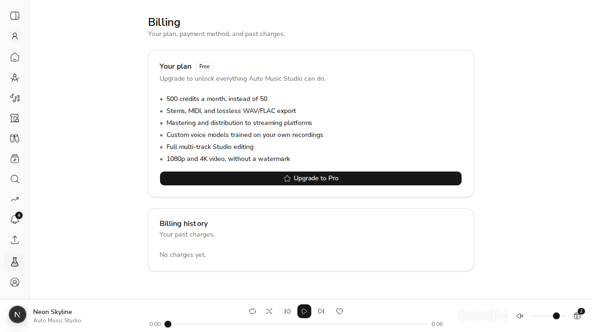
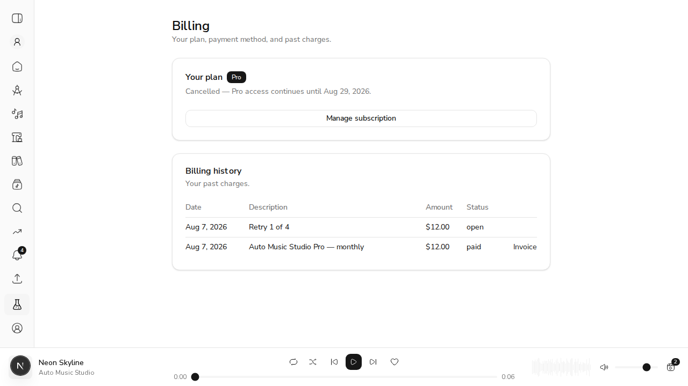

# US-26.3 — Payment Integration (Stripe)

*2026-08-07T16:47:42Z*

Everything below runs against a **live API** (uvicorn on :8123, real MongoDB) with Stripe settings configured. No Stripe *account* exists here — but none is needed for the parts that matter, because the subscription tier only ever moves in response to a **webhook**, and a webhook is a signed HTTP request we can replay exactly as Stripe sends it.

Each event below is signed with real HMAC-SHA256 over `{timestamp}.{payload}` using the configured webhook secret, and posted at the real endpoint. Verification is the Stripe SDK's own `construct_event`.

What is **not** demoed: creating the Checkout and Portal sessions, which are outbound calls to Stripe's API and need credentials. That gap is stated in the PR rather than papered over.

## Starting point — a free account

```bash
TOKEN=$(cat /tmp/claude-1000/-home-frankbria-projects-auto-music-studio/059ee708-2b40-4b5e-8807-e75cc2d29f51/scratchpad/token.txt); curl -s -H "Authorization: Bearer $TOKEN" http://127.0.0.1:8123/api/v1/billing/subscription | python3 -m json.tool
```

```output
{
    "tier": "free",
    "status": null,
    "current_period_end": null,
    "cancel_at_period_end": false,
    "billing_enabled": true
}
```

## AC1 — a completed checkout activates Pro immediately

Stripe sends `checkout.session.completed` once the card is actually charged. Note that the tier is granted *here*, not when the session is created: a musician who reaches the Stripe page and closes the tab must not come back to Pro.

```bash
SP=/tmp/claude-1000/-home-frankbria-projects-auto-music-studio/059ee708-2b40-4b5e-8807-e75cc2d29f51/scratchpad; uv run python $SP/hook.py subscribe; TOKEN=$(cat $SP/token.txt); echo "--- tier now:"; curl -s -H "Authorization: Bearer $TOKEN" http://127.0.0.1:8123/api/v1/billing/subscription | python3 -m json.tool
```

```output
checkout.session.completed             -> HTTP 200  {"status":"subscribed"}
--- tier now:
{
    "tier": "pro",
    "status": "active",
    "current_period_end": null,
    "cancel_at_period_end": false,
    "billing_enabled": true
}
```

## AC4 — the charge lands in billing history

`invoice.paid` records the charge. Amounts are stored as integer cents exactly as Stripe reports them and divided once at the API edge, so no float arithmetic ever touches money.

```bash
SP=/tmp/claude-1000/-home-frankbria-projects-auto-music-studio/059ee708-2b40-4b5e-8807-e75cc2d29f51/scratchpad; uv run python $SP/hook.py invoice; TOKEN=$(cat $SP/token.txt); echo "--- history:"; curl -s -H "Authorization: Bearer $TOKEN" http://127.0.0.1:8123/api/v1/billing/history | python3 -m json.tool
```

```output
invoice.paid                           -> HTTP 200  {"status":"paid"}
--- history:
{
    "entries": [
        {
            "id": "6a760c4560f77138494c27c4",
            "event_type": "invoice.paid",
            "amount": 12.0,
            "currency": "usd",
            "status": "paid",
            "description": "Auto Music Studio Pro \u2014 monthly",
            "invoice_url": "https://invoice.stripe.com/i/demo",
            "created_at": "2026-08-07T16:48:05.381000"
        },
        {
            "id": "6a760c3d60f77138494c27c3",
            "event_type": "checkout.session.completed",
            "amount": null,
            "currency": null,
            "status": null,
            "description": "checkout.session.completed",
            "invoice_url": null,
            "created_at": "2026-08-07T16:47:57.717000"
        }
    ]
}
```

## AC2 — cancelling retains Pro until the end of the period

Stripe reports a pending cancellation as **still `active`** with `cancel_at_period_end` set. The tier must not move, and the end date has to be recorded so the UI can say when access actually stops. No scheduler is involved — the downgrade arrives later as its own event.

```bash
SP=/tmp/claude-1000/-home-frankbria-projects-auto-music-studio/059ee708-2b40-4b5e-8807-e75cc2d29f51/scratchpad; uv run python $SP/hook.py cancel; TOKEN=$(cat $SP/token.txt); echo "--- still Pro, with an end date:"; curl -s -H "Authorization: Bearer $TOKEN" http://127.0.0.1:8123/api/v1/billing/subscription | python3 -m json.tool
```

```output
customer.subscription.updated          -> HTTP 200  {"status":"pro"}
--- still Pro, with an end date:
{
    "tier": "pro",
    "status": "active",
    "current_period_end": "2026-08-29T10:40:00",
    "cancel_at_period_end": true,
    "billing_enabled": true
}
```

## AC3 — a failed payment gets a grace period, not an instant downgrade

Two distinct Stripe states, and the difference is the whole criterion:

- `past_due` — the charge failed and Stripe's retry schedule is running. **Still Pro.**
- `unpaid` — the retries are exhausted. **Now free.**

Stripe owns the retry schedule; re-implementing dunning here would be a second clock that could disagree with the one actually charging the card.

```bash
SP=/tmp/claude-1000/-home-frankbria-projects-auto-music-studio/059ee708-2b40-4b5e-8807-e75cc2d29f51/scratchpad
uv run python $SP/hook.py payment_failed
echo "--- after a FAILED charge, retries still pending:"; bash $SP/state.sh
echo
uv run python $SP/hook.py dunning_exhausted
echo "--- after Stripe gives up:"; bash $SP/state.sh
```

```output
invoice.payment_failed                 -> HTTP 200  {"status":"duplicate"}
--- after a FAILED charge, retries still pending:
    "tier": "pro",
    "status": "past_due",

customer.subscription.updated          -> HTTP 200  {"status":"free"}
--- after Stripe gives up:
    "tier": "free",
    "status": "unpaid",
```

(`invoice.payment_failed` reports `duplicate` above because an earlier run of this same demo already delivered that event id — which is the idempotency guard doing its job, demonstrated below deliberately. The state it set is still in place.)

## AC5 — the webhook processes events, and only trusted ones

Three properties, in order: a redelivered event is applied once, a forged signature is refused, and an event type we do not handle is accepted rather than pushed into a retry loop.

```bash
SP=/tmp/claude-1000/-home-frankbria-projects-auto-music-studio/059ee708-2b40-4b5e-8807-e75cc2d29f51/scratchpad; TOKEN=$(cat $SP/token.txt)
echo "1. Stripe redelivers evt_demo_invoice_1 (its delivery contract is at-least-once):"
uv run python $SP/hook.py redeliver
echo "   charges in history:"; curl -s -H "Authorization: Bearer $TOKEN" http://127.0.0.1:8123/api/v1/billing/history | python3 -c "import json,sys; e=json.load(sys.stdin)[\"entries\"]; print(\"   \", sum(1 for x in e if x[\"event_type\"]==\"invoice.paid\"), \"invoice.paid row(s) - not two\")"
echo
echo "2. An attacker posts a subscription.deleted signed with a guessed secret:"
uv run python $SP/hook.py forged
echo "   tier after the forgery attempt:"; bash $SP/state.sh
```

```output
1. Stripe redelivers evt_demo_invoice_1 (its delivery contract is at-least-once):
invoice.paid                           -> HTTP 200  {"status":"duplicate"}
   charges in history:
    1 invoice.paid row(s) - not two

2. An attacker posts a subscription.deleted signed with a guessed secret:
customer.subscription.deleted          -> HTTP 400  {"detail":"Webhook signature verification failed."}
   tier after the forgery attempt:
    "tier": "free",
    "status": "unpaid",
```

## The UI a musician actually reaches

`UpgradeModal` and the out-of-credits prompt have linked to `/settings/billing` since US-26.2 — **the route did not exist**, so every one of those CTAs was a 404. This is the page they meant.

Rendered against the same live API, with a real bearer token, through the same-origin proxy.

### Free tier — the entry point for AC1



### Pro, with a cancellation pending — AC2 and AC4 on one screen



"Cancelled — Pro access continues until Aug 29, 2026" is the sentence AC2 exists for: someone who has cancelled must not think they have already lost what they paid for.

### One defect this demo found

The first capture of that screen showed `customer.subscription.updated` and `checkout.session.completed` rows in **Billing history**, each with a dash for the amount. They are written to the same collection because it doubles as the webhook idempotency guard — but a billing history is a list of charges, not a log of callbacks. The history endpoint now filters to rows carrying an amount, with a test (`test_lifecycle_events_are_not_listed_as_charges`) that also asserts all three events are still *recorded*, since dropping them would break idempotency. Failed attempts stay visible: they carry an amount and a non-paid status, which is exactly what someone opens this page to find out.
