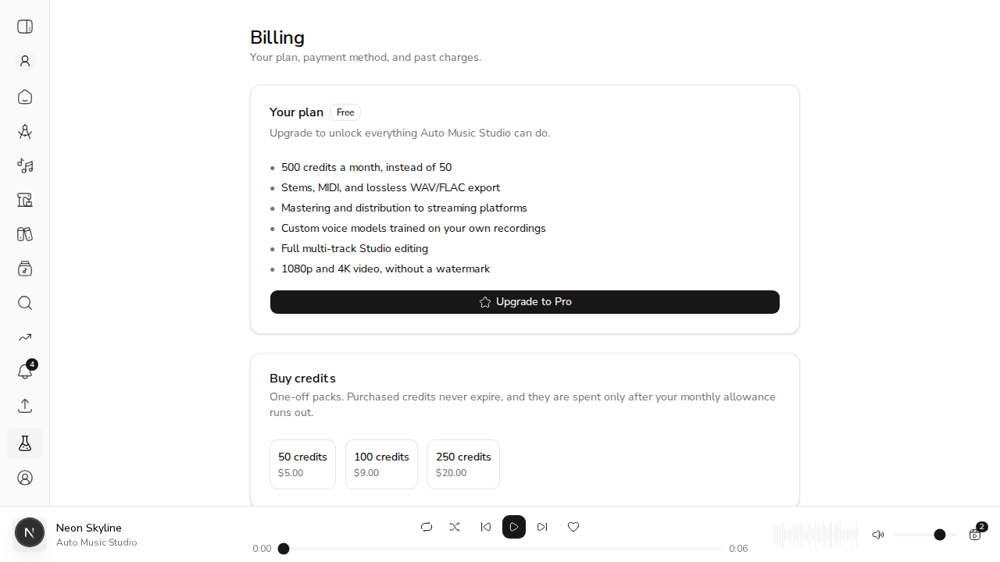

# US-26.4 — Credit Top-Up Purchase

*2026-08-07T21:27:27Z*

Driven against a **live API** (uvicorn + real MongoDB) with real HMAC-signed Stripe webhooks. No Stripe account is needed for any of this: a purchase becomes credits only when `checkout.session.completed` arrives, and that is a signed HTTP request we can replay exactly as Stripe sends it.

The interesting part of this story is not the purchase — it is **which bucket the credits land in, and which bucket pays**.

## Why two buckets, and not just a bigger number

`apply_monthly_reset` grants `max(0, allocation - credits_balance)` — it tops the balance *up to* the tier allocation rather than adding to it. So with a single field:

> buy 100 credits, spend 60, and your next monthly 50 **never arrives** — the balance is still above 50, so the reset grants nothing.

AC2 ("monthly consumed first") and AC3 ("purchased persist across resets") cannot both hold in one number. Purchases now live in their own field that the reset never touches.

## Starting point — a free account, monthly allowance only

```bash
SP=/tmp/claude-1000/-home-frankbria-projects-auto-music-studio/059ee708-2b40-4b5e-8807-e75cc2d29f51/scratchpad; source $SP/env.sh; export ACEMUSIC_API_MONGODB_DB_NAME=acemusic_demo_264; uv run python $SP/buckets.py show
```

```output
  monthly=  50.0   purchased=   0.0   spendable=  50.0
```

## AC1 — buying a pack credits the account

The purchase arrives on the **same event type** as a subscription checkout. Only the metadata distinguishes them, which is why the handler branches on the pack id first — otherwise a $9 credit pack would grant Pro.

```bash
SP=/tmp/claude-1000/-home-frankbria-projects-auto-music-studio/059ee708-2b40-4b5e-8807-e75cc2d29f51/scratchpad; source $SP/env.sh; export ACEMUSIC_API_MONGODB_DB_NAME=acemusic_demo_264
uv run python $SP/topup.py buy100
uv run python $SP/buckets.py show
```

```output
  checkout.session.completed     -> 200 {"status":"topped_up"}
  monthly=  50.0   purchased= 100.0   spendable= 150.0
```

## AC2 — monthly credits are consumed first

Spend 30: it comes entirely out of the monthly bucket. Then spend 40: the remaining 20 monthly is drained first and only the last 20 touches what was paid for. One atomic operation, not read-then-write — the deduction spans two fields but stays a single `find_one_and_update`, so two concurrent generations cannot each see enough credit and overdraw.

```bash
SP=/tmp/claude-1000/-home-frankbria-projects-auto-music-studio/059ee708-2b40-4b5e-8807-e75cc2d29f51/scratchpad; source $SP/env.sh; export ACEMUSIC_API_MONGODB_DB_NAME=acemusic_demo_264
uv run python $SP/buckets.py spend 30
echo
uv run python $SP/buckets.py spend 40
```

```output
  spent 30; spendable now 120.0
  monthly=  20.0   purchased= 100.0   spendable= 120.0

  spent 40; spendable now 80.0
  monthly=   0.0   purchased=  80.0   spendable=  80.0
```

## AC3 — purchased credits survive the monthly reset

The account is now at 0 monthly / 80 purchased. When the anniversary comes round, the free tier's 50 must arrive **in full** — and the 80 must still be there.

This is the exact case a single balance gets wrong: `max(0, 50 - 80)` is 0, so the musician would silently lose a month's allowance as a *consequence of having paid us*.

```bash
SP=/tmp/claude-1000/-home-frankbria-projects-auto-music-studio/059ee708-2b40-4b5e-8807-e75cc2d29f51/scratchpad; source $SP/env.sh; export ACEMUSIC_API_MONGODB_DB_NAME=acemusic_demo_264; uv run python $SP/reset.py
```

```output
  (subscription anniversary reached — the monthly reset is now due)
  monthly=  50.0   purchased=  80.0   spendable= 130.0
```

## A redelivery must not be a second sale

Stripe's delivery contract is at-least-once. A tier flip is naturally idempotent — setting Pro twice is setting it once — but a **credit grant is not**: crediting twice is a real gift. So the handlers' write order is inverted here: the ledger row is written first and the grant only follows if it was genuinely new.

```bash
SP=/tmp/claude-1000/-home-frankbria-projects-auto-music-studio/059ee708-2b40-4b5e-8807-e75cc2d29f51/scratchpad; source $SP/env.sh; export ACEMUSIC_API_MONGODB_DB_NAME=acemusic_demo_264
echo "Stripe resends the purchase event:"
uv run python $SP/topup.py replay
uv run python $SP/buckets.py show
```

```output
Stripe resends the purchase event:
  checkout.session.completed     -> 200 {"status":"duplicate"}
  monthly=  50.0   purchased=  80.0   spendable= 130.0
```

## AC4 — the purchase appears in billing history

A top-up is a **one-off** invoice: it carries no `subscription`. The guard added at the very end of US-26.3 exists precisely for this — a paid top-up must be recorded as a charge without touching subscription status, or it would clear a genuine `past_due` and tell a musician their failing card is fine.

```bash
SP=/tmp/claude-1000/-home-frankbria-projects-auto-music-studio/059ee708-2b40-4b5e-8807-e75cc2d29f51/scratchpad; source $SP/env.sh; export ACEMUSIC_API_MONGODB_DB_NAME=acemusic_demo_264
uv run python $SP/topup.py invoice
TOKEN=$(uv run python $SP/demo_setup.py 2>/dev/null || true)
uv run python - <<PYEOF
import asyncio, os
from acemusic.api.database import init_db, close_db
from acemusic.api.models import BillingEvent, User
from acemusic.api.settings import ApiSettings
async def main():
    s = ApiSettings(mongodb_url=os.environ["ACEMUSIC_API_MONGODB_URL"],
                    mongodb_db_name=os.environ["ACEMUSIC_API_MONGODB_DB_NAME"],
                    jwt_secret_key=os.environ["ACEMUSIC_API_JWT_SECRET_KEY"])
    await init_db(s)
    try:
        u = await User.find_one(User.email == "demo-topup@example.com")
        rows = await BillingEvent.find(BillingEvent.user_id == u.id).to_list()
        for r in rows:
            amt = "-" if r.amount_cents is None else f"\${r.amount_cents/100:.2f}"
            print(f"  {r.event_type:30} {amt:>8}  {r.description}")
        print(f"  subscription_status stayed: {u.subscription_status!r}  tier={u.subscription_tier!r}")
    finally:
        await close_db()
asyncio.run(main())
PYEOF
```

```output
  invoice.paid                   -> 200 {"status":"one_off"}
  invoice.paid                      $9.00  100 Auto Music Studio credits
  checkout.session.completed            -  checkout.session.completed
  subscription_status stayed: None  tier='free'
```

## The UI



Rendered against the same live API through the same-origin proxy. Note the picker sits **outside** the free-tier branch — a Pro musician who burns through 500 credits mid-project needs a top-up more than a free user does.

One trap worth recording: the Next.js proxy validates the path segment against a fixed allowlist, and adding `packs`/`topup` to the API without touching that list 404s both endpoints with no indication why. Caught locally; the allowlist now carries a comment saying it must track the router.

## Every balance surface

`spendable()` is monthly + purchased. Seven routers read `credits_balance` directly before this story and would each have under-reported what a musician paid for — the sidebar balance, the profile, and the 402 bodies on generation, video, iterative and mastering.

Rather than check them one at a time, there is a test that greps the router package and fails if any of them reads the raw field. A *new* endpoint getting this wrong is the actual failure mode, and a per-endpoint test cannot catch that.
