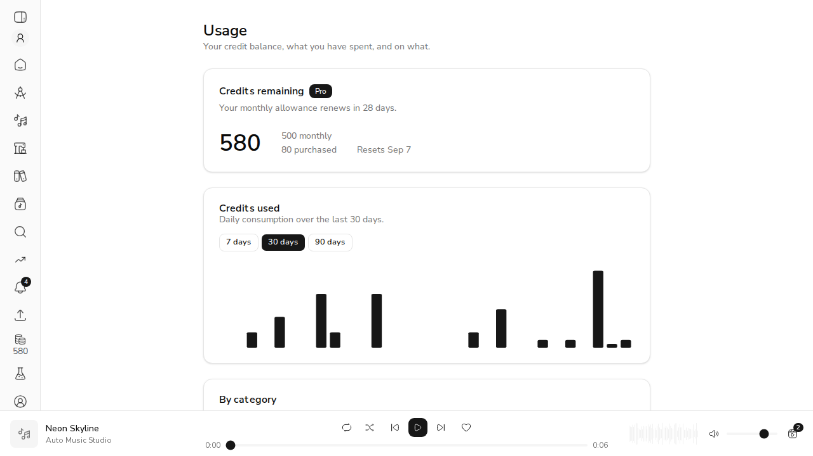
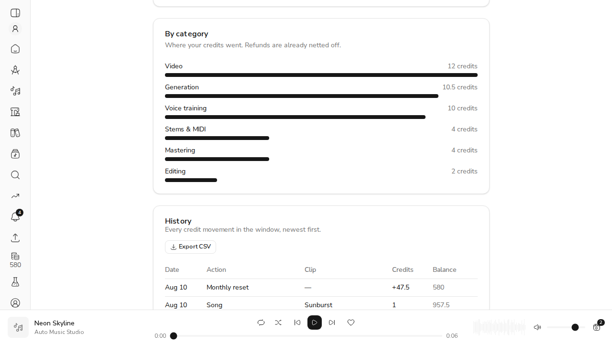
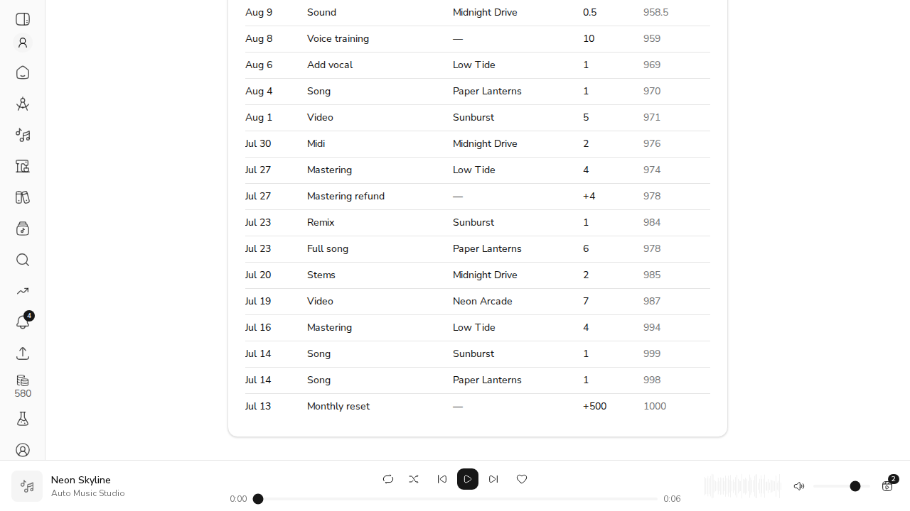

# US-26.5 — Usage Dashboard

Live demo against a real stack: FastAPI on `:8765` (Mongo on `:27018`), the production
Next.js build on `:3765`, and a seeded Pro account with 17 credit movements spread over
28 days — including a refund, a monthly reset, and clip-linked jobs.

Every number below was cross-checked against `GET /api/v1/credits/usage` rather than read
off the screen alone.

---

## AC1 — Dashboard shows accurate credit balance and reset date



The seeded account holds 500 monthly + 80 purchased credits and last reset 28 days ago.

| Shown | Source |
| --- | --- |
| `580` | `total_credits` — `spendable()`, both buckets |
| `500 monthly` / `80 purchased` | `credits_service.buckets()` |
| `Resets Sep 7` / `renews in 28 days` | `next_reset_due()` on the signup anniversary |
| `Pro` badge | `subscription_tier` read from the database |

The account was seeded at `credits_balance = 452.5` with a reset due; the endpoint applied
the lazy monthly top-up before reporting (500), and wrote the `Monthly reset +47.5` row
visible at the top of the history — the same behaviour `/credits/balance` performs, so the
dashboard and the sidebar (`580` in the rail) cannot disagree.

## AC2 — Usage chart reflects actual credit consumption over time

```
API   nonzero days: 12 of 30   [07-14: 2, 07-16: 4, 07-19: 7, 07-20: 2, 07-23: 7,
                                07-30: 2, 08-01: 5, 08-04: 1, 08-06: 1, 08-08: 10,
                                08-09: 0.5, 08-10: 1]
DOM   <rect> count: 30         nonzero bars: 12
      heights:      2 → 7.6   4 → 15.2   7 → 26.6   10 → 38 (peak)   0.5 → 1.9
```

Thirty bars for a thirty-day window — quiet days keep their slot at zero height, so the
axis spans the window it claims to. Bar heights are exactly proportional to the API's
daily credits (`7/10 × 38 = 26.6`).

Switching the window re-reads the backend rather than re-slicing the client copy:

```
click "7 days" → GET /api/credits/usage?days=7
                 window_days 7 · daily 7 points · history 6 rows
DOM              7 <rect> · 6 table rows · 3 categories
```

## AC3 — Category breakdown correctly attributes credits to action types



| Category | Credits | Ledger rows behind it |
| --- | --- | --- |
| Video | 12 | `video` ×2 (7 + 5) |
| Generation | 10.5 | `song` ×4, `sound`, `full_song` |
| Voice training | 10 | `voice_training` |
| Stems & MIDI | 4 | `stems` + `midi` |
| Mastering | **4** | `mastering` ×2 (8) **less** `mastering_refund` (4) |
| Editing | 2 | `remix` + `add_vocal` |

Mastering is the one that matters: two 4-credit jobs were charged and one was refunded, and
the breakdown shows the net 4 rather than the gross 8. `monthly_reset` is excluded — it is a
grant, not consumption. Totals reconcile both ways: `sum(daily) == sum(categories) == 42.5`.

## AC4 — Usage history lists all credit-consuming actions



18 rows in the table, 18 in `history` from the API. The listing carries the clip title via a
batched `job_id → Job → clip_id → Clip` lookup (`Sunburst`, `Midnight Drive`, `Low Tide`,
`Paper Lanterns`, `Neon Arcade`), and shows an em dash where a movement has no clip
(`Voice training`, `Monthly reset`, `Mastering refund`). Charges read as credits spent (`4`);
anything that returned credit keeps its sign (`+4`, `+500`).

## AC5 — CSV export contains complete usage data

`URL.createObjectURL` was hooked before clicking **Export CSV** to capture what the browser
actually downloaded:

```
19 lines = 1 header + 18 rows (every history row)

date,action,category,clip,credits,balance_after
2026-08-10T15:24:03.150000,monthly_reset,grant,,-47.5,580
2026-08-10T11:23:42.793000,song,generation,Sunburst,1,957.5
2026-08-09T12:23:42.791000,sound,generation,Midnight Drive,0.5,958.5
```

Built in the browser from the payload already on screen, so a download cannot export
something the musician never saw. Titles containing commas or quotes are quoted and escaped.

---

## Contract checks

```
GET /api/v1/credits/usage            (no Authorization)  → 401
GET /api/v1/credits/usage?days=0     (authenticated)     → 422
GET /api/v1/credits/usage?days=7     (authenticated)     → 200, window_days 7
```

## Known limitations

- **Bucket attribution.** The ledger records a combined `balance_after`, not which bucket
  paid (#421/#422), so monthly-vs-purchased is reported for the *remaining* balance only.
- **"Complete" means credit-moving.** Free actions (crop, speed, export) and Stripe top-ups
  write no ledger row, so they do not appear in the history or the CSV.
- **History is capped at 1000 rows** per window. The charts above it still total the whole
  window, so a very heavy month reports honest numbers with a shortened table.
