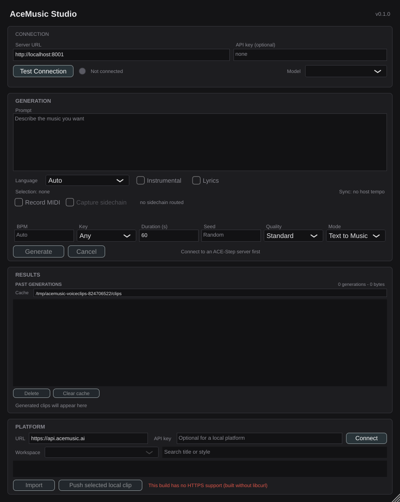
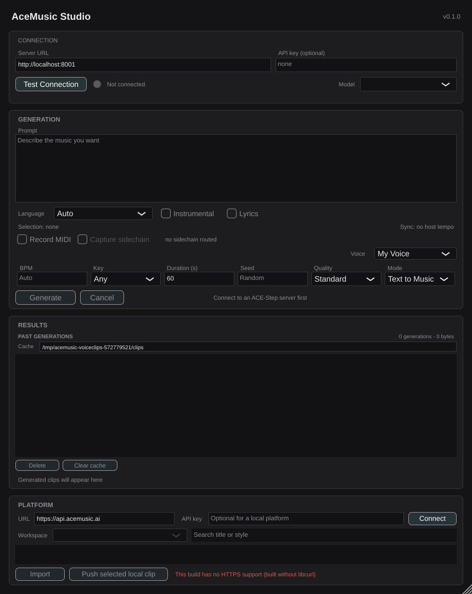
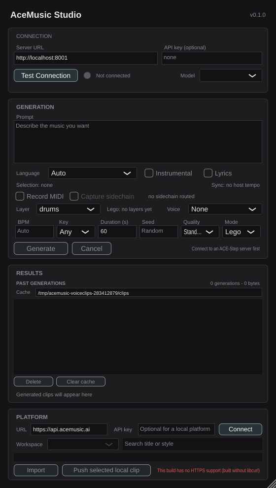

# #396 — Voice selector in the VST3 plugin

The plugin generates straight against local ACE-Step. A custom voice cannot work that way:
the voice's LoRA adapter is loaded on the ACE-Step host by the **platform's own worker**, so
a plugin that loaded it too would be a second, uncoordinated owner of that state — which is
exactly what the last acceptance criterion rules out.

So the routing is hybrid:

```
no voice selected -> AceStepClient      -> local /release_task   (free, offline, unchanged)
voice selected    -> PlatformClient     -> POST /api/v1/generate (platform worker owns the LoRA)
                                        -> poll /jobs/{id}/status
                                        -> GET /clips/{id}/audio
```

Routing *everything* through the platform — option 2 as the issue words it — would also make
every plugin generation cost credits and require an authenticated online session. That is a
change to what the plugin is, not to how it generates, so it was raised rather than assumed.

---

## Signed out: no selector at all



A musician who has not connected has no voices and cannot get any without connecting, so a
control reading "None" would be a question the plugin cannot answer. There is no Voice row.

## Connected: the ready voices, one selected



`Voice: My Voice` sits beside the parameter grid. Both screenshots are the **real
`PluginEditor`**, rendered by the same tests that assert the behaviour
(`captureIfRequested` snapshots the component tree under test) — so the picture cannot
drift from what is verified. Driving the standalone app would have needed a click on
Connect, and there is no `xdotool` on this machine.

---

## Acceptance criteria

| # | Criterion | Evidence | |
|---|---|---|---|
| 1 | An authenticated session lists the user's `ready` voice models | `AC: an authenticated session lists the user's voice models` — real loopback server, asserts the bearer token went out. `AC: only ready models are offered` — a training and a failed model are filtered out. `AC: connecting offers the ready voices, and only those` — the combo holds "None" + the one ready model | **VERIFIED** |
| 2 | Selecting one makes the generated audio use that voice | `AC: connecting offers the ready voices, and only those` asserts the selection reaches `buildRequest().voiceModelId`; `AC: submitting returns the platform's job id` asserts that id is in the body the platform receives | **VERIFIED** |
| 3 | No selection generates exactly as it does today | `AC: a voiced run goes to the platform, an unvoiced one does not` — the unvoiced run hits `/release_task` and makes **zero** calls to `/api/v1/generate`. `an omitted voice leaves voice_model_id out entirely` — the key is absent, not null | **VERIFIED** |
| 4 | Signed-out sessions hide the selector rather than showing an empty or erroring list | `AC: signed out hides the selector rather than showing an empty list`, plus the screenshot above. `signing out takes the selector away again` covers the transition, including that a stale choice does not linger on the request | **VERIFIED** |
| 5 | Only one component owns the ACE-Step LoRA state at a time | Same end-to-end test: after a **voiced** run, the local `/release_task` call count is **unchanged** from before it. The plugin demonstrably never goes near the local generation endpoint when a voice is in play, so it never races the platform worker for the adapter | **VERIFIED** |

## The end-to-end check, in full

One stub server answering both APIs, driven through the real `GenerationManager`:

```
1. unvoiced run  -> /release_task calls > 0,  /api/v1/generate calls == 0
2. voiced run    -> /api/v1/generate calls > 0,
                    /release_task calls == (the count from before the run)
                    1 clip downloaded via /api/v1/clips/clip-a/audio
```

The assertion that matters for AC 5 is the second line's second clause: not "the platform
was used" but "the local server was **not**".

## A bug this caught before it shipped

The first `setVoiceModels` replaced the model array *before* reading the previous selection
out of it, so a refresh that merely reordered the voices moved the musician onto a
different one — a silent wrong-voice generation. `a surviving voice keeps its selection
across a refresh` failed, which is the only reason it is not in the branch as a bug.

`a voice deleted on the web does not stay selected` covers the other direction: the
selection falls back to None rather than sliding onto whichever model now occupies the slot.

## Layout

The selector shares the Lego row rather than taking one of its own — the editor's minimum
height is already tight, and every prior story's comment in `PluginEditor::resized` warns
about squeezing the readouts. `the selector fits at the editor's minimum size without
crushing its neighbour` holds that trade honest: at the configured minimum (560×990), in
Lego mode, both selectors have non-zero width, they do not intersect, and the Lego readout
is not crushed to nothing.



## Reproducing

```bash
cd plugin
cmake --build build --target AceMusicPluginTests -j4
xvfb-run -a ./build/AceMusicPluginTests_artefacts/Release/AceMusicPluginTests
# and to regenerate the screenshots above:
ACEMUSIC_DEMO_DIR=../docs/demos xvfb-run -a ./build/AceMusicPluginTests_artefacts/Release/AceMusicPluginTests
```

## Known limitations

- **Platform auth is a JWT bearer with a 15-minute expiry, and there is no API-key scheme.**
  The plugin's "API key" field already holds one for workspace browsing, so this is
  pre-existing rather than introduced here — but it does mean a voiced generation can fail
  with "API key rejected by the server" mid-session. Filed separately rather than silently
  half-fixed inside this story.
- **This build has no HTTPS support** (`ACEMUSIC_TLS=0`, visible in the screenshots) because
  the machine has no libcurl development headers. The tests all run against a loopback
  `http://` stub, so they are unaffected — but a real platform on `https://` needs a build
  with curl.
- **Only text-to-music is routed.** The plugin's other modes need a source audio file that
  lives on this machine and the platform cannot reach it. That is also the only mode a
  voice is meaningful in.
- **Nothing here ships.** #406 (Steinberg VST3 SDK licence) gates public plugin builds; this
  is development only, and no binary has been published.
