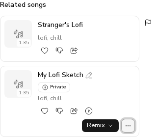

# #564 Related songs rail: no owner-only controls on other users' clips

*2026-10-08T02:40:26Z by Showboat 0.6.1*
<!-- showboat-id: 27e5a4c8-cdb3-4dcc-b07e-bae318d37e07 -->

Live run: FastAPI on :8000 against a seeded `acemusic_demo_564` database, `next dev` on :3000, and Playwright (Chromium) signed in as the viewer through a freshly minted single-use `ams_refresh_token` cookie.

Seed: the viewer owns **Seed Song** and a private **My Lofi Sketch**. Another user owns a public **Stranger's Lofi**. All three are tagged `lofi`, so `GET /clips/{seed}/similar` returns both rail clips, with `is_owner` false and true respectively.

The script opens `/song/{seed}`, finds each card in the **Related songs** region, and lists every control button it offers. It then opens the owner's ⋯ menu and checks that Delete is still there.

## Captured output

```
Stranger's Lofi: [Play, Like, Dislike, Share, Report] draggable=false
My Lofi Sketch: [Play, Like, Dislike, Share, Edit title, Remix or edit clip, More options, Visibility picker] draggable=true
My Lofi Sketch ⋯ menu has Delete: true
```

| Criterion | Outcome evidence | Status |
|---|---|---|
| Another user's clip in the rail shows no rename, visibility or delete control | `Stranger's Lofi`: no Edit title, no Visibility picker or badge, no ⋯ menu (so no Delete), no Remix. Play/Like/Dislike/Share and Report remain. It is not a Studio drag source | VERIFIED |
| The viewer's own clips in the rail keep them | `My Lofi Sketch`: Edit title, the Private badge and Visibility picker, Remix, and a ⋯ menu that still offers Delete | VERIFIED |

```bash {image}

```


