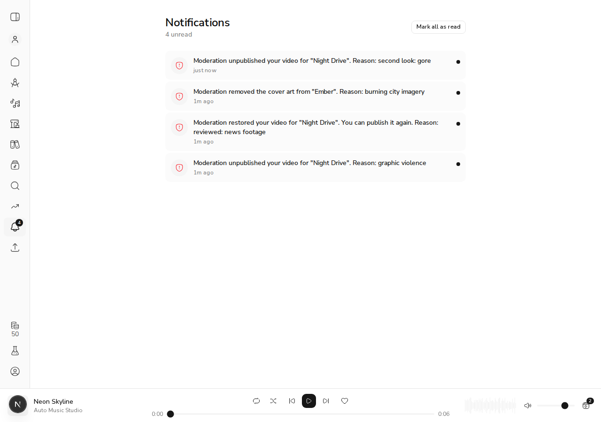
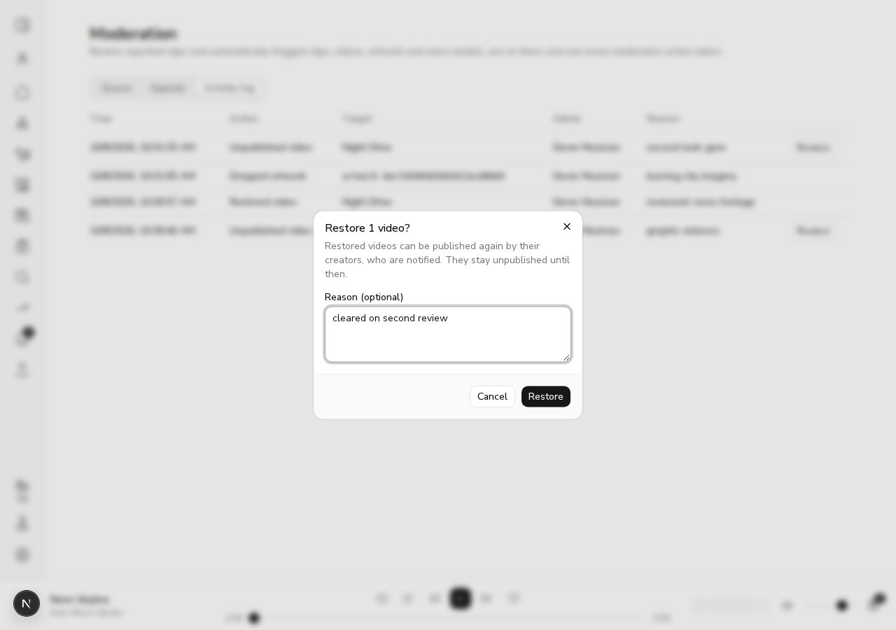
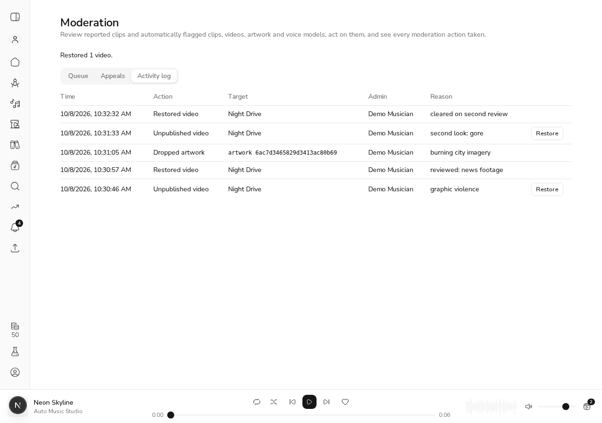

# #571 — moderation notices for videos and artwork, and video restore

*2026-10-08T17:30:43Z by Showboat 0.6.1*
<!-- showboat-id: bd790300-71d6-4463-8e16-e5841bc5abb6 -->

Live API on the throwaway `acemusic_demo_571` database (`scripts/demo_api_stack.py`). The seeded musician is promoted to admin, so one account both moderates and receives the owner's notices. A published, flagged video is seeded for song 1, and a flagged artwork option is set as song 2's cover.

```bash
. /tmp/claude-1002/-home-frankbria-projects-auto-music-studio/f5018d3a-b888-4bde-84b0-b4029712ef46/scratchpad/demo-571/env.sh >/dev/null; M 'db.users.updateOne({}, {$set: {is_admin: true}}); db.clips.updateOne({_id: ObjectId("'$CLIP_1'")}, {$set: {title: "Night Drive"}}); db.clips.updateOne({_id: ObjectId("'$CLIP_2'")}, {$set: {title: "Ember", artwork_path: "art/ember.png"}}); const v = db.videos.insertOne({clip_id: ObjectId("'$CLIP_1'"), user_id: ObjectId("'$USER_ID'"), job_id: new ObjectId(), storage_path: "v.mp4", resolution: "720p", aspect_ratio: "16:9", published: true, moderation_flags: ["violent extremism"], moderation_reviewed_at: null, removed_at: null, created_at: new Date()}); const a = db.artwork_options.insertOne({clip_id: ObjectId("'$CLIP_2'"), user_id: ObjectId("'$USER_ID'"), job_id: new ObjectId(), storage_path: "art/ember.png", option_index: 0, moderation_flags: ["violent extremism"], moderation_reviewed_at: null, created_at: new Date()}); print("VIDEO=" + v.insertedId + " ARTWORK=" + a.insertedId)' | tee /tmp/claude-1002/-home-frankbria-projects-auto-music-studio/f5018d3a-b888-4bde-84b0-b4029712ef46/scratchpad/demo-571/ids.txt
```

```output
VIDEO=6ac7d3465829d3413ac80b67 ARTWORK=6ac7d3465829d3413ac80b69
```

**Criterion 1a: an unpublish notifies the owner.** The admin unpublishes the video with a reason. The owner's inbox gets a `moderation_video_unpublished` notice naming the song and the reason.

```bash
. /tmp/claude-1002/-home-frankbria-projects-auto-music-studio/f5018d3a-b888-4bde-84b0-b4029712ef46/scratchpad/demo-571/env.sh >/dev/null; api POST /admin/moderation/content '{"target_type":"video","action":"unpublish","ids":["'$VIDEO'"],"reason":"graphic violence"}'; api GET /users/me/notifications | python3 -c 'import json,sys; [print(n["event_type"], n["payload"]) for n in json.load(sys.stdin)["notifications"]]' 2>/dev/null || true
```

```output
HTTP 200
{"results":[{"ok":true,"detail":null,"id":"6ac7d3465829d3413ac80b67"}]}
```

```bash
. /tmp/claude-1002/-home-frankbria-projects-auto-music-studio/f5018d3a-b888-4bde-84b0-b4029712ef46/scratchpad/demo-571/env.sh >/dev/null; api GET '/users/me/notifications' >/dev/null; python3 -c 'import json; d=json.load(open("/tmp/claude-1002/-home-frankbria-projects-auto-music-studio/f5018d3a-b888-4bde-84b0-b4029712ef46/scratchpad/demo-571/last_body.json")); [print(n["event_type"], n["clip_id"]=="'$CLIP_1'", n["payload"]) for n in d["notifications"]]'
```

```output
moderation_video_unpublished True {'video_id': '6ac7d3465829d3413ac80b67', 'title': 'Night Drive', 'reason': 'graphic violence'}
```

**Criterion 2: a video takedown can be reversed.** While the video is taken down, the owner's publish is refused (403). The admin restores it, the owner gets a `moderation_video_restored` notice, and the same publish call now succeeds.

```bash
. /tmp/claude-1002/-home-frankbria-projects-auto-music-studio/f5018d3a-b888-4bde-84b0-b4029712ef46/scratchpad/demo-571/env.sh >/dev/null; api POST /videos/$VIDEO/publish
```

```output
HTTP 403
{"detail":"This video was removed by moderation."}
```

```bash
. /tmp/claude-1002/-home-frankbria-projects-auto-music-studio/f5018d3a-b888-4bde-84b0-b4029712ef46/scratchpad/demo-571/env.sh >/dev/null; api POST /admin/moderation/content '{"target_type":"video","action":"restore","ids":["'$VIDEO'"],"reason":"reviewed: news footage"}'; M 'printjson(db.videos.findOne({}, {published: 1, removed_at: 1, _id: 0}))'
```

```output
HTTP 200
{"results":[{"ok":true,"detail":null,"id":"6ac7d3465829d3413ac80b67"}]}
{
  published: false,
  removed_at: null
}
```

```bash
. /tmp/claude-1002/-home-frankbria-projects-auto-music-studio/f5018d3a-b888-4bde-84b0-b4029712ef46/scratchpad/demo-571/env.sh >/dev/null; api GET /users/me/notifications >/dev/null; python3 -c 'import json; d=json.load(open("/tmp/claude-1002/-home-frankbria-projects-auto-music-studio/f5018d3a-b888-4bde-84b0-b4029712ef46/scratchpad/demo-571/last_body.json")); [print(n["event_type"], n["payload"]) for n in d["notifications"]]'
```

```output
moderation_video_restored {'video_id': '6ac7d3465829d3413ac80b67', 'title': 'Night Drive', 'reason': 'reviewed: news footage'}
moderation_video_unpublished {'video_id': '6ac7d3465829d3413ac80b67', 'title': 'Night Drive', 'reason': 'graphic violence'}
```

```bash
. /tmp/claude-1002/-home-frankbria-projects-auto-music-studio/f5018d3a-b888-4bde-84b0-b4029712ef46/scratchpad/demo-571/env.sh >/dev/null; api POST /videos/$VIDEO/publish | head -c 160; echo; M 'printjson(db.videos.findOne({}, {published: 1, removed_at: 1, _id: 0}))'
```

```output
HTTP 200
{"id":"6ac7d3465829d3413ac80b67","clip_id":"6ac7d32868db9cf445641bcf","job_id":"6ac7d3465829d3413ac80b66","resolution":"720p","aspect_ratio":"16:9","pu
{
  published: true,
  removed_at: null
}
```

**Error path:** restoring a video that isn't taken down is refused per target, without a log entry or notice. Restore is also a 422 on artwork, which takes approve or drop only.

```bash
. /tmp/claude-1002/-home-frankbria-projects-auto-music-studio/f5018d3a-b888-4bde-84b0-b4029712ef46/scratchpad/demo-571/env.sh >/dev/null; api POST /admin/moderation/content '{"target_type":"video","action":"restore","ids":["'$VIDEO'"]}'; api POST /admin/moderation/content '{"target_type":"artwork","action":"restore","ids":["'$ART'"]}' | head -c 200; echo
```

```output
HTTP 200
{"results":[{"ok":false,"detail":"This video is not taken down.","id":"6ac7d3465829d3413ac80b67"}]}
HTTP 422
{"detail":[{"type":"value_error","loc":["body"],"msg":"Value error, A artwork takes only: approve, drop.","input":{"target_type":"artwork","action":"restore","ids":["6ac7d3465829d3413ac80b69"
```

**Criterion 1b: dropping artwork notifies the owner.** The flagged option is song 2's cover. Dropping it clears the cover, and the owner gets a `moderation_artwork_dropped` notice with `was_cover: true`. The log entry and the notice for each action are both on record.

```bash
. /tmp/claude-1002/-home-frankbria-projects-auto-music-studio/f5018d3a-b888-4bde-84b0-b4029712ef46/scratchpad/demo-571/env.sh >/dev/null; api POST /admin/moderation/content '{"target_type":"artwork","action":"drop","ids":["'$ART'"],"reason":"burning city imagery"}'; M 'printjson(db.clips.findOne({_id: ObjectId("'$CLIP_2'")}, {title: 1, artwork_path: 1, _id: 0}))'
```

```output
HTTP 200
{"results":[{"ok":true,"detail":null,"id":"6ac7d3465829d3413ac80b69"}]}
{
  title: 'Ember',
  artwork_path: null
}
```

```bash
. /tmp/claude-1002/-home-frankbria-projects-auto-music-studio/f5018d3a-b888-4bde-84b0-b4029712ef46/scratchpad/demo-571/env.sh >/dev/null; api GET /users/me/notifications >/dev/null; python3 -c 'import json; d=json.load(open("/tmp/claude-1002/-home-frankbria-projects-auto-music-studio/f5018d3a-b888-4bde-84b0-b4029712ef46/scratchpad/demo-571/last_body.json")); n=d["notifications"][0]; print(n["event_type"], n["clip_id"]=="'$CLIP_2'", n["payload"])'
```

```output
moderation_artwork_dropped True {'was_cover': True, 'title': 'Ember', 'reason': 'burning city imagery'}
```

```bash
. /tmp/claude-1002/-home-frankbria-projects-auto-music-studio/f5018d3a-b888-4bde-84b0-b4029712ef46/scratchpad/demo-571/env.sh >/dev/null; api GET /admin/moderation/log >/dev/null; python3 -c 'import json; [print(e["action"], e["target_type"], e["target_label"], e["reason"]) for e in json.load(open("/tmp/claude-1002/-home-frankbria-projects-auto-music-studio/f5018d3a-b888-4bde-84b0-b4029712ef46/scratchpad/demo-571/last_body.json"))["entries"]]'
```

```output
drop artwork None burning city imagery
restore video Night Drive reviewed: news footage
unpublish video Night Drive graphic violence
```

**Web (Playwright, live `next dev` against the same API, signed in with a minted refresh cookie).** The video was unpublished once more first ("second look: gore"). The inbox renders all three new event types as moderation rows, not the generic *System* fallback, and the video notices link to `/video/{songId}`.

```bash {image}
/tmp/claude-1002/-home-frankbria-projects-auto-music-studio/f5018d3a-b888-4bde-84b0-b4029712ef46/scratchpad/us571-notifications.png
```



In the activity log, video-unpublish rows have a **Restore** button and the artwork-drop row has none. Restore opens the reason dialog, then reports "Restored 1 video.", and the new log row carries the reason. Afterwards the database shows `published: false, removed_at: null`: the takedown is lifted, and republishing is left to the owner.

```bash {image}
/tmp/claude-1002/-home-frankbria-projects-auto-music-studio/f5018d3a-b888-4bde-84b0-b4029712ef46/scratchpad/us571-restore-dialog.png
```



```bash {image}
/tmp/claude-1002/-home-frankbria-projects-auto-music-studio/f5018d3a-b888-4bde-84b0-b4029712ef46/scratchpad/us571-restored.png
```


