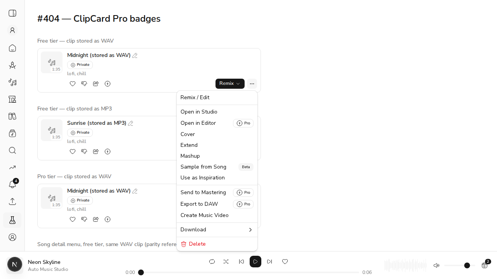
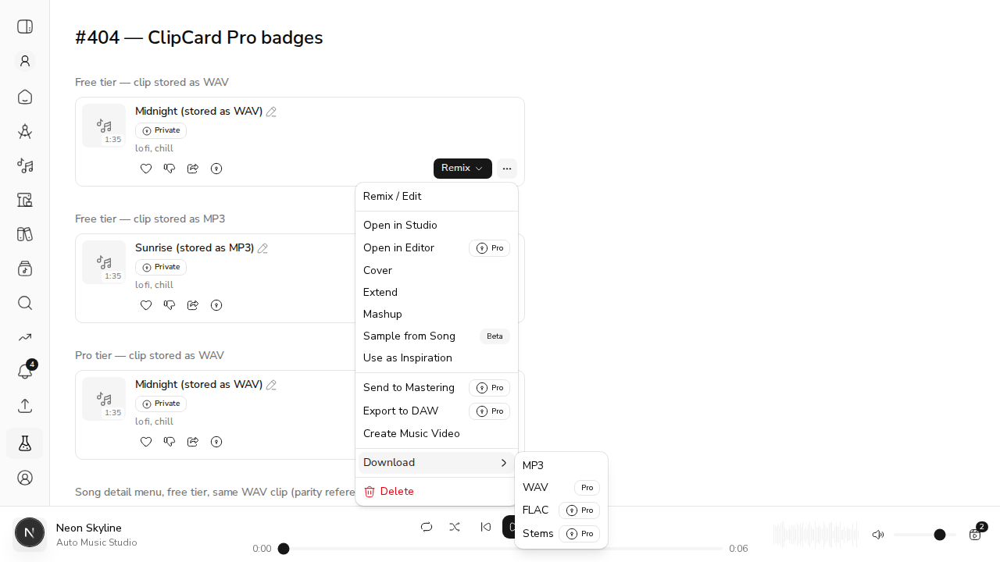
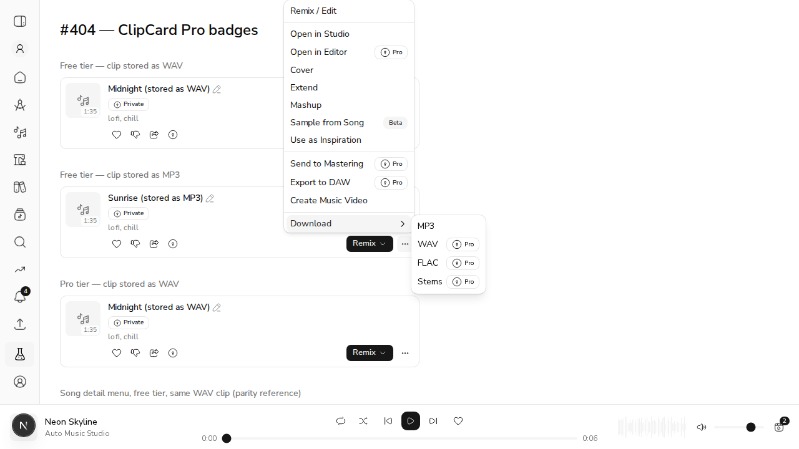
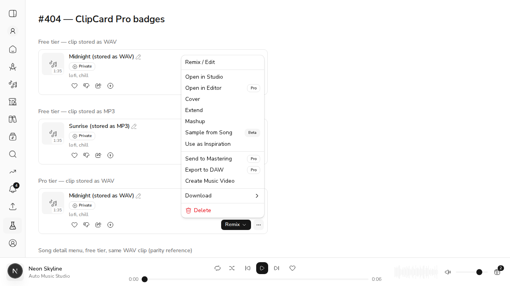
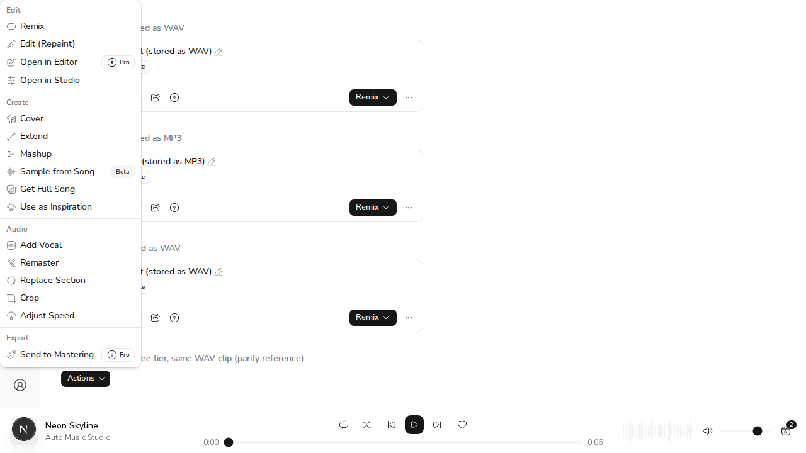

# #404 — ClipCard's ⋯ menu badges every Pro item

**What changed.** `ClipCard` hardcoded its own ⋯ menu items and its own
`DOWNLOAD_ITEMS`, so only *Open in Editor* carried a Pro badge. *Send to Mastering*,
*Export to DAW* and the whole Download submenu are `proOnly` in `lib/song-actions.ts`
but rendered bare. Both card menus now render from the shared registry through a new
`SongActionItem` component, extracted from `SongActionsMenu`.

**How this was demoed.** `ClipCard` (free/Pro, WAV-native and MP3-native clips) and
`SongActionsMenu` were mounted on the public `/labs` page against a running
`npm run dev`, driven with `agent-browser`. The harness page was reverted afterwards;
only these screenshots remain.

---

## AC1 — every `proOnly` item shows the Pro badge, padlock only when locked

Free tier, WAV-native clip:



*Open in Editor*, *Send to Mastering* and *Export to DAW* all carry 🔒 Pro. Before this
change only the first of the three did. *Sample from Song* keeps its Beta mark, now off
the registry rather than a hardcoded literal.

## AC2 — download items respect the native-format carve-out

Same free-tier musician, **clip stored as WAV**:



- MP3 — no badge (free at every tier)
- **WAV — "Pro" with no padlock.** Serving back the musician's own WAV is not a
  conversion, and `GET /clips/{id}/audio` permits it, so the menu must not claim
  otherwise.
- FLAC, Stems — 🔒 Pro

Negative control, same tier, **clip stored as MP3**:



WAV is now 🔒 Pro here — mp3 → wav *is* a conversion, which the API does gate.

## AC1 (Pro side) — a Pro musician sees no locks



Pro badges still identify the tier's features; every padlock is gone.

## AC3 — the card and song detail agree

`SongActionsMenu` rendered for the same clip and the same free tier:



*Open in Editor* 🔒 Pro, *Sample from Song* Beta, *Send to Mastering* 🔒 Pro — the same
marks the card shows. Also asserted automatically: `ClipCard.test.tsx` opens both menus
for the same clip/tier and compares the badge + `data-locked` state of every action the
two surfaces share.

## AC4 — a test covers a Pro item other than Open in Editor

`ClipCard.test.tsx`:

- `badges Send to Mastering as Pro in the more-options menu`
- `badges Export to DAW as Pro in the more-options menu`
- `badges the Pro download formats, honouring the native-format carve-out`
- `leaves Pro items unlocked for a Pro musician`
- `marks the same actions as song detail for the same clip and tier`
- `badges the Remix CTA's Pro items from the same registry`

```
Test Files  206 passed (206)
     Tests  1636 passed (1636)
```
